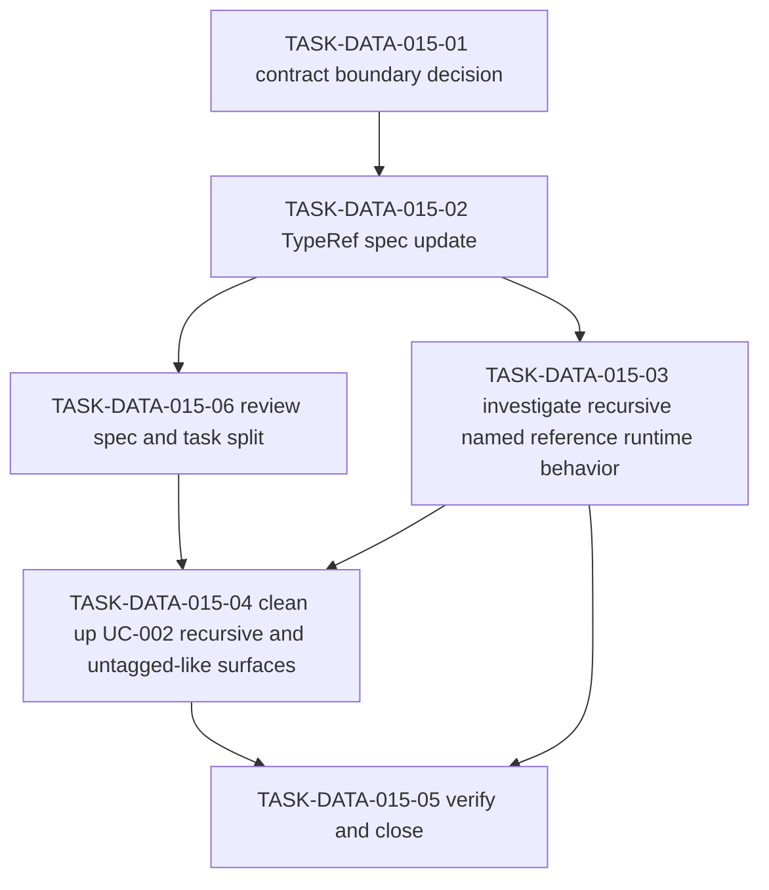

# WORK-DATA-015: Define recursive and untagged-union representation

- **id**: WORK-DATA-015
- **status**: in_progress
- **date**: 2026-06-01
- **source_requirement**: REQ-DATA-008
- **impact_refs**:
  - REQ-DATA-008
  - REQ-DATA-002
  - INV-DATA-002
  - WORK-DATA-009
  - TASK-DATA-009-03
  - TASK-DATA-009-04
- **tasks**:
  - TASK-DATA-015-01
  - TASK-DATA-015-02
  - TASK-DATA-015-03
  - TASK-DATA-015-04
  - TASK-DATA-015-05
  - TASK-DATA-015-06

## Goal

Define the follow-up path for recursive structures and untagged unions captured by `REQ-DATA-008`.

This work item owns the `recursive / union structure` bucket: N-009 and N-044.

## Boundary

### Included

- Decide whether brewprint data models should represent recursive references and untagged union shapes.
- Decide whether this remains separate from ADR-073 or requires an explicit future ADR-073 successor / broadening decision.
- Identify required spec, diagnostic, YAML, render, and fixture follow-up before any implementation work begins.
- Split later task artifacts only when this work item is selected for execution.

### Excluded

- Direct UC-002 YAML migration in this capture.
- Fixture / golden regeneration in this capture.
- Parser, renderer, validator, MCP, or other implementation changes in this capture.
- Tagged union / discriminator payload support as already captured by `REQ-DATA-004` / `WORK-DATA-010`.
- DAG asset TypeRef hint support.
- MCP identity / semantic reference support.
- Request-side generic container cleanup, enum/literal cleanup, numeric/default behavior, or selector support matrix successor scope.
- Reopening M15, WORK-DATA-001, WORK-DATA-002, WORK-DATA-003, WORK-DATA-004, WORK-DATA-005, WORK-DATA-006, WORK-DATA-007, WORK-DATA-008, WORK-DATA-009, or WORK-DATA-010.

## Impact Scope

| layer | current state | handling in this work item |
|---|---|---|
| source requirement | REQ-DATA-008 captured | Owns recursive and untagged-union representation |
| related tagged-union successor | REQ-DATA-004 / WORK-DATA-010 not_started | Preserve as tagged / discriminated union only unless a later decision broadens it |
| source planning | WORK-DATA-009 done | Consume the selected successor bucket only |
| candidate bucket | recursive / union structure | Own the bucket as a future contract decision track |

## Task Flow

Current task split:

`TASK-DATA-015-01` and `TASK-DATA-015-02` are complete. `TASK-DATA-015-03` through `TASK-DATA-015-06` remain the active follow-up plan.

## Completion Condition

This work item can be marked `done` when recursive and untagged-union representation is accepted, specified, implemented and verified if selected, or explicitly closed as no-action without silently expanding tagged-union, helper-shape, or MCP identity work.
