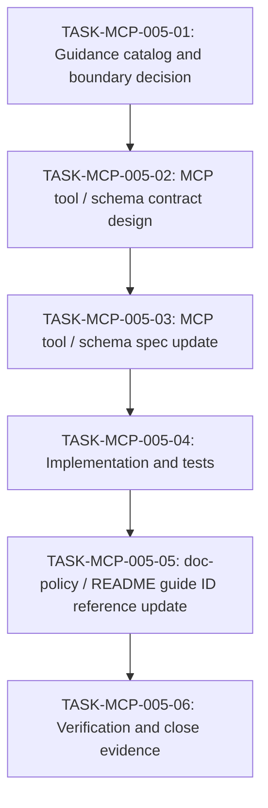

# WORK-MCP-005: Project authoring guidance retrieval support

- **id**: WORK-MCP-005
- **status**: done
- **date**: 2026-05-31
- **source_requirement**: REQ-MCP-005
- **impact_refs**:
  - docs/doc-policy.md
  - docs/guides/adr-authoring.md
  - docs/guides/spec-authoring.md
  - docs/guides/requirement-authoring.md
  - docs/guides/work-item-authoring.md
  - docs/guides/task-authoring.md
  - docs/guides/investigation-authoring.md
  - docs/guides/artifact-boundary.md
  - docs/spec/design-records-mcp/tools.md
  - docs/spec/design-records-mcp/schema.md
- **tasks**:
  - TASK-MCP-005-01
  - TASK-MCP-005-02
  - TASK-MCP-005-03
  - TASK-MCP-005-04
  - TASK-MCP-005-05
  - TASK-MCP-005-06

## Close Evidence

Closed by `TASK-MCP-005-06`.

- `docs/guides/*.md` guide source model is documented and implemented.
- `list_authoring_guides` returns guide catalog metadata as `id` / `title` / `abstract` without exposing source path.
- `get_authoring_guidance` returns `id` / `title` / raw Markdown `content` by guide ID.
- Guide source path remains an internal implementation detail.
- Guides are not Design Records record kinds and are not resolver / validation targets.
- `docs/doc-policy.md` is thinned to startup policy and points authoring flow to Design Records MCP guide tools.
- Guide files use `## Migration Note` rather than `## Source`; migration notes explicitly state they are not instructions to read original files and are not part of the public retrieval contract.
- Targeted implementation tests passed:
  - `go test ./internal/designrecords ./internal/designrecordsmcp`
  - `go test ./cmd/design-records-mcp ./internal/designrecords ./internal/designrecordsmcp`
- Known `go test ./...` render / manifest failures are outside WORK-MCP-005 scope.

## Goal

Define and implement a Design Records MCP authoring guidance discovery / retrieval flow so project-wide authoring guides can be loaded on demand instead of being treated as mandatory startup reads.

## Boundary

### Included

- Introduce `docs/guides/` as the phase-1 authoring guidance source directory.
- Use filename stem as guide ID.
- Use the first H1 as guide title and `## Abstract` as catalog summary.
- Keep existing authoring guides and README files in place during phase 1.
- Add a discovery tool, working name `list_authoring_guides`, returning `id`, `title`, and `abstract` without exposing physical path.
- Add a retrieval tool, working name `get_authoring_guidance`, returning Markdown content by guide ID.
- Update Design Records MCP tool / schema specs for request and response contracts.
- Update implementation and tests for the selected guide catalog.
- After MCP support exists, update `docs/doc-policy.md` and relevant README entry points so authoring rule references can use guide IDs rather than source file paths.
- Verify the flow with representative guide types: ADR, spec, requirement, work item, task, investigation, and artifact boundary.

### Excluded

- Removing or relocating existing Markdown authoring guides during phase 1.
- Exposing guide source file path as public tool response contract.
- Converting authoring guides into Design Records records with new canonical IDs unless explicitly decided as part of later work.
- Building a generic full-text search / RAG system for project docs.
- Changing existing record retrieval semantics for `get_record` / `get_records`.
- Reopening closed M-series or legacy migration scopes.

## Impact Scope

| layer | current state | handling in this work item |
|---|---|---|
| source requirement | `REQ-MCP-005` captured | This work item owns the discovery / retrieval flow |
| guide source | `docs/guides/*.md` introduced | Source files remain internal implementation detail behind guide IDs |
| MCP tool spec | no dedicated authoring guidance tools | Add `list_authoring_guides` and `get_authoring_guidance` contracts |
| MCP schema spec | record schema exists, guidance schema is not defined | Define guide summary response as `id` / `title` / `abstract`; define guide content response as Markdown by guide ID |
| implementation | existing tools retrieve design records | Add guide catalog and retrieval implementation without changing record retrieval behavior |
| docs policy | doc-policy and README entry points now reference guide IDs | Final verification should confirm no stale path-as-contract wording remains |
| authoring guides | Existing Markdown guides and README files remain | Preserve as compatibility source; do not remove during phase 1 |
| tests / validation | guide retrieval tests added and targeted tests passed | Repository-wide render / manifest failures are known out-of-scope failures |

## Task flow

## Task Candidates

- `TASK-MCP-005-01`: Guidance catalog and boundary decision.
- `TASK-MCP-005-02`: MCP tool / schema contract design.
- `TASK-MCP-005-03`: MCP tool / schema spec update.
- `TASK-MCP-005-04`: Implementation and tests.
- `TASK-MCP-005-05`: doc-policy / README guide ID reference update.
- `TASK-MCP-005-06`: Verification and close evidence.

`TASK-MCP-005-01` through `TASK-MCP-005-06` are materialized.

## Completion Condition

This work item is done. Design Records MCP can list authoring guides as `id` / `title` / `abstract`, retrieve Markdown guidance content by guide ID, keep guide source path as an internal resolution detail, document the guide catalog and response schema, pass targeted implementation tests, thin startup docs so agents can discover task-specific authoring rules without reading every guide upfront, and record close evidence including known out-of-scope repository-wide test failures.
