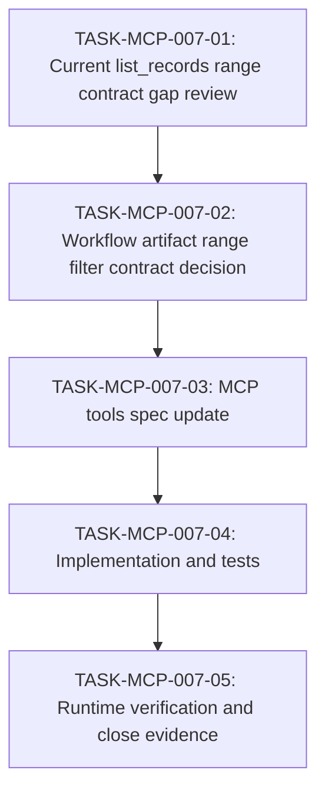

# WORK-MCP-007: list_records workflow artifact range filter support を判断・実現する

- **id**: WORK-MCP-007
- **status**: done
- **date**: 2026-06-01
- **source_requirement**: REQ-MCP-007
- **impact_refs**:
  - SPEC-design-records-mcp-tools
  - ADR-092
  - WORK-DATA-004
- **tasks**:
  - TASK-MCP-007-01
  - TASK-MCP-007-02
  - TASK-MCP-007-03
  - TASK-MCP-007-04
  - TASK-MCP-007-05

## Goal

REQ-MCP-007 を解消するため、Design Records MCP の `list_records` で workflow artifact を ID range または同等の domain-scoped sequence filter により安全に探索できるようにする。

## Boundary

- 本 work item は `list_records` における workflow artifact range navigation の contract 判断と実現フローを所有する。
- `id_range` を workflow artifact ID へ拡張するか、decision-only の `id_range` を維持して別 filter を追加するかを判断する。
- Cross-domain / mixed-kind range comparison は、明示的な ordering contract が定義されない限り対象外とする。
- `SPEC-*` / `INV-*` range support は本 work item の対象外とする。
- Workflow traversal、orphan diagnostics、progress projection、task dependency cycle / execution order projection は対象外とする。
- Physical path relation support、`req:` / `work:` / `task:` semantic prefix support は導入しない。
- WORK-DATA-004 の仕様判断自体は再オープンしない。本 work item では、workflow artifact navigation の利用例として扱う。

## Impact scope

| layer | expected handling |
|---|---|
| requirement | REQ-MCP-007 の gap を解消する |
| tool contract | `list_records` request schema と error behavior を判断・更新する |
| spec | `docs/spec/design-records-mcp/tools.md` の `list_records` / error handling を更新する |
| implementation | `internal/designrecords` / `internal/designrecordsmcp` の range filter behavior を contract に合わせる |
| tests | workflow artifact range / invalid mixed range / legacy ADR range behavior の regression tests を追加する |
| verification | runtime MCP call で代表ケースを確認し、close evidence を残す |

## Task flow

## Task Candidates

- `TASK-MCP-007-01`: Current `list_records.id_range` contract / implementation / tests の evidence を整理する。
- `TASK-MCP-007-02`: `id_range` 拡張か、workflow artifact 専用 filter 追加かを判断する。
- `TASK-MCP-007-03`: 採用 contract を Design Records MCP tools spec に反映する。
- `TASK-MCP-007-04`: Parser / index / MCP tool schema / tests を実装する。
- `TASK-MCP-007-05`: Runtime verification と close review を実施する。

`TASK-MCP-007-01` through `TASK-MCP-007-05` are materialized.

## Completion condition

以下を満たしたとき、本 work item を `done` にできる。

- Workflow artifact range navigation の public contract が決定されている。
- `list_records` で requirement / work item / task の domain-scoped range または同等 filter による探索が可能である。
- Unsupported mixed-domain / mixed-kind / unsupported record kind range が、silent reinterpretation なしに明示的に拒否される。
- ADR decision range の既存 behavior が regression していない。
- Spec、implementation、tests、runtime verification evidence が同期している。
- REQ-MCP-007 への relation と close evidence が整合している。

## Current blockers

None.

## Progress summary

- 2026-06-01: REQ-MCP-007 から起票。現行 spec では `list_records.id_range` は `ADR-NNN` decision record 専用であり、workflow artifact の range navigation は後続 refinement に委ねられていた。
- 2026-06-01: `id_range` を workflow artifact ID family に拡張する contract を採用。`TASK-*` range は same domain + same work sequence に限定。
- 2026-06-01: `docs/spec/design-records-mcp/tools.md`、implementation、tests を更新。
- 2026-06-01: `go test ./internal/designrecords ./internal/designrecordsmcp` passed.
- 2026-06-01: Runtime MCP verification passed for ADR compatibility, workflow valid ranges, invalid mixed ranges, and `validate_records` task range.

## Close evidence

- `TASK-MCP-007-01` through `TASK-MCP-007-05` are done.
- `validate_records(kind: requirement, id_range: REQ-MCP-007..REQ-MCP-007)` returned `ok: true`.
- `validate_records(kind: work_item, id_range: WORK-MCP-007..WORK-MCP-007)` returned `ok: true`.
- `validate_records(kind: task, id_range: TASK-MCP-007-01..TASK-MCP-007-05)` returned `ok: true`.
- `list_records(kind: work_item, id_range: WORK-MCP-007..WORK-MCP-007)` returned `WORK-MCP-007`.
- `list_records(kind: task, id_range: TASK-MCP-007-01..TASK-MCP-007-05)` returned `TASK-MCP-007-01` through `TASK-MCP-007-05`.
- Invalid mixed-domain / mixed-work-sequence / unsupported family ranges returned `invalid_id_range`.
