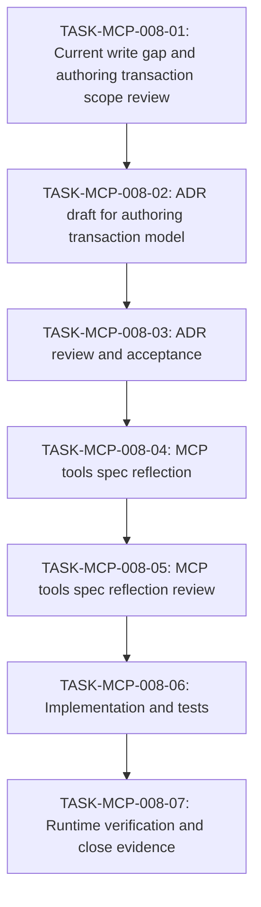

# WORK-MCP-008: Design Records MCP authoring transaction support を設計・実現する

- **id**: WORK-MCP-008
- **status**: done
- **date**: 2026-06-01
- **source_requirement**: REQ-MCP-008
- **impact_refs**:
  - SPEC-design-records-mcp-tools
  - SPEC-design-records-mcp-schema
  - REQ-MCP-005
  - REQ-MCP-007
  - REQ-MCP-010
- **tasks**:
  - TASK-MCP-008-01
  - TASK-MCP-008-02
  - TASK-MCP-008-03
  - TASK-MCP-008-04
  - TASK-MCP-008-05
  - TASK-MCP-008-06
  - TASK-MCP-008-07

## Goal

REQ-MCP-008 を解消するため、Design Records MCP に artifact-oriented な authoring transaction capability を追加し、AI assistants が requirement / work item / task / decision を filesystem path ではなく record identity と proposal flow で安全に作成し、既存 record の metadata / section を安全に更新できるようにする。

## Boundary

- 本 work item は Design Records MCP authoring write capability の contract 判断、spec 反映、実装、検証フローを所有する。
- MVP は propose → accept の二段階 write、`new` placeholder による自動採番、`body` / `body_cache_id` 排他、3 days cache retention、validation / repair hint を対象とする。
- Create 対象は requirement / work item / task / decision に限定する。Spec skeleton creation / `SPEC-new` は MVP 対象外とする。
- Update 対象は kind-specific metadata block 全体置換と named Markdown section 全体置換に限定する。既存 spec record は update 対象に含める。
- ADR は transaction model / pathless artifact-oriented write / cache policy / set-only MVP などの設計判断を固定するために起票する。
- ADR review と spec reflection review を明示的に挟む。ADR 未レビューのまま spec / implementation へ進めない。
- Add/remove relation convenience operations、partial Markdown AST edit、general-purpose multi-record atomic transaction、auto close cascade、generic filesystem write、force accept invalid proposal、spec skeleton creation は MVP 対象外とする。

## Impact Scope

| layer | expected handling |
|---|---|
| requirement | REQ-MCP-008 の authoring transaction gap を解消する |
| ADR | authoring transaction model の判断を新規 ADR で固定し、review を通す |
| spec | `docs/spec/design-records-mcp/tools.md` に write/proposal/cache/validation contract を反映し、review を通す |
| implementation | `internal/designrecords` / `internal/designrecordsmcp` に proposal store, body cache, ID resolution, accept write を実装する |
| tests | create/update proposal, accept, discard, cache retry, validation failure, invalid body source, `new` misuse の regression tests を追加する |
| verification | runtime MCP call で代表ケースを確認し、REQ-MCP-008 / WORK-MCP-008 close evidence を残す |

## Task flow

## Task Candidates

- `TASK-MCP-008-01`: Current Design Records MCP write gap, existing read/guidance/range contracts, and REQ-MCP-008 MVP scopeを確認する。
- `TASK-MCP-008-02`: Authoring transaction model の ADR を起草する。対象判断は propose/accept、pathless artifact input、`new` ID resolution、body cache、set-only MVP、validation behavior。
- `TASK-MCP-008-03`: ADR review を実施し、blocking / major 指摘を反映して accepted にする。
- `TASK-MCP-008-04`: Accepted ADR に基づき `SPEC-design-records-mcp-tools` へ authoring transaction tool contract を反映する。
- `TASK-MCP-008-05`: Spec reflection review を実施し、ADR と spec の乖離、schema ambiguity、response/error contract 漏れを潰す。
- `TASK-MCP-008-06`: Proposal store、3 days cache retention、body source validation、ID resolution、accept write、validation / repair hint response、tests を実装する。
- `TASK-MCP-008-07`: Runtime MCP verification と close evidence を記録し、REQ-MCP-008 / WORK-MCP-008 の status 同期を行う。

`TASK-MCP-008-01` through `TASK-MCP-008-07` are materialized.

## Completion Condition

以下を満たしたとき、本 work item を `done` にできる。

- REQ-MCP-008 に対応する authoring transaction model の ADR が accepted になっている。
- ADR review が実施され、blocking / major 指摘が未解決で残っていない。
- Design Records MCP tools spec に authoring transaction contract が反映されている。
- Spec reflection review が実施され、ADR と spec の不整合や実装不能な曖昧さが残っていない。
- MCP write operations が filesystem path を primary input とせず、record identity / kind / domain / section / structured fields を primary input とする。
- Create operations で `new` placeholder の自動採番が requirement / work item / task / decision について機能し、update operations では `new` が拒否される。`SPEC-new` は MVP で拒否される。
- `body` と `body_cache_id` の排他検証、3 days cache retention、write failure recovery hint が実装されている。
- Proposal response が proposal ID, resolved target ID, diff, validation result, note を返し、accept 前に repository files を変更しない。
- Accept response が `written: true/false` と validation / repair hint を返す。
- Targeted tests と runtime MCP verification が通っている。
- REQ-MCP-008 の `work_items` と close evidence が同期している。

## Current blockers

None.

## Progress summary

- 2026-06-01: REQ-MCP-008 から起票。User instruction により ADR review と spec reflection review を明示的に task flow へ追加した。
- 2026-06-02: Spec reflection review findings を反映。Spec skeleton creation / `SPEC-new` は MVP 外へ移し、spec domain tree / placement discovery を REQ-MCP-010 に切り出した。
- 2026-06-02: TASK-MCP-008-06 を起票し、WORK-MCP-008 を `implementation_pending` に更新した。
- 2026-06-02: TASK-MCP-008-07 を起票し、runtime verification / close evidence を残タスクとして明示した。
- 2026-06-02: Runtime MCP smoke, targeted tests, and Design Records validation passed. WORK-MCP-008 was closed as done.
