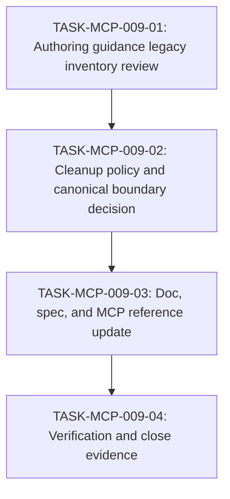

# WORK-MCP-009: Authoring guidance canonicalization and legacy cleanup

- **id**: WORK-MCP-009
- **status**: done
- **date**: 2026-06-02
- **source_requirement**: REQ-MCP-009
- **impact_refs**:
  - SPEC-design-records-mcp-tools
  - SPEC-design-records-mcp-schema
  - docs/doc-policy.md
  - docs/guides/adr-authoring.md
  - docs/guides/spec-authoring.md
  - docs/guides/requirement-authoring.md
  - docs/guides/work-item-authoring.md
  - docs/guides/task-authoring.md
  - docs/guides/investigation-authoring.md
  - docs/guides/artifact-boundary.md
  - docs/adr-authoring-guide.md
  - docs/spec-authoring-guide.md
  - docs/requirements/README.md
  - docs/work-items/README.md
  - docs/tasks/README.md
  - docs/investigations/README.md
- **tasks**:
  - TASK-MCP-009-01
  - TASK-MCP-009-02
  - TASK-MCP-009-03
  - TASK-MCP-009-04

## Goal

REQ-MCP-009 を解消するため、authoring guidance の canonical source と legacy guide / README の責務境界を整理し、必要な docs / spec / MCP reference update と検証 evidence まで完了できる作業フローを確立する。

最終的には、`docs/guides/*.md` と Design Records MCP の authoring guidance retrieval を正本として扱うか、または例外的に残す legacy entrypoint の責務を明確化し、将来の assistant / reviewer が旧文書を二重正本として誤読しない状態にする。

## Boundary

- 本 work item は authoring guidance の canonical source 判断、legacy guide / README の cleanup classification、必要な docs / spec / MCP reference update、close verification を所有する。
- 本 work item は workflow artifact metadata validation strictness の再判断を所有しない。WORK-MCP-006 の scope を再オープンしない。
- 本 work item は REQ-MCP-008 authoring transaction support の実装を所有しない。TASK-MCP-009-03 で MCP reference update が必要になった場合も、authoring guidance catalog / retrieval reference の範囲に留める。
- Accepted ADR の supersession は、この work item の通常 scope には含めない。後続 task が明示的に必要と判断した場合のみ、別 artifact として扱う。
- Legacy docs の削除や薄型化は、TASK-MCP-009-02 の cleanup policy decision 前には行わない。

## Impact Scope

| layer | expected handling |
|---|---|
| requirement | REQ-MCP-009 の required outcome を満たし、work item relation と close evidence を同期する |
| authoring guides | `docs/guides/*.md` の canonical responsibility と overlap を確認する |
| legacy docs | 旧 top-level authoring guides / artifact README を delete / thin entrypoint / keep non-canonical に分類する |
| doc policy | startup / authoring guidance entrypoint wording が canonical boundary と矛盾しないよう必要に応じて更新する |
| spec | Design Records MCP tools / schema spec の guide catalog / retrieval contract 参照に stale wording があれば更新する |
| implementation / tests | guide catalog behavior や source references に実装影響がある場合のみ、必要最小限で更新する |
| verification | metadata relation、stale reference、MCP authoring guidance retrieval を確認し、close evidence を残す |

## Task flow

## Task Candidates

- `TASK-MCP-009-01`: `docs/guides/*.md` と旧 top-level authoring guides / artifact README の重複・差分・入口責務を inventory として整理する。削除や薄型化は行わない。
- `TASK-MCP-009-02`: Inventory をもとに cleanup policy を判断し、対象ファイルごとに delete / thin entrypoint / keep non-canonical を分類する。曖昧さが残る場合は reviewer handoff を行う。
- `TASK-MCP-009-03`: Cleanup policy に従い、doc-policy / guides / legacy docs / Design Records MCP specs / MCP implementation or tests を必要範囲で更新する。
- `TASK-MCP-009-04`: validate_records、stale reference check、MCP authoring guidance retrieval verification を行い、完了可能なら WORK-MCP-009 / REQ-MCP-009 の close evidence と status を同期する。

## Completion Condition

以下を満たしたとき、本 work item を `done` にできる。

- `docs/guides/*.md` と legacy authoring docs / artifact README の overlap inventory が完了している。
- Authoring guidance canonical source と legacy docs の扱いが明確に判断されている。
- 対象ファイルごとの cleanup classification が記録されている。
- TASK-MCP-009-02 の decision に従い、必要な docs / spec / MCP reference update が完了している。
- REQ-MCP-008 authoring transaction support、WORK-MCP-006 metadata validation strictness、accepted ADR supersession を不要に再オープンしていない。
- `validate_records` で `REQ-MCP-009`, `WORK-MCP-009`, and `TASK-MCP-009-01` through `TASK-MCP-009-04` の metadata relation が確認されている。
- Stale reference check と MCP authoring guidance retrieval verification の結果が evidence として残っている。
- Close 可能な場合は `WORK-MCP-009` と `REQ-MCP-009` の status / evidence が同期されている。

## Current blockers

- None.

## Progress summary

- 2026-06-02: REQ-MCP-009 から起票。Legacy docs の削除判断は TASK-MCP-009-02 まで保留し、REQ-MCP-008 authoring transaction implementation は explicit exclusion とした。
- 2026-06-02: TASK-MCP-009-01 で legacy guide / README inventory を完了し、旧 top-level guides / artifact README が二重正本として読まれる risk と legacy-only material を整理した。
- 2026-06-02: TASK-MCP-009-02 で canonical source boundary を Design Records MCP authoring guidance retrieval と guide IDs に寄せる方針を決め、legacy docs を compatibility entrypoint / thin directory entrypoint / keep non-canonical に分類した。
- 2026-06-02: TASK-MCP-009-03 で cleanup policy に従い legacy entrypoints、artifact README、`docs/TASKS.md`、関連 concept specs を更新した。MCP implementation は、removed legacy file dependency がなかったため変更不要と判断した。
- 2026-06-02: TASK-MCP-009-04 で close verification を完了した。`validate_records` は REQ-MCP-009 / WORK-MCP-009 / TASK-MCP-009-01..04 すべて `ok: true`, `diagnostics: null`。`list_authoring_guides` は canonical guide IDs `adr-authoring`, `artifact-boundary`, `investigation-authoring`, `requirement-authoring`, `spec-authoring`, `task-authoring`, `work-item-authoring` を返し、対象全 guide ID の `get_authoring_guidance` が成功した。Targeted stale wording search では legacy docs / README を canonical authoring guidance owner とする current-facing wording は見つからなかった。Plain `git diff --check` for tracked modified files returned exit code 0; untracked closeout files were checked with `git diff --no-index --check -- NUL <file>` and showed only line-ending normalization warnings, with no whitespace errors. REQ-MCP-008 / WORK-MCP-006 / accepted ADR supersession は再オープンしていない。
