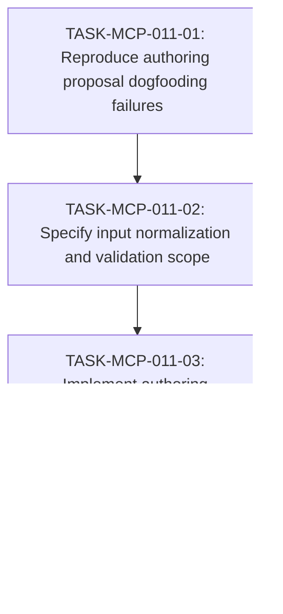

# WORK-MCP-011: Authoring proposal contract and validation fixes

- **id**: WORK-MCP-011
- **status**: done
- **date**: 2026-06-02
- **source_requirement**: REQ-MCP-011
- **impact_refs**:
  - REQ-MCP-011
  - REQ-MCP-012
  - REQ-MCP-008
  - ADR-093
  - SPEC-design-records-mcp-tools
  - SPEC-design-records-mcp-schema
- **tasks**:
  - TASK-MCP-011-01
  - TASK-MCP-011-02
  - TASK-MCP-011-03
  - TASK-MCP-011-04

## Goal

Fix the Design Records MCP authoring proposal bugs found during dogfooding so create/update proposal behavior is predictable, proposal-local, and documented.

This work item primarily closes `REQ-MCP-011` and also includes the closely coupled validation-scope fix captured by `REQ-MCP-012`.

## Boundary

- This work item owns authoring proposal input normalization and proposal validation scope isolation for Design Records MCP authoring transactions.
- This work item owns the required spec/schema updates, implementation changes, regression tests, and runtime smoke evidence for the observed dogfooding failures.
- This work item does not own cleanup of unrelated existing repository validation errors.
- This work item does not reopen `REQ-MCP-008` / `WORK-MCP-008`; it treats authoring transaction support as existing functionality that now needs bug-fix hardening.
- This work item does not implement spec skeleton creation or `SPEC-new` support.

## Impact Scope

| layer | expected handling |
|---|---|
| requirements | `REQ-MCP-011` is the source requirement; `REQ-MCP-012` is included as coupled scope and should be related by task evidence or a follow-up work item if split becomes necessary |
| ADR | `ADR-093` is checked for authoring transaction model consistency; supersession is not expected unless the transaction model itself changes |
| spec | `SPEC-design-records-mcp-tools` and/or `SPEC-design-records-mcp-schema` are updated to define input normalization and validation-scope behavior |
| implementation | `propose_record_create` request normalization, body/fields handling, ID/domain handling, and proposal validation scope are corrected |
| tests | regression tests cover duplicate ID handling, domain normalization, body/fields behavior, and unrelated diagnostic isolation |
| verification | targeted Go tests and runtime smoke verify proposal creation without unrelated validation pollution |

## Task flow

## Task Candidates

- `TASK-MCP-011-01`: Reproduce and classify the observed `propose_record_create` failures: `body`/`fields` precedence, `fields.id` duplication, domain case mismatch, and unrelated diagnostics during proposal validation.
- `TASK-MCP-011-02`: Update the MCP tools/schema spec to define the accepted behavior for authoring create inputs and proposal validation scope.
- `TASK-MCP-011-03`: Patch Design Records MCP implementation for input normalization and validation scope isolation.
- `TASK-MCP-011-04`: Add regression tests, run targeted Go tests, perform no-write runtime smoke, and update close evidence.

## Completion Condition

The work item can be closed when:

- `REQ-MCP-011` input normalization behavior is specified and covered by tests.
- `REQ-MCP-012` proposal validation scope behavior is specified and covered by tests or explicitly split into a follow-up work item with preserved traceability.
- `propose_record_create` can create a proposal for a new MCP requirement without requiring duplicate `fields.id` when top-level `id` is sufficient, unless the final spec explicitly rejects that design.
- Lowercase domain input such as `mcp` is either accepted by normalization or rejected with a documented, actionable diagnostic consistent with the public contract.
- Supplying both `body` and `fields` is either rejected as ambiguous or handled according to an explicit documented precedence rule.
- Proposal diagnostics for unrelated existing records are not mixed into proposal-local blocking diagnostics.
- Targeted tests for `internal/designrecords` and `internal/designrecordsmcp` pass.
- Runtime smoke demonstrates no-write proposal creation without unrelated repository validation pollution.

## Current blockers

- Existing unrelated repository validation errors may affect runtime smoke until proposal validation scope isolation is implemented. They should be treated as test fixtures for isolation behavior, not as blockers requiring cleanup in this work item.

## Progress summary

- 2026-06-02: Created from dogfooding failures in Design Records MCP authoring transactions. Initial scope intentionally covers both `REQ-MCP-011` and coupled `REQ-MCP-012` because the bugs appeared in the same authoring proposal path.
- 2026-06-02: Completed `TASK-MCP-011-02` spec contract update for create input normalization and proposal-local validation scope; implementation remains pending for `TASK-MCP-011-03`.
- 2026-06-02: Completed `TASK-MCP-011-03` implementation for create input normalization, case-insensitive domain comparison, proposal-local validation filtering, and semantic ref source preservation; targeted and package Go tests passed.
- 2026-06-02: Completed `TASK-MCP-011-04` regression and runtime smoke verification. Targeted and package Go tests passed; JSON-RPC smoke confirmed create input normalization, lowercase domain handling, proposal-local diagnostic isolation, and accept-time pre-write validation. No unrelated repository validation errors were fixed.
