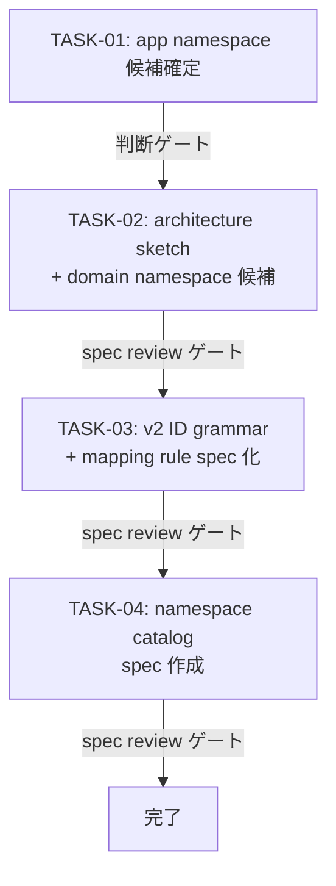

# WORK-PRODUCT-001: App and domain namespace model の定義と v2 artifact ID grammar 仕様化

- **id**: WORK-PRODUCT-001
- **status**: done
- **date**: 2026-06-07
- **source_requirement**: REQ-PRODUCT-001
- **impact_refs**:
  - ADR-095
  - ADR-096
- **tasks**:
  - TASK-PRODUCT-001-01
  - TASK-PRODUCT-001-02
  - TASK-PRODUCT-001-03
  - TASK-PRODUCT-001-04

## Goal

app namespace と domain namespace を分離した namespace model を定義し、v2 artifact ID grammar を仕様化する。namespace catalog の初版を作成し、REQ-PRODUCT-001 の Required Outcome を解消する。

## Boundary

このWORKが所有するもの:

- app namespace と domain namespace の分離モデルの定義
- v2 artifact ID grammar の spec 化
- namespace catalog 初版（DRMCP / BPDSL / PRODUCT を含む確定 app namespace 一覧）
- 各 app の architecture sketch と domain namespace の割り当て

このWORKが所有しないもの:

- 既存 artifact の v2 ID への migration（ADR-096 で非実施決定）
- namespace-aware MCP API の実装
- Design Records UI の実装
- major-version migration の最終互換・エイリアス・ロールバックポリシー

## Impact Scope

- 新規 spec file: namespace model / namespace catalog
- REQ-PRODUCT-001: work_items への本 WORK 反映
- 将来の WORK の前提条件: namespace-aware layout、MCP discovery、major-version migration

## Task flow

## Task Candidates

- TASK-PRODUCT-NNN-01: app namespace 候補一覧の整理（判断ゲート）
- TASK-PRODUCT-NNN-02: 各 app architecture sketch + domain namespace 候補リストアップ（spec review ゲート）
- TASK-PRODUCT-NNN-03: v2 artifact ID grammar + mapping rule の spec 化（spec review ゲート）
- TASK-PRODUCT-NNN-04: namespace catalog spec 作成（spec review ゲート）

## Completion Condition

- namespace model spec が存在し、app/domain namespace の分離が記述されている
- v2 artifact ID grammar が spec に記述されている
- namespace catalog spec が存在し、少なくとも DRMCP / BPDSL / PRODUCT を含む
- REQ-PRODUCT-001 に本 WORK が反映されている

## Evidence
- docs/spec/concepts/namespace-model/index.md 作成（app namespace 定義・各 app architecture sketch・domain namespace catalog・v2 ID grammar・mapping rule）
- ADR-095: YAML DSL と Design Records MCP の結合境界
- ADR-096: 既存 artifact の PRODUCT namespace 所有と per-app migration 非実施
- REQ-PRODUCT-002 起票: domain namespace 内 subdomain grouping model
- REQ-PRODUCT-001 の Required Outcome 5件全て充足
