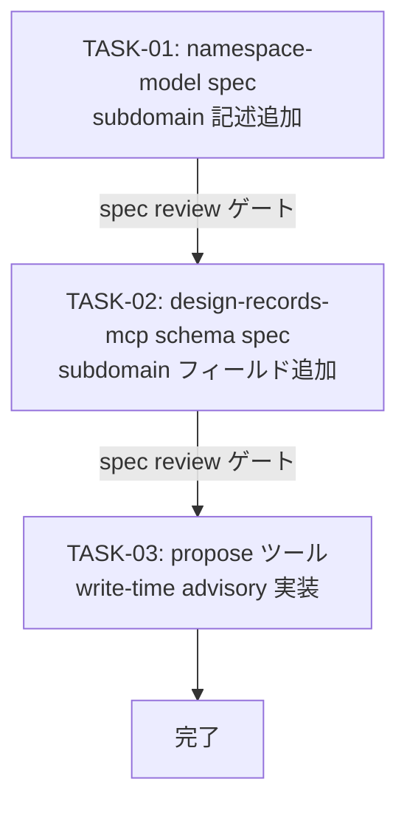

# WORK-PRODUCT-002: Subdomain grouping model の仕様化と propose ツール write-time advisory 実装

- **id**: WORK-PRODUCT-002
- **status**: not_started
- **date**: 2026-06-07
- **source_requirement**: REQ-PRODUCT-002
- **impact_refs**:
- **tasks**:

## Goal

REQ-PRODUCT-002 が定義した subdomain grouping model を spec に記述し、propose 系ツールの write-time advisory として実装する。

## Boundary

このWORKが所有するもの:

- namespace-model spec への subdomain model 記述追加
- design-records-mcp schema spec への `subdomain:` フィールド定義追加
- propose 系ツール（propose_record_create / propose_record_update）への write-time advisory 実装

このWORKが所有しないもの:

- 既存 records への `subdomain:` フィールドの一括付与
- subdomain を軸にした検索・フィルタリング API の追加
- UI での subdomain 表示

## Task flow

## Task Candidates

- TASK-01: `docs/spec/concepts/namespace-model/index.md` に subdomain model を追記（subdomain の定義・label 形式・動的導出・write-time advisory の概要）→ spec review ゲート
- TASK-02: `SPEC-design-records-mcp-schema` に `subdomain:` フィールドを追加（任意フィールド、文字列型）→ spec review ゲート
- TASK-03: propose_record_create / propose_record_update が `subdomain` 新規値を検出した際に同 domain 内の既存値を列挙して返す（block なし）

## Completion Condition

- namespace-model spec に subdomain model が記述されている
- design-records-mcp schema spec に `subdomain:` フィールドが定義されている
- propose 系ツールが新規 subdomain 値を検出した場合に既存値を列挙する advisory を返す
- REQ-PRODUCT-002 に本 WORK が反映されている
