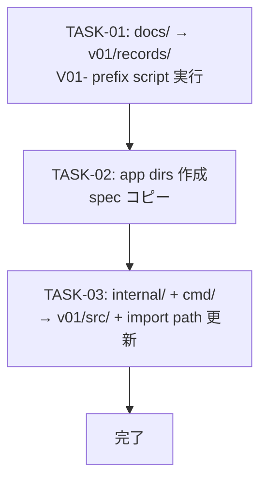

# WORK-PRODUCT-004: Repository layout migration execution — v01/ restructure and V01- ID rename

- **id**: WORK-PRODUCT-004
- **status**: not_started
- **date**: 2026-06-08
- **source_requirement**: REQ-PRODUCT-003
- **impact_refs**:
  - WORK-PRODUCT-003
- **tasks**:

## Goal

ADR-097（app namespace-first layout）と ADR-099（V01- epoch prefix）で確定した方針に基づき、repository の物理移行を実行する。

- Phase 1: `docs/` → `v01/records/`、V01- rename script、app namespace dirs 作成・spec コピー
- Phase 2: `internal/` + `cmd/` → `v01/src/`、Go import path 書き換え・build 確認

MCP multi-root 対応（Phase 3）は本 WORK のスコープ外とし、別 WORK に委ねる。

## Boundary

このWORKが所有するもの:

- `docs/` → `v01/records/` への rename
- 全 artifact ID への `V01-` prefix 付与（ファイル名・id フィールド・cross-reference の一括更新）
- `drmcp/` / `bpdsl/` / `product/` ディレクトリ作成
- 各 app namespace の `records/spec/` への spec ファイルコピー（v01/ からの複製）
- `internal/` + `cmd/` → `v01/src/` への移動と Go import path 書き換え
- Go build の通過確認
- MCP の scan root を `v01/records/` に変更（v01/ が従来の docs/ として機能し続けるための最小変更）
- CLAUDE.md 等のパス参照更新

このWORKが所有しないもの:

- MCP の multi-root 対応（v01/ + 各 app records/ を横断インデックスする機能）
- 新規 artifact の各 app namespace dirs への移行
- v01/ コンテンツの段階的廃止・削除

## Task flow

## Task Candidates

- TASK-01: `docs/` を `v01/records/` に rename し、全 Markdown の artifact ID（ファイル名・`id:` フィールド・cross-reference）に `V01-` prefix を付与するスクリプトを実行する。MCP の scan root を `v01/records/` に更新し、動作確認する
- TASK-02: `drmcp/records/spec/`・`bpdsl/records/spec/`・`product/records/spec/` を作成し、INV-PRODUCT-001 の分類に基づき対応する spec ファイルを v01/ からコピーする。CLAUDE.md 等のパス参照を更新する
- TASK-03: `internal/` と `cmd/` を `v01/src/` に移動し、全 Go ファイルの import path を新しいパスに書き換える。`go build` / `go test` が通ることを確認する

## Completion Condition

- `v01/records/` に全既存 design records が存在し、全 artifact ID が `V01-` prefix 付きになっている
- `drmcp/` / `bpdsl/` / `product/` がそれぞれ `records/spec/` を持つ
- `internal/` と `cmd/` が `v01/src/` に移動し、Go build / test が通る
- MCP が `v01/records/` をスキャンして既存 records を返せる
- REQ-PRODUCT-003 の migration target 宣言が物理的に実現されている
