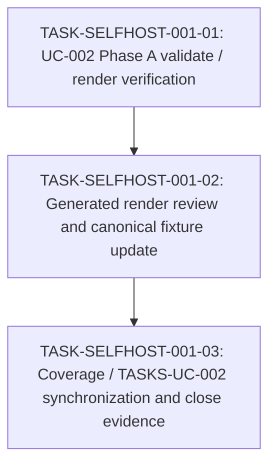

# WORK-SELFHOST-001: Verify UC-002 Phase A canonical render and coverage

- **id**: WORK-SELFHOST-001
- **status**: fixture_pending
- **date**: 2026-05-31
- **source_requirement**: REQ-SELFHOST-001
- **impact_refs**:
  - ADR-057
  - REQ-DATA-001
  - WORK-DATA-001
  - REQ-RESOLVE-001
  - WORK-RESOLVE-001
- **tasks**:
  - TASK-SELFHOST-001-01

## Goal

Establish UC-002 Phase A as a verified current baseline by validating and rendering the MCP public contract YAML, generating canonical render artifacts, and synchronizing UC-002 coverage / gap tracking with the post-M15 and post-RESOLVE state.

## Boundary

### Included

- Validate UC-002 Phase A YAML against the current resolver / data-layer baseline.
- Generate canonical UC-002 Phase A render artifacts under the UC-002 `renders/` directory.
- Review generated render outputs for expected Phase A coverage:
  - project index
  - MCP group index
  - DAG renders for the MCP tool tasks
  - ER render behavior, including the expected limitation for context-store contract schemas
- Update UC-002 coverage and TASKS-UC-002 to distinguish current remaining gaps from issues already resolved by M15 or RESOLVE work.
- Record verification evidence in future task artifacts and, when ready, this work item close outcome.

### Excluded

- Phase B internal layer blueprinting.
- M14 close or legacy M14 status changes.
- Changes to legacy M14 / M14a / M15 records.
- Helper model, tagged union, DAG TypeRef hint, or MCP semantic identity implementation.

## Impact Scope

| layer | current state | handling in this work item |
|---|---|---|
| source requirement | `REQ-SELFHOST-001` captured | This work item resolves its Phase A verification need |
| legacy record | M14 is paused | Do not close or edit M14 in this work item |
| prerequisite data work | `WORK-DATA-001` done | Treat M15 F1 boundary as closed baseline |
| prerequisite resolver work | `WORK-RESOLVE-001` done | Treat duplicate task QID / unresolved flow issue as resolved |
| UC-002 YAML | Phase A files are placed | Validate and render current YAML |
| UC-002 renders | Canonical render artifacts are not yet generated/reviewed | Generate and review |
| UC-002 coverage | Coverage says render/test are unconfirmed | Synchronize after verification |

## Task flow

## Task Candidates

- `TASK-SELFHOST-001-01`: UC-002 Phase A validate / render verification.
- `TASK-SELFHOST-001-02`: Generated render review and canonical fixture update.
- `TASK-SELFHOST-001-03`: Coverage / TASKS-UC-002 synchronization and close evidence.

Task artifacts are intentionally not created in this migration step. Therefore these candidate IDs are shown only in the body and are not listed in the metadata `tasks` field.

## Completion Condition

This work item can be marked `done` when UC-002 Phase A validate / render evidence is recorded, canonical renders are reviewed, coverage and gap logs reflect the current baseline, and no M14a or M15 closed scope has been reopened.
