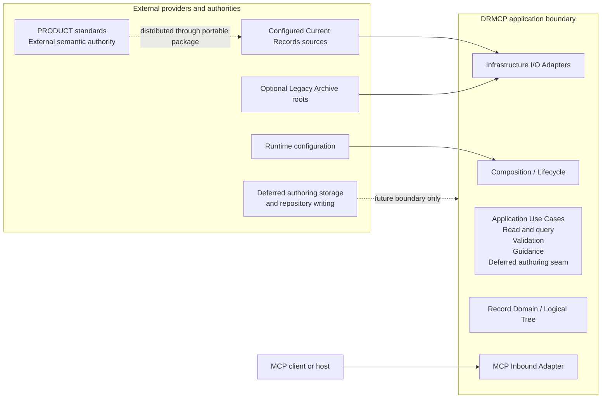

# Concept: Application boundary and components

- **id**: `spec:drmcp.application_architecture.application_boundary_and_components`
- **status**: draft
- **date**: 2026-07-04
- **parent**: `spec:drmcp.application_architecture`

## What this is

Whole-application scope and stable component model for DRMCP. This view owns operation-family classification, actors, providers, and the five application-level responsibility boundaries.

## Concept model

### Operation families

The application boundary contains eleven current public operations.

| family | public operations | treatment |
|---|---|---|
| Read and query | `list_records`, `get_records`, `resolve_reference` | Active Application Use Cases. |
| Validation | `validate_records` | Active Application Use Case. |
| Guidance | `list_authoring_guides`, `get_authoring_guidance` | Active Application Use Cases. |
| Authoring extension | Five current proposal and write operations | Deferred internals. Preserve only the MCP-to-use-case seam. |

The authoring extension family remains inside the whole-application boundary. Current architecture does not define its components, retained state, transaction behavior, or write semantics.

### Application-level components

DRMCP has five application-level components.

| component | owned responsibility | excluded responsibility |
|---|---|---|
| Composition / Lifecycle | Validate configuration, construct dependencies, wire the application, start the server, and shut resources down. | Operation policy, record semantics, and concrete source behavior. |
| MCP Inbound Adapter | Decode MCP requests, map protocol inputs, invoke Application Use Cases, and encode selected results. | Application policy, domain semantics, result reclassification, and concrete source access. |
| Application Use Cases | Own operation sequencing, request-scoped orchestration, source selection, fixed Guidance scope, response projection, and operation-specific result policy. | Record semantics and concrete I/O. |
| Record Domain / Logical Tree | Own current record models, immutable logical structures, identity, retrieval primitives, resolution, section representation, and validation behavior. | MCP transport, application sequencing, configuration, and I/O. |
| Infrastructure I/O Adapters | Enumerate and read Current Records and Legacy Archive sources behind inward-owned source contracts. | Operation policy, domain-result classification, and cross-adapter orchestration. |

## Rules

- The five components are responsibility boundaries.
- A component does not require one package, module, type, or runtime object.
- Parser, resolver, validator, snapshot builder, index, individual source, and Guidance projection helper are not top-level components.
- Portable standards use the normal Current Records model under the `design_records` app namespace.
- Guidance tools remain operation-specific Application Use Cases over shared record-query orchestration.
- A later top-level split requires an independent lifecycle, owner, substitution boundary, or cross-component contract.
- Deferred Authoring preserves the same MCP Inbound Adapter to Application Use Case seam.
- Authoring internals must not be inferred from current stale or incomplete operation specifications.

Detailed dependency direction is owned by `spec:drmcp.application_architecture.dependency_and_responsibility`.

## Boundary

### Inbound actor

The MCP client or host is the inbound actor. MCP transport is the external protocol boundary.

### External providers

| provider | application use |
|---|---|
| Configured Current Records sources | Host app records and the portable `design_records` spec tree. |
| Optional Legacy Archive roots | Exact issued-ID compatibility source access. |
| PRODUCT standards | External semantic authority. The portable package distributes these semantics. |
| Runtime configuration | Server-lifetime source selection and wiring supplied to Composition / Lifecycle. |
| Deferred authoring storage and repository writing | External boundaries acknowledged for future authoring design. No active internal contract is defined. |

### Excluded actors and concerns

- Retired operations and tombstones.
- Existing brewprint MCP internals.
- Model-provider behavior.
- Unspecified host-level policy.
- Proposal or body-cache mechanics.
- Write transaction and post-write validation design.

## Non-goals

- Package layout.
- Concrete source-port interfaces.
- Runtime object graphs.
- Operation request and response schemas.
- Authoring state or transaction design.

## Related specs

| ref | relation |
|---|---|
| `spec:drmcp.application_architecture` | Parent Overview and authoritative four-view map. |
| `spec:drmcp.application_architecture.dependency_and_responsibility` | Defines component dependencies and responsibility placement. |
| `spec:drmcp.application_architecture.runtime_and_state` | Defines use-case collaboration and state lifetime. |
| `spec:drmcp.application_architecture.failure_and_evolution` | Defines architecture-return triggers for boundary changes. |
