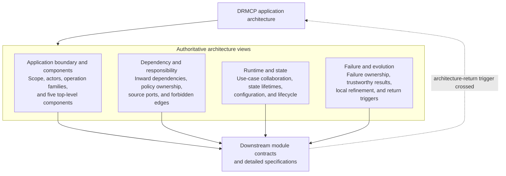

# Overview: DRMCP application architecture

- **id**: `spec:drmcp.application_architecture`
- **status**: draft
- **date**: 2026-07-04
- **parent**: root

## What this is

Canonical whole-application architecture for DRMCP. This Overview owns the four-view topology and the boundary to downstream contract design.

## Current contract

DRMCP uses one whole-application boundary for eleven public operations.

The current architecture has five application-level responsibility components. Dependencies point inward. Read, Validation, and Guidance use one fresh immutable request-scoped Current Records snapshot. Legacy Archive remains separate compatibility state.

The architecture defines ownership, collaboration, lifecycle, failure semantics, and evolution boundaries. It does not define module contracts or implementation structure.

The durable rationale is recorded by:

- `DRMCP-ADR-MCP-010` for the five-component whole-application model;
- `DRMCP-ADR-MCP-011` for inward ownership and Guidance query aliases;
- `DRMCP-ADR-MCP-012` for unified Current Records state and application lifecycle.

`DRMCP-ADR-MCP-002` and `DRMCP-ADR-MCP-007` through `DRMCP-ADR-MCP-009` are superseded historical authority.

## Non-goals

- Exact module contracts.
- Package or file layout.
- Interfaces, types, functions, methods, or constructors.
- Parser, resolver, validator, or adapter algorithms.
- Authoring transaction and proposal-state design.
- Production implementation and tests.

## Topic map

The four child views are the authoritative partition of the current application architecture. Each architecture decision has one primary view. Other views use canonical cross-references instead of duplicating the same normative rule.

## Topics

| title | kind | ref | summary |
|---|---|---|---|
| Application boundary and components | Concept | `spec:drmcp.application_architecture.application_boundary_and_components` | Defines scope, actors, operation families, and the five application-level components. |
| Dependency and responsibility | Concept | `spec:drmcp.application_architecture.dependency_and_responsibility` | Defines inward dependencies, responsibility placement, source ports, and forbidden edges. |
| Runtime and state | Concept | `spec:drmcp.application_architecture.runtime_and_state` | Defines request collaboration, record-state lifetimes, source separation, configuration, and deferred authoring state. |
| Failure and evolution | Concept | `spec:drmcp.application_architecture.failure_and_evolution` | Defines failure ownership, trustworthy-result semantics, local refinement, and architecture-return triggers. |

## Boundary

Downstream module contracts may refine the accepted components and ports. Detailed specifications may define concrete operation contracts inside this architecture.

Downstream work must return to application-architecture decision work when a proposed change crosses an architecture-return trigger in `spec:drmcp.application_architecture.failure_and_evolution`.

## Related specs

| ref | relation |
|---|---|
| `spec:drmcp.application_architecture.application_boundary_and_components` | Authoritative boundary and component view. |
| `spec:drmcp.application_architecture.dependency_and_responsibility` | Authoritative dependency and responsibility view. |
| `spec:drmcp.application_architecture.runtime_and_state` | Authoritative runtime and state view. |
| `spec:drmcp.application_architecture.failure_and_evolution` | Authoritative failure and evolution view. |
