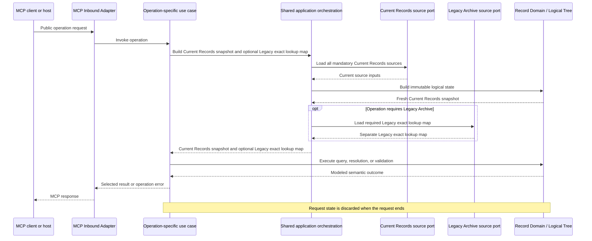

# Concept: Runtime and state

- **id**: `spec:drmcp.application_architecture.runtime_and_state`
- **status**: draft
- **date**: 2026-07-04
- **parent**: `spec:drmcp.application_architecture`

## What this is

Runtime collaboration and state-lifetime contract for DRMCP. This view owns Application Use Case collaboration, request-scoped record state, source separation, configuration lifecycle, and deferred mutable authoring state.

## Concept model

### Application collaboration

Application Use Cases contain two internal responsibility groups.

| group | responsibility |
|---|---|
| Operation-specific use cases | Own public-operation policy, sequencing, source-capability selection, and result semantics. |
| Shared application orchestration | Reuse request-scoped source loading and logical-state assembly across operations. |

Public use cases do not call one another. They use shared application orchestration and Domain capabilities.

Shared application orchestration is not a public use case. It is not a seventh top-level component.

The five top-level components remain authoritative in `spec:drmcp.application_architecture.application_boundary_and_components`.

### Request-scoped record state

Each Read, Validation, or Guidance request builds one fresh immutable Current Records snapshot.
The request uses that snapshot from start to finish and discards it when the request ends.

Current Records and Legacy Archive remain separate capabilities and separate request state.

| source capability | request state | purpose |
|---|---|---|
| Current Records | Fresh immutable Current Records snapshot | Host app records, portable `design_records` package Specs, one active logical tree and index, current identity state, validation subjects, and relation inputs. |
| Legacy Archive | Fresh immutable Legacy lookup state when required | Exact issued-ID lookup for retrieval, resolution, and relation validation. |

Current Records includes every configured mandatory current source.
The portable package is registered as a spec-tree source with `app_namespace: design_records`.
Package Specs use the same discovery, identity, logical-tree, index, retrieval, resolution, and validation semantics as other current Specs.

Current Records and Legacy Archive use separate source contracts. They are not merged into one generic compatibility state.

Each operation-specific use case decides whether Legacy state is required. Shared application orchestration may load Legacy state through its distinct port.

Guidance builds and consumes the normal Current Records snapshot. Guidance adds no package-specific snapshot or source lifecycle.

### Server lifecycle

Composition / Lifecycle owns the server-lifetime sequence.

1. Load and validate runtime configuration.
2. Construct concrete components.
3. Wire concrete adapters to inward-owned contracts.
4. Start the MCP server.
5. Shut resources down in a defined order.

Runtime configuration is immutable for one server lifetime.
Configuration selects the bundled or explicit portable spec-tree root and associates it with `design_records`.
An explicit package root does not silently fall back to the bundled root.
Exact configuration serialization remains downstream.

Active use cases receive validated dependencies. They do not reload configuration, construct adapters, start the server, or own shutdown.

## Rules

DRMCP does not keep these record-state mechanisms in the active architecture:

- process-wide mutable record index;
- shared record cache across requests;
- package-specific index or snapshot;
- filesystem watcher;
- background refresh;
- incremental index patching;
- stale-snapshot reuse after source failure.

Filesystem changes become visible to the next request that builds the affected state.
A request does not continue with incomplete or untrustworthy mandatory state.
Failure projection is owned by `spec:drmcp.application_architecture.failure_and_evolution`.

### Deferred authoring state

Proposal and body-cache state design is deferred.
Write transaction and post-write validation design is deferred.

Request-spanning mutable authoring state requires a return to application-architecture decision work before downstream design proceeds.
The same return is required before deciding write atomicity, rollback, affected-set validation, repository mutation, or consistency between retained state and filesystem state.

The active architecture does not decide:

- proposal store or body cache;
- TTL, retention, cleanup, or restart behavior;
- concurrency or persistence behavior;
- write atomicity or rollback;
- affected-set validation;
- post-write consistency behavior.

#### Non-binding example — not part of the active architecture contract

| responsibility area | possible future placement |
|---|---|
| Proposal identity, states, transitions, and invariants | Domain. |
| Propose, get, accept, and discard sequencing | Application. |
| Proposal storage, body storage, and repository writes | Infrastructure. |
| Store construction, wiring, cleanup, and shutdown | Composition / Lifecycle. |

This example preserves a possible cross-layer split. It does not establish a component contract, state model, storage design, or transaction design.

## Boundary

This view defines lifetimes and responsibility placement. It does not define snapshot data types, loading algorithms, concrete ports, persistence APIs, or authoring transaction steps.

## Non-goals

- Snapshot implementation structure.
- Cache or watcher design.
- Proposal and body-cache contracts.
- Repository write protocol.
- Concrete startup or shutdown APIs.

## Related specs

| ref | relation |
|---|---|
| `spec:drmcp.application_architecture` | Parent Overview and authoritative four-view map. |
| `spec:drmcp.application_architecture.application_boundary_and_components` | Owns the five-component graph. |
| `spec:drmcp.application_architecture.dependency_and_responsibility` | Owns source-contract direction and Guidance alias ownership. |
| `spec:drmcp.application_architecture.failure_and_evolution` | Owns trustworthy-result failure and architecture-return triggers. |
