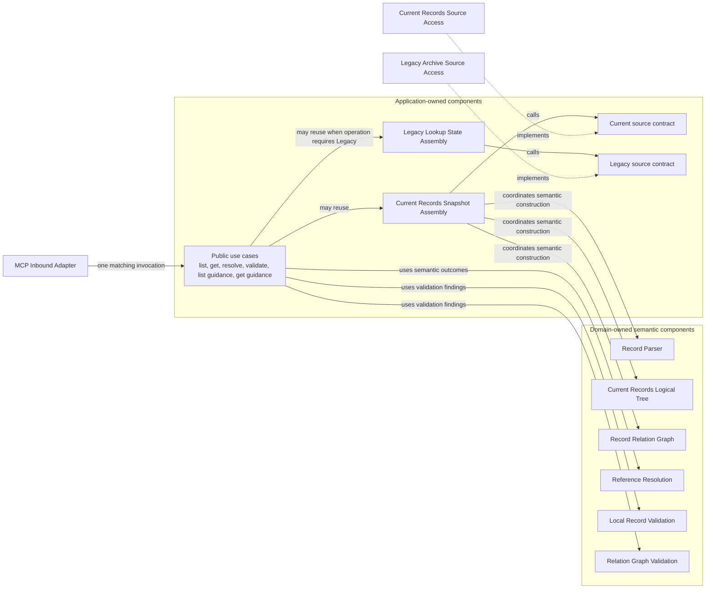
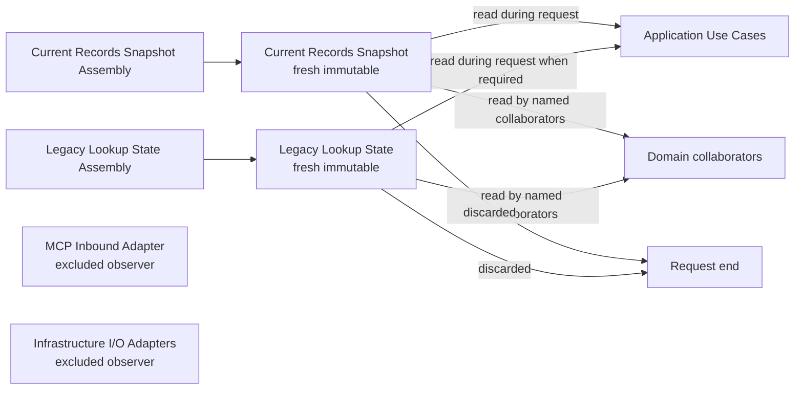

# Concept: Application use case boundary

- **id**: `spec:drmcp.implementation.contracts.application_use_cases.contract_boundary`
- **status**: draft
- **date**: 2026-07-06
- **parent**: `spec:drmcp.implementation.contracts.application_use_cases`

## What this is

Contract baseline for Application Use Cases as module-contract owners.

## Current contract

Application Use Cases own operation policy, request sequencing, shared orchestration, source selection, response projection, and result policy.
They do not own record semantics or concrete I/O.

Active use-case components:

| component | responsibility |
|---|---|
| List Records Use Case | List-records request policy, sequencing, and response projection. |
| Get Records Use Case | Exact retrieval request policy, sequencing, and response projection. |
| Resolve Reference Use Case | Public resolve-reference request policy and response projection. |
| Validate Records Use Case | Validation subject selection, validator orchestration, aggregation, ordering, and response projection. |
| List Authoring Guides Use Case | Fixed Guidance list scope, ordering, and response projection. |
| Get Authoring Guidance Use Case | Exact Guidance detail scope and response projection. |

Shared orchestration components:

| component | responsibility |
|---|---|
| Current Records Snapshot Assembly | Coordinates Current source access, parsing, and Domain semantic construction to produce one fresh immutable Current Records Snapshot for a request. |
| Legacy Lookup State Assembly | Coordinates Legacy Archive source access and exact lookup-state construction when the operation requires Legacy fallback or compatibility lookup. |

Shared orchestration may be reused by operation-specific use cases.
Public use cases do not call one another.

### Application-owned orchestration view

The diagram separates public use cases from shared orchestration.
It does not add an operation behavior Specification.

### Request-state visibility view

Current Records Snapshot and Legacy Lookup State are request-scoped state.
The diagram shows allowed readers and excluded observers.

## Non-goals

- Record parser rules.
- Logical tree identity rules.
- Relation graph algorithms.
- Concrete source enumeration or reading.
- Operation or feature behavior Specifications.

## Concept model

| surface | meaning |
|---|---|
| Public operation request | Transport-neutral input from MCP. |
| Public operation response | Transport-neutral output to MCP. |
| Current Records Snapshot Assembly | Application shared-orchestration component that produces Current Records Snapshot. |
| Legacy Lookup State Assembly | Application shared-orchestration component that produces optional Legacy Lookup State. |
| Current Records Snapshot | Fresh immutable Current request state produced by Current Records Snapshot Assembly. |
| Legacy Lookup State | Optional fresh immutable Legacy request state produced by Legacy Lookup State Assembly. |
| Aggregated validation result | Application projection of validation findings. |
| Guidance projection input | Fixed-scope Guidance projection over Current Records. |

## Rules

| rule | contract |
|---|---|
| One use case per operation | Each public operation maps to one Application Use Case component. |
| No public use-case calls | A public use case never invokes another public use case. |
| Shared orchestration allowed | Operation-specific use cases may reuse internal orchestration and Domain capabilities. |
| Current assembly ownership | Current Records Snapshot Assembly owns request-level orchestration for source access, parsing, Domain construction, completeness handling, and snapshot handoff. |
| Legacy assembly ownership | Legacy Lookup State Assembly owns request-level orchestration for Legacy source access, optional lookup-state construction, and failure handoff. |
| Domain construction boundary | Domain owns semantic structures inside the snapshot; Application owns request-level assembly orchestration. |
| Response projection | Application projects Domain outcomes into operation-specific normal responses, diagnostics, warnings, request errors, or operation errors. |
| Request-state visibility | Application may read Current Records Snapshot and Legacy Lookup State required by the operation. |
| Request-state retention | Application does not retain request state after the request ends. |
| Failure selection | Application selects execution failure when mandatory state is incomplete or untrustworthy. |

## Boundary

Forbidden bypasses:

- A use case must not reload configuration or construct concrete adapters.
- A use case must not perform filesystem I/O directly.
- Assembly components must use inward-owned source-access contracts rather than concrete adapters.
- Assembly components must not retain Current Records Snapshot or Legacy Lookup State after the request ends.
- Assembly components must not move semantic identity, graph, lookup, or validation rules out of Domain.
- A use case must not reproduce Reference Resolution sequencing when Reference Resolution owns the semantic rule.
- Validate Records Use Case must not perform each relation-target lookup itself.
- Guidance use cases must not introduce a separate Guidance source, index, snapshot, cache, or lifecycle.

Downstream detailed contract convergence must define operation-specific preconditions, postconditions, exact fields, and behavior Specifications.
This module-contract baseline is not implementation-ready.

## Related specs

| ref | relation |
|---|---|
| `spec:drmcp.implementation.contracts` | Module-contract root. |
| `spec:drmcp.implementation.application_architecture.runtime_and_state` | Accepted runtime and state authority. |
| `DRMCP-ADR-MCP-013` | Source ADR. |
