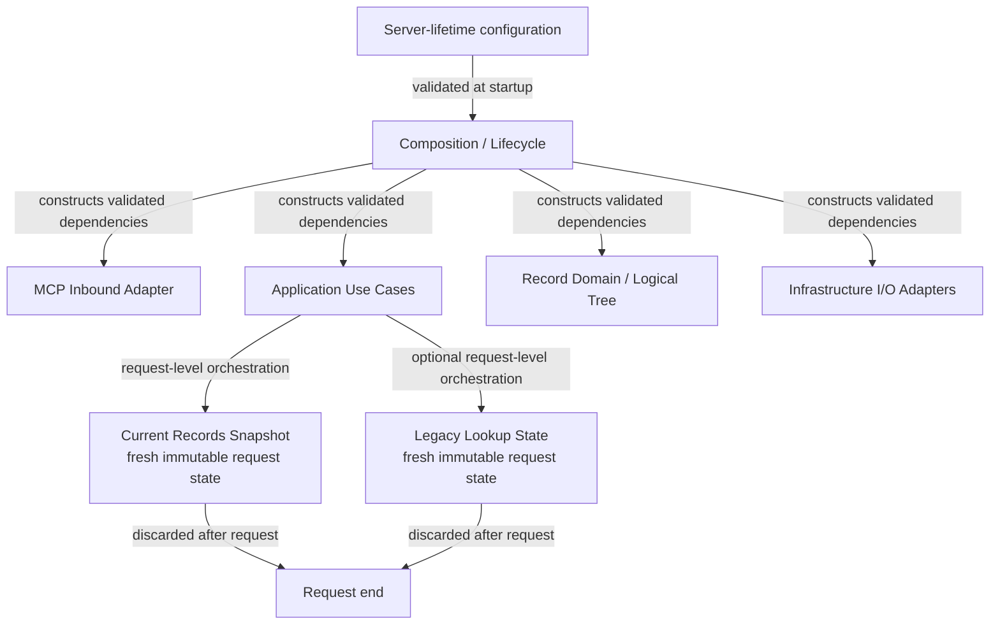

# Concept: Composition lifecycle boundary

- **id**: `spec:drmcp.implementation.contracts.composition_lifecycle.contract_boundary`
- **status**: draft
- **date**: 2026-07-06
- **parent**: `spec:drmcp.implementation.contracts.composition_lifecycle`

## What this is

Contract baseline for Composition / Lifecycle as a module-contract owner.

## Current contract

Composition / Lifecycle owns server-lifetime construction work.
It does not own operation policy, Domain semantics, or source reading semantics.

| concern | owner |
|---|---|
| Startup configuration validation | Composition / Lifecycle. |
| Dependency construction and wiring | Composition / Lifecycle. |
| Server start and ordered shutdown | Composition / Lifecycle. |
| Operation sequencing | Application Use Cases. |
| Record identity and validation semantics | Record Domain / Logical Tree. |
| Concrete source enumeration and reading | Infrastructure I/O Adapters. |

Server-lifetime configuration is visible to active use cases only as validated dependencies.
Composition / Lifecycle does not expose mutable runtime configuration to Domain components.

### Lifecycle and request-state boundary

The diagram shows construction responsibility only.
Request-state assembly belongs to Application Use Cases after startup dependencies exist.

## Non-goals

- Operation-specific request or response policy.
- Parser, resolver, validator, or adapter algorithms.
- Go constructor signatures or package layout.
- Concrete configuration serialization.

## Concept model

| element | meaning |
|---|---|
| Validated dependency | A dependency constructed from startup configuration before use-case invocation. |
| Server-lifetime configuration | Immutable configuration for one server process lifetime. |
| Request state exclusion | Current Records Snapshot and Legacy Lookup State are not owned by Composition / Lifecycle after handoff to use cases. |

## Rules

| rule | contract |
|---|---|
| Lifecycle ownership | Composition / Lifecycle owns startup, dependency construction, wiring, start, and shutdown. |
| No semantic ownership | Composition / Lifecycle does not parse records, resolve refs, validate records, or project operation responses. |
| Validated dependency visibility | Active use cases receive validated dependencies and do not reload configuration. |
| Request-state exclusion | Composition / Lifecycle does not retain request-scoped Current or Legacy state. |
| Failure boundary | Invalid startup configuration prevents server start. Request-time mandatory state failure is selected by Application. |

## Boundary

Forbidden bypasses:

- A use case must not construct concrete source adapters.
- A Domain component must not read startup configuration.
- An Infrastructure adapter must not invoke Composition / Lifecycle to classify Domain outcomes.
- Composition / Lifecycle must not retain a server-wide Current Records index.

## Related specs

| ref | relation |
|---|---|
| `spec:drmcp.implementation.contracts` | Module-contract root. |
| `spec:drmcp.implementation.application_architecture.runtime_and_state` | Accepted runtime and state authority. |
| `DRMCP-ADR-MCP-013` | Source ADR. |
