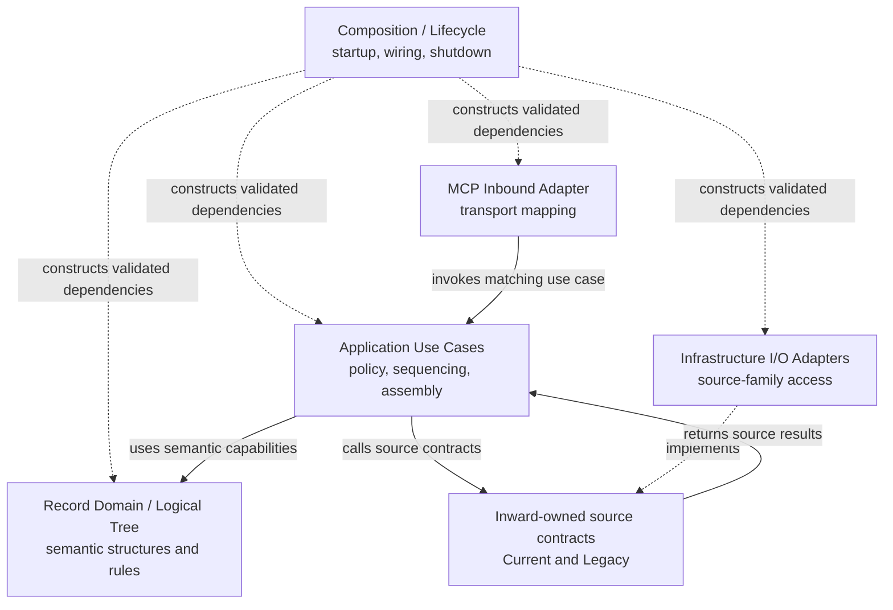

# Index: DRMCP implementation contracts

- **id**: `spec:drmcp.implementation.contracts`
- **status**: draft
- **date**: 2026-07-06
- **parent**: `spec:drmcp.implementation`

## What this is

Navigation entry for DRMCP module contracts derived from the accepted application architecture.

## Topics

| title | kind | ref | summary |
|---|---|---|---|
| Composition lifecycle contracts | Index | `spec:drmcp.implementation.contracts.composition_lifecycle` | Contracts for startup, dependency construction, wiring, configuration visibility, and shutdown boundaries. |
| MCP inbound adapter contracts | Index | `spec:drmcp.implementation.contracts.mcp_inbound_adapter` | Contracts for MCP decoding, application invocation, response encoding, and semantic non-reclassification. |
| Application use case contracts | Index | `spec:drmcp.implementation.contracts.application_use_cases` | Contracts for active use cases, shared orchestration, request-state use, response projection, and public use-case isolation. |
| Record domain and logical tree contracts | Index | `spec:drmcp.implementation.contracts.record_domain_logical_tree` | Contracts for parser, logical tree, relation graph, reference resolution, validation, and domain handoff surfaces. |
| Infrastructure I/O adapter contracts | Index | `spec:drmcp.implementation.contracts.infrastructure_io_adapters` | Contracts for Current Records and Legacy Archive source access behind inward-owned source contracts. |

### Topology view

The diagram is a navigation view only.
It does not imply package layout, Go interfaces, structs, functions, or implementation order.

## Related specs

| ref | relation |
|---|---|
| `spec:drmcp.implementation` | Parent implementation architecture area. |
| `spec:drmcp.application_architecture` | Accepted whole-application architecture authority. |
| `DRMCP-ADR-MCP-013` | Module-contract ADR. |
