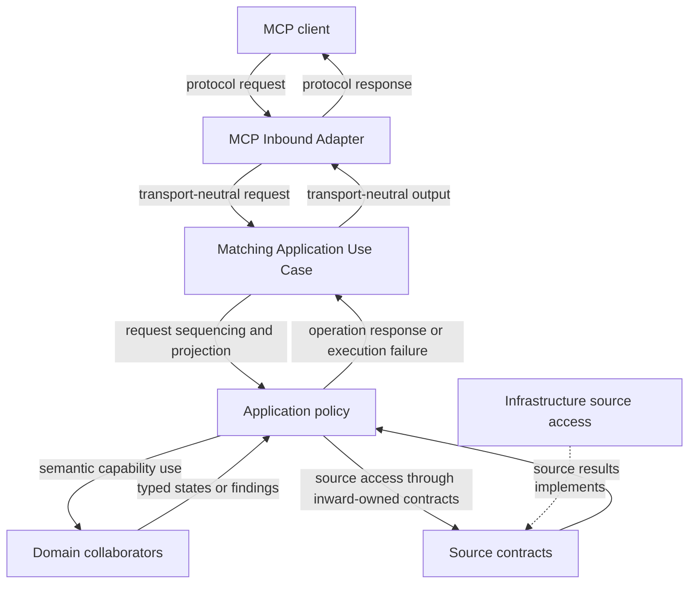

# Concept: MCP inbound adapter boundary

- **id**: `spec:drmcp.implementation.contracts.mcp_inbound_adapter.contract_boundary`
- **status**: draft
- **date**: 2026-07-06
- **parent**: `spec:drmcp.implementation.contracts.mcp_inbound_adapter`

## What this is

Contract baseline for MCP Inbound Adapter as a module-contract owner.

## Current contract

MCP Inbound Adapter owns transport mapping and use-case invocation.
It does not own Application policy, Domain semantics, or Infrastructure access.

| concern | owner |
|---|---|
| MCP protocol decoding | MCP Inbound Adapter. |
| Public operation request mapping | MCP Inbound Adapter. |
| Matching use-case invocation | MCP Inbound Adapter. |
| Public operation response encoding | MCP Inbound Adapter. |
| Operation sequencing and response projection | Application Use Cases. |
| Semantic outcome classification | Application and Domain owners. |

The adapter passes transport-neutral public operation requests to Application Use Cases.
The adapter receives transport-neutral public operation responses or execution failures from Application.

### Request path view

The diagram shows request responsibility.
It does not define a runtime sequence, function call graph, or implementation API.

## Non-goals

- Operation-specific semantic decisions.
- Record lookup, parsing, resolution, or validation behavior.
- Filesystem or Legacy Archive access.
- Go MCP SDK integration details.

## Concept model

| surface | direction | meaning |
|---|---|---|
| Public operation request | MCP to Application | Transport-neutral input. |
| Public operation response | Application to MCP | Transport-neutral normal result, request error, operation error, or execution failure encoding input. |

## Rules

| rule | contract |
|---|---|
| Matching use case | MCP invokes only the Application Use Case for the requested public operation. |
| No use-case chaining | MCP does not route one public operation through another public operation. |
| No semantic reclassification | MCP does not reinterpret Domain outcomes or Application-selected execution failures. |
| No state observation | MCP does not observe Current Records Snapshot or Legacy Lookup State internals. |
| No I/O ownership | MCP does not enumerate, read, or classify concrete sources. |

## Boundary

Forbidden bypasses:

- MCP must not call Domain collaborators directly.
- MCP must not call Infrastructure adapters directly for operation semantics.
- MCP must not inspect parser, resolver, validation, Current, or Legacy internal state.
- MCP must not convert technical state-construction failure into a normal diagnostic result.

## Related specs

| ref | relation |
|---|---|
| `spec:drmcp.implementation.contracts` | Module-contract root. |
| `spec:drmcp.application_architecture.dependency_and_responsibility` | Accepted dependency authority. |
| `DRMCP-ADR-MCP-013` | Source ADR. |
