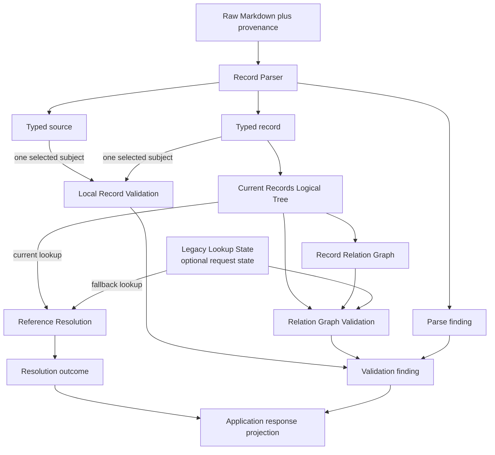

# Concept: Record domain logical tree boundary

- **id**: `spec:drmcp.implementation.contracts.record_domain_logical_tree.contract_boundary`
- **status**: draft
- **date**: 2026-07-06
- **parent**: `spec:drmcp.implementation.contracts.record_domain_logical_tree`

## What this is

Contract baseline for Record Domain / Logical Tree as module-contract owners.

## Current contract

Record Domain / Logical Tree owns current record models, typed parser outputs, immutable logical structures, identity, retrieval primitives, relation graph capability, reference resolution, and validation behavior.
It owns no MCP transport, Application sequencing, request-level assembly orchestration, configuration loading, or I/O.

Contract-level components:

| component | responsibility |
|---|---|
| Record Parser | Converts raw Markdown plus provenance into typed source, typed record, and parse findings. |
| Current Records Logical Tree | Owns app namespace, domain namespace, canonical current identity, current addressability, and semantic structure inside the Current Records Snapshot. |
| Record Relation Graph | Owns relation graph capability over logical-tree nodes. |
| Reference Resolution | Owns exact supplied-value classification, current-first lookup, accepted Legacy eligibility, fallback lookup, and resolution outcomes. |
| Local Record Validation | Owns checks decidable from one typed source or record. |
| Relation Graph Validation | Owns checks that require logical tree, relation graph, current targets, Legacy targets, reciprocity, or Topics graph context. |

The Current Records Logical Tree has these identity branches:

| branch | identity rule |
|---|---|
| Sequential-artifact branch | App namespace, domain namespace, kind, and record identity. |
| Spec branch | App namespace and path-derived topic segments. |

### Domain responsibility split

The diagram shows semantic ownership inside Record Domain / Logical Tree.
It does not define storage layout, traversal algorithms, structs, or validation handler decomposition.

## Non-goals

- Raw filesystem enumeration or reading.
- MCP request or response encoding.
- Application response projection.
- Concrete graph storage or traversal algorithms.
- Concrete parser algorithms or Go structs.
- Validation rule-handler decomposition.

## Concept model

| surface | producer | consumer | meaning |
|---|---|---|---|
| Typed source | Record Parser | Local Record Validation and snapshot construction | Parsed source-level state, including non-record validation subjects. |
| Typed record | Record Parser | Logical tree, validation, and relation graph | Parsed addressable record state. |
| Parse finding | Record Parser | Validation projection | Syntax, metadata, or document-shape finding. |
| Domain semantic construction result | Record Parser, Current Records Logical Tree, and Record Relation Graph | Current Records Snapshot Assembly | Semantic structures that Application assembly includes in one request snapshot. |
| Logical-tree lookup result | Current Records Logical Tree | Reference Resolution, relation validation, and use cases | Exact current lookup outcome. |
| Relation-graph query result | Record Relation Graph | Relation Graph Validation and Guidance-related query use | Relation query outcome. |
| Resolution outcome | Reference Resolution | Resolve Reference and Get Records use cases | Current-first and optional Legacy fallback outcome. |
| Validation finding | Local or relation validation | Validate Records Use Case | Transport-neutral diagnostic candidate. |
| Source-backed location reference | Parser, logical tree, and validators | Diagnostic projection | Stable location material. |

## Rules

| rule | contract |
|---|---|
| Parser boundary | Raw Markdown crosses into Domain only through Record Parser outputs. |
| No raw reinterpretation | Current Records Logical Tree does not parse or reinterpret raw Markdown. |
| Logical tree ownership | Current identity, addressability, and semantic structures inside the snapshot belong to Current Records Logical Tree. |
| Application assembly boundary | Request-level snapshot assembly belongs to Application shared orchestration, not Domain. |
| Legacy separation | Legacy exact lookup remains outside Current Records Logical Tree. |
| Reference resolution ownership | Reference Resolution owns current-first and optional Legacy fallback sequencing. |
| Local validation purity | Local Record Validation receives one typed subject and does not query tree, graph, Legacy state, parser, or Infrastructure. |
| Relation validation ownership | Relation Graph Validation may consume Record Relation Graph, Current Records Logical Tree, and optional Legacy Lookup State. |
| Finding output | Validators return transport-neutral findings and do not format MCP responses. |
| No I/O | Domain components perform no filesystem or configuration I/O. |

## Boundary

Forbidden bypasses:

- Application must not duplicate Reference Resolution sequencing.
- Validate Records Use Case must not pass every relation target lookup manually.
- Infrastructure must not depend on logical-tree internals.
- MCP must not inspect Domain state objects.
- Domain validators must not call public MCP tools or rescan roots.
- Domain components must not coordinate source access, parser invocation, or trustworthy-result failure selection for a request.

Downstream detailed contract convergence must define exact field schemas, rule IDs, graph queries, resolver outcomes, and validation rule placement.
This module-contract baseline is not implementation-ready.

## Related specs

| ref | relation |
|---|---|
| `spec:drmcp.implementation.contracts` | Module-contract root. |
| `spec:drmcp.application_architecture.application_boundary_and_components` | Accepted component authority. |
| `DRMCP-ADR-MCP-013` | Source ADR. |
