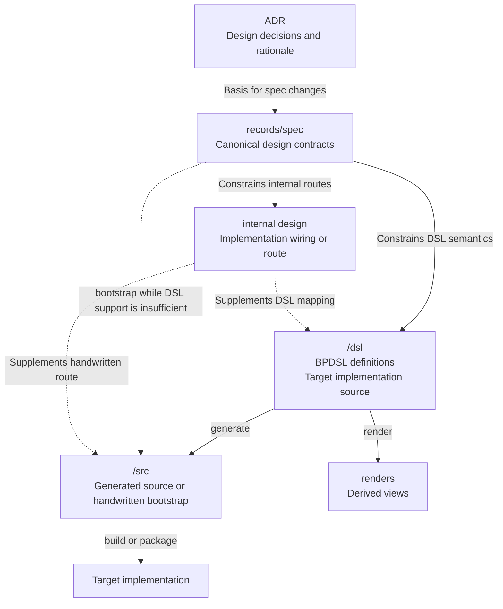

# Reference: Design flow preservation

- **id**: `spec:product.bpdsl.design_flow`
- **status**: draft
- **date**: 2026-06-24
- **parent**: `spec:product.bpdsl`

## What this is

Preservation-only staging for the previous Design artifact flow material.
It preserves DSL, source, render, internal-design, and target implementation-flow descriptions removed from generic artifact-model specs.

This file is not a canonical BPDSL contract.
It does not validate BPDSL correctness.
It does not define a new accepted Design Records-to-BPDSL integration contract.

## Preservation status

| rule | status |
|---|---|
| Ownership claim | No PRODUCT canonical ownership claim. |
| Expected final owner | `bpdsl/records/spec/**` after BPDSL migration review, subject to later decision. |
| Integration claim | Historical; not adopted by PRODUCT. Retained as migration-review evidence only. Historical model differs from current app-local BPDSL contracts. |
| Migration review obligation | Review all retained statements during BPDSL migration or when an explicit integration requirement is accepted. |

## Preserved design artifact flow

The following flow preserves the previous meaning for review.
It is not accepted as current integration behavior.

## Preserved source-of-truth roles

| artifact | preserved role | status |
|---|---|---|
| `<app>/records/spec/` | Canonical authority for current design contracts. | Generic Design Records pointer. |
| `<app>/dsl/` | Target implementation source when the app's DSL pipeline is operational. | Preservation-only BPDSL staging. |
| `<app>/src/` | Generated realization of DSL definitions, or handwritten bootstrap implementation while DSL support is insufficient. | Preservation-only implementation-flow staging. |
| internal design | Supplements the route from spec semantics to DSL or source implementation. | Previous description; not adopted by PRODUCT. No current app-local BPDSL owner identified for an internal design layer. Historical context; retained as migration-review evidence only. |
| renders | Views derived from DSL definitions; not editable source of truth. | Preservation-only BPDSL staging. |
| target implementation | Executable or deployable realization built from source implementation; not canonical design authority. | Preservation-only implementation-flow staging. |

## Preserved rules

- Current design meaning is owned by `<app>/records/spec/`.
- For an app with an operational DSL pipeline, `<app>/dsl/` was described as the target implementation source.
- For an app with an operational DSL pipeline, `<app>/src/` was described as generated from `<app>/dsl/`.
- While DSL support is insufficient, implementation may be handwritten in `<app>/src/` directly from current specs and internal design.
- Handwritten source is a bootstrap path, not an alternative authority for design contracts.
- An app without DSL or implementation concerns may remain records-only.
- Internal design supplements implementation routing.
- Internal design does not replace spec or DSL authority.

## Deferred integration disposition

| preserved statement | status |
|---|---|
| `records/spec` constrains DSL semantics. | Previous description; not adopted by PRODUCT. Not represented by current app-local BPDSL contracts; no accepted integration contract currently defines this relationship. Retained as historical context for migration review only; not an active Design Records-to-BPDSL integration claim. |
| `records/spec` constrains internal routes. | Not adopted by PRODUCT; V01-INV-DOCS-003 and V01-ADR-088 preserve the current non-endpoint decision. |
| Internal design supplements DSL mapping. | Previous description; not adopted by PRODUCT. No current app-local BPDSL owner for an internal design layer. Historical context for migration review only. |
| Internal design supplements handwritten route. | Previous description; not adopted by PRODUCT. No current app-local BPDSL owner for an internal design layer. Historical context for migration review only. |

## Source mapping

| source file | source sections | disposition |
|---|---|---|
| `product/records/spec/concepts/project-artifact-model/design-flow.md` | `## What this is`, `## Design artifact flow`, `## Source of truth roles`, `## Rules`, `## Related specs`, `## Sources` | Preserved here before removing the generic source file. |
| `product/records/spec/concepts/project-artifact-model/index.md` | `### Design and implementation artifacts` | BPDSL and implementation-flow rows preserved here and in `spec:product.bpdsl.artifact_responsibilities`. |

## Preservation context

The previous related-spec and source references are preserved as historical context.
They are not restored as current authoritative links from the generic artifact model.

| previous context | preservation |
|---|---|
| `spec:product.concepts.repository_layout` related-spec link for records, `dsl/`, `src/`, bootstrap states, and design-record placement. | Relationship preserved here and in `spec:product.bpdsl.repository_implementation_flow`. |
| `spec:product.brewprint.layout` related-spec link for current Brewprint repository inventory. | Historical context preserved here. |
| V01-ADR-083: Project artifact boundary and YAML as primary implementation source. | Historical source preserved here. |
| V01-ADR-097: App namespace-first repository directory layout. | Historical source preserved here. |
| V01-ADR-084 and V01-ADR-088: Traceability and MVP boundary. | Historical source preserved here. |
| V01-INV-DOCS-002 and V01-INV-DOCS-003: Deferred relation and internal-design scope. | Historical source preserved here. |

## Related specs

| ref | relation |
|---|---|
| `spec:product.bpdsl` | Temporary staging parent. |
| `spec:product.bpdsl.repository_implementation_flow` | Preserves related `dsl/` and `src/` layout statements. |
| `spec:product.brewprint.layout` | Historical context for the old current-inventory pointer. |
