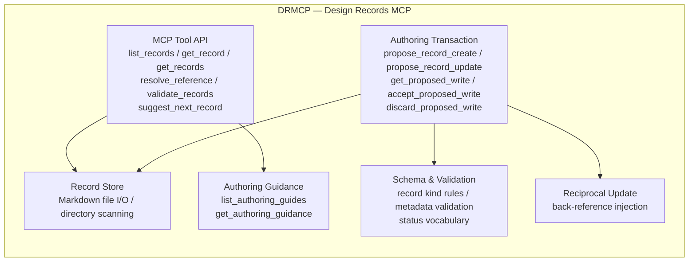
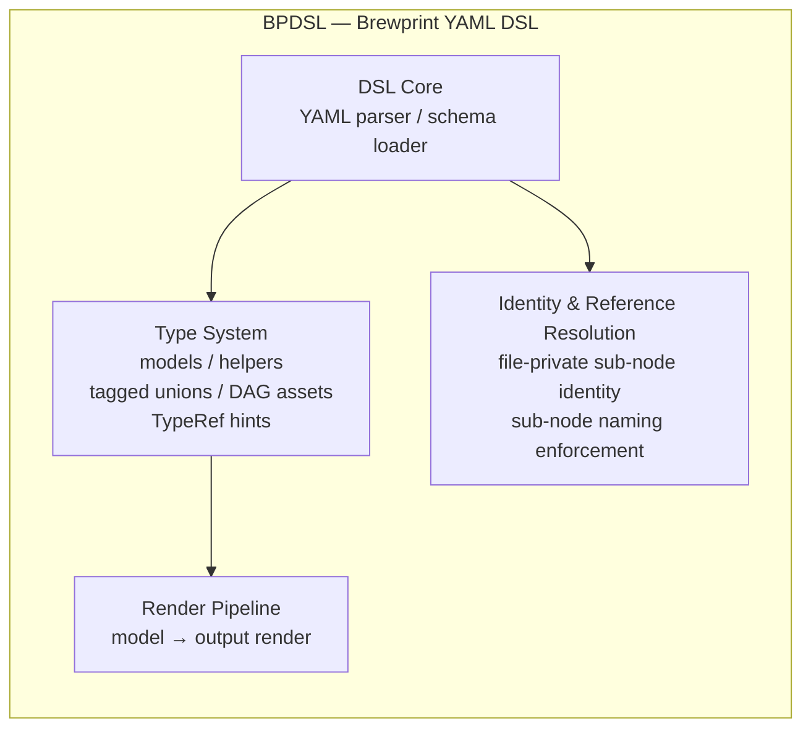

# Reference: App namespaces

- **id**: `spec:product.concepts.namespace_model.app_namespaces`
- **status**: draft
- **date**: 2026-06-22
- **parent**: `spec:product.concepts.namespace_model`

## What this is

Defines the three active app namespaces (DRMCP, BPDSL, PRODUCT), their architecture overview, and domain namespace assignments.

## App namespace definitions

brewprint currently has three app namespaces.

| app namespace | formal name | nature |
|---|---|---|
| `DRMCP` | Design Records MCP | Design record management MCP server |
| `BPDSL` | Brewprint YAML DSL | DSL for describing brewprint designs |
| `PRODUCT` | Product-wide / cross-app | Cross-app policy and governance namespace |

`DRUI` (Design Records UI) is a future candidate and will be evaluated after BPDSL becomes operational. It is not confirmed as an app namespace at this time.

## DRMCP

### Architecture

Design Records MCP is an MCP server that manages brewprint design records (ADR / spec / INV / REQ / WORK / TASK). It provides LLM clients with tools for exploring, retrieving, creating, updating, and validating design records.

### Domain namespaces

| domain namespace | concern area | representative artifacts |
|---|---|---|
| `MCP` | All of MCP tool API, authoring transactions, schema, and validation | REQ-MCP-\* / WORK-MCP-\* |

Currently operated as a single domain namespace `MCP`. For subdomain grouping within the domain, see `spec:product.concepts.namespace_model.subdomain_model`.

## BPDSL

### Architecture

Brewprint YAML DSL is a DSL for describing brewprint design models in YAML. It has a type system, identity resolution, rendering, and a self-hosting layer for the DSL itself.

### Domain namespaces

| domain namespace | concern area | representative artifacts |
|---|---|---|
| `DATA` | Data models, type system, rendering | REQ-DATA-\* / WORK-DATA-\* |
| `RESOLVE` | Identity resolution, file-private sub-node enforcement | REQ-RESOLVE-\* / WORK-RESOLVE-\* |

## PRODUCT

### Nature

`PRODUCT` is not an application with runtime components, but a product-level namespace handling cross-application policy, governance, and migration.

Responsible areas:

- Requirements, decisions, and policies spanning multiple app namespaces
- Definition and maintenance of the namespace model itself (this spec)
- Future major-version migration policies
- Cross-app governance rules

### Domain namespaces

| domain namespace | concern area | representative artifacts |
|---|---|---|
| `NAMESPACE` | Namespace model, catalog, artifact ID grammar | V01-REQ-PRODUCT-001 / V01-WORK-PRODUCT-001 |
| `GOVERNANCE` | Cross-app governance rules (future) | — |
| `MIGRATION` | Major-version migration policies (future) | — |
