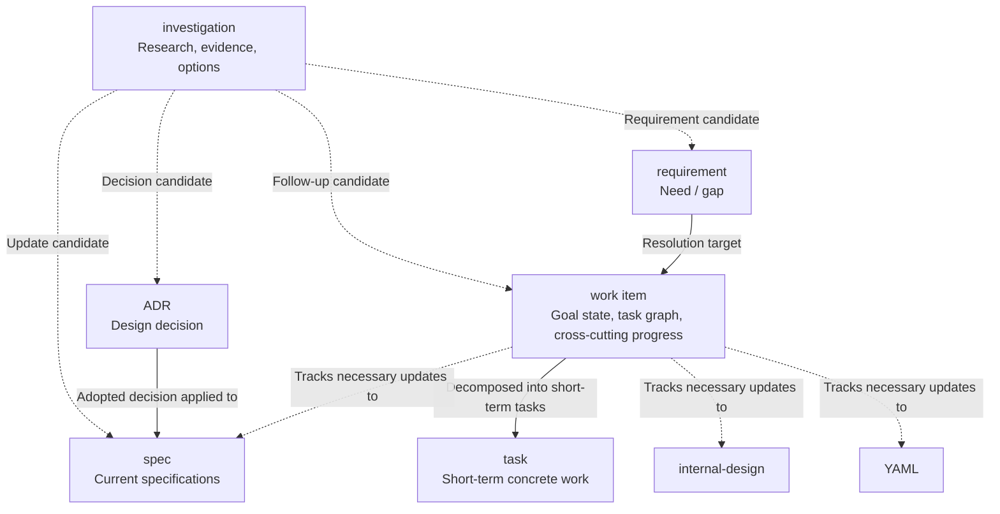

# Reference: Change and investigation flow

- **id**: `spec:product.concepts.project_artifact_model.change_and_investigation_flow`
- **status**: draft
- **date**: 2026-06-22
- **parent**: `spec:product.concepts.project_artifact_model`

## What this is

Defines the change discovery, decision, and execution flow among design record and workflow artifacts in the brewprint project.

## Change and investigation flow

The flow from discovering a design change through decision to execution is as follows.

## Artifact ownership in the flow

| artifact | owns in this flow | does not own |
|---|---|---|
| investigation | Research results, evidence, options, follow-up artifact candidates | Decisions (sent to ADR), current specs, cross-cutting progress |
| ADR | Adopted decisions | Canonical specs, progress management |
| requirement | The need / gap / request and its stable identity | Research process, implementation procedures |
| work item | Entire resolution flow, cross-cutting progress, task graph | Spec body, canonical status of subordinate tasks |
| task | Concrete short-term work, completion conditions, individual status | Design decisions, current specs, work item goal state |

## Rules

- Investigations preserve research results for complex changes, but are not a required gate for every change.
- Investigations do not own decisions. When a decision is needed, it is sent to an ADR.
- Requirements own what is needed; work items own the entire resolution flow — investigation / decision / spec / implementation / verification etc. — and cross-cutting progress to satisfy the requirement.
- Tasks own concrete work closeable in roughly 0.5–3 days and do not become the canonical authority for design decisions or current specs.
- The canonical status of a task is held by each task artifact; work items do not manually replicate subordinate task completion state via checkboxes etc.
- The execution-plan role previously called `milestone` is handled by work items in the new format. Milestones are not added as new artifact layers or canonical relations.
- Persistent references between workflow artifacts use `REQ-*` / `WORK-*` / `TASK-*` ID-as-refs; physical paths are not supported canonical relations.

## Sources

V01-ADR-081, V01-ADR-083, V01-ADR-085, V01-ADR-086, V01-ADR-091
