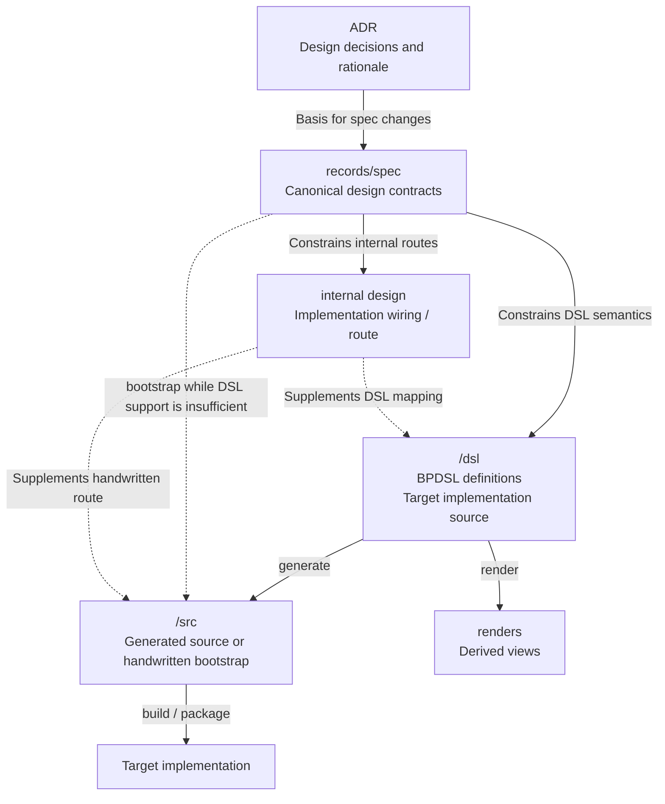

# Reference: Design artifact flow

- **id**: `spec:product.concepts.project_artifact_model.design_flow`
- **status**: draft
- **date**: 2026-06-23
- **parent**: `spec:product.concepts.project_artifact_model`

## What this is

Defines source-of-truth and derivation relationships among design contracts, DSL definitions, source implementation, and target implementation.

The target DSL-generated flow and the current handwritten bootstrap path are both represented.

## Design artifact flow

## Source of truth roles

| artifact | source-of-truth role |
|---|---|
| `<app>/records/spec/` | Canonical authority for current design contracts. |
| `<app>/dsl/` | Target implementation source when the app's DSL pipeline is operational. |
| `<app>/src/` | Generated realization of DSL definitions, or handwritten bootstrap implementation while DSL support is insufficient. |
| internal design | Supplements the route from spec semantics to DSL or source implementation. |
| renders | Views derived from DSL definitions; not editable source of truth. |
| target implementation | Executable or deployable realization built from source implementation; not canonical design authority. |

## Rules

- Current design meaning is owned by `<app>/records/spec/`.
- For an app with an operational DSL pipeline, `<app>/dsl/` is the target implementation source and `<app>/src/` is generated from it.
- While DSL support is insufficient, implementation may be handwritten in `<app>/src/` directly from current specs and internal design.
- Handwritten source is a bootstrap path, not an alternative authority for design contracts.
- An app without DSL or implementation concerns may remain records-only.
- Internal design supplements implementation routing. It does not replace spec or DSL authority.
- Placement, directory requiredness, and bootstrap states are defined in `spec:product.concepts.repository_layout`.

## Related specs

| ref | relation |
|---|---|
| `spec:product.concepts.repository_layout` | Normative records/dsl/src model, bootstrap states, and design-record placement. |
| `spec:product.brewprint.layout` | Current Brewprint repository inventory. |

## Sources

- V01-ADR-083: Project artifact boundary and YAML as primary implementation source.
- V01-ADR-097: App namespace-first repository directory layout.
- V01-ADR-084 and V01-ADR-088: Traceability and MVP boundary.
- V01-INV-DOCS-002 and V01-INV-DOCS-003: Deferred relation and internal-design scope.
