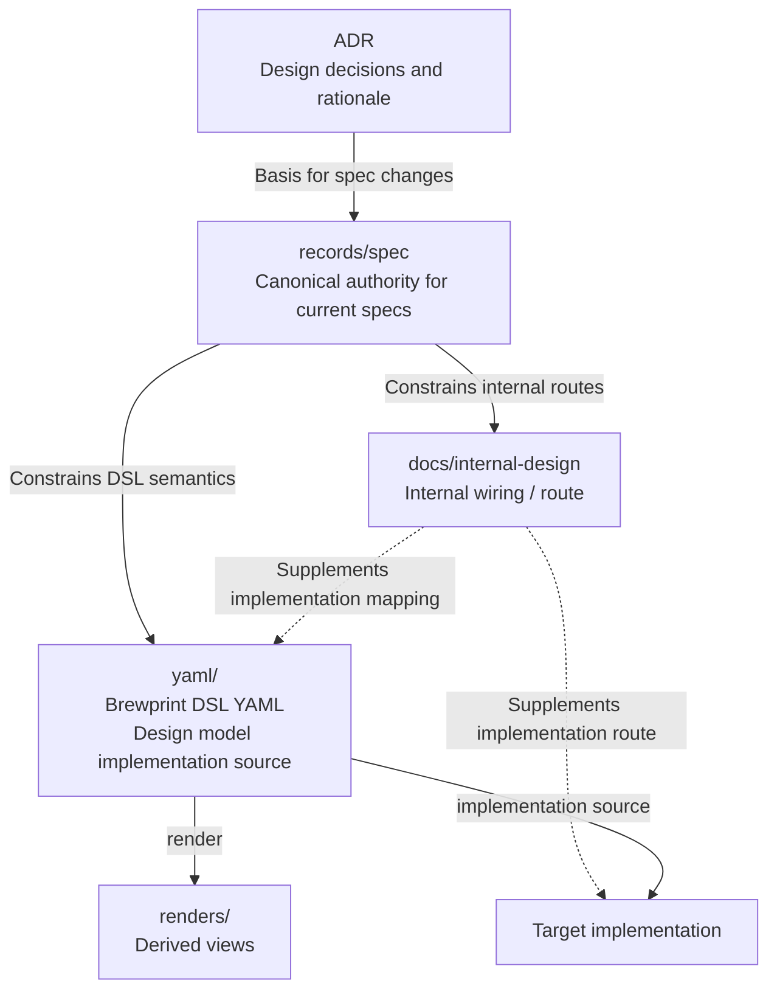

# Reference: Design artifact flow

- **id**: `spec:product.concepts.project_artifact_model.design_flow`
- **status**: draft
- **date**: 2026-06-22
- **parent**: `spec:product.concepts.project_artifact_model`

## What this is

Defines the source-of-truth flow and derivation relationships among design and implementation artifacts in the brewprint project.

## Design artifact flow

The source-of-truth and derivation relationships among design / implementation artifacts are as follows.

## Source of truth roles

| artifact | source of truth role |
|---|---|
| `records/spec/` | Canonical authority for current design contracts |
| `yaml/` | Primary implementation source for the target design model |
| `docs/internal-design/` | Supplements the route from spec/YAML to target implementation (not an alternative source of truth) |
| `renders/` | Views derived from YAML (not source of truth) |
| target implementation | Implementation artifact built from YAML and internal design (not source of truth) |

## Rules

- `records/spec/` is the canonical authority for current design contracts.
- `yaml/` is the primary implementation source for the target design model.
- `docs/internal-design/` supplements the route from spec / YAML to target implementation; it is not an alternative source of truth for spec or YAML.
- In the MVP, `docs/internal-design/` is not a semantic trace endpoint and its realization relation with spec is not operationalized.
- External relation / assurance artifacts are not part of the MVP operational scope. If concrete needs for internal-design navigation, YAML trace, completeness / evidence / sign-off, or centrally managed relation sets arise, placement will be decided at that time.

## Sources

V01-ADR-083 §0, §1, §2, §6–§8; V01-ADR-084; V01-ADR-088; V01-INV-DOCS-002; V01-INV-DOCS-003
