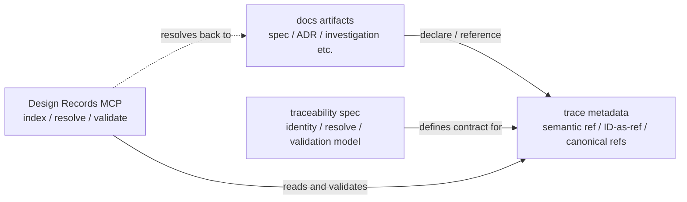

# Reference: Traceability boundary

- **id**: `spec:product.concepts.project_artifact_model.traceability_boundary`
- **status**: draft
- **date**: 2026-06-22
- **parent**: `spec:product.concepts.project_artifact_model`

## What this is

Defines the traceability and tool boundary layer in the artifact system and its MVP scope.

## Traceability and tool boundary

Traceability is not an independent design source layer. In the MVP, it is a mechanism for stably recording, resolving, and validating the canonical identity and references of the artifacts described above.

## MVP scope

| item | MVP treatment |
|---|---|
| active semantic prefix | `spec:` only |
| ID-as-ref | Design Records MCP handles canonical resolution of `ADR-*` / `SPEC-*` / `INV-*` / `REQ-*` / `WORK-*` / `TASK-*`. Also handles declared relation integrity validation between workflow artifacts, but excludes physical paths, orphan diagnostics, progress projection, and workflow traversal. `COV-*` is outside MVP |
| MVP semantic realization relation | Not handled. Deferred to a future decision together with the `internal-design:` endpoint |
| external coverage artifacts | Not operationally handled in MVP. Will be reconsidered when introduction triggers are met |
| investigation trace | Resolve validation of `source_refs` / recorded `follow_up_results`. `follow_up_candidates` checks canonical form but does not require unresolved candidates to exist. Additional workflow ID-as-ref support limited to `REQ-*` / `WORK-*`; `TASK-*` is excluded from investigation metadata canonical references |
| implementation boundary | Design Records MCP is responsible for resolve / validation; concrete contracts / implementation are tracked separately |

`product/records/spec/concepts/traceability/` is the subordinate concept spec set defining the semantic ref grammar, canonical metadata boundary, and resolve/validation rules for this mechanism. It does not replace the responsibility boundary of the entire artifact system owned by this document. Semantic realization mapping and external coverage artifacts are outside MVP scope per V01-ADR-088.

The Design Records MCP spec defines which record / tool contracts Design Records MCP provides for this mechanism. It is not the owner of the traceability semantic model itself.

## Sources

V01-ADR-084, V01-ADR-087, V01-ADR-088
