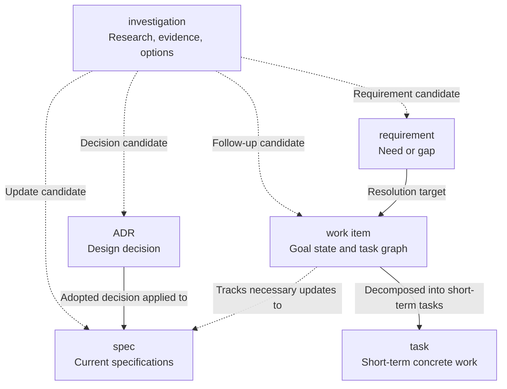

# Reference: Change and investigation flow

- **id**: `spec:product.design_records.artifact_model.change_and_investigation_flow`
- **status**: draft
- **date**: 2026-06-24
- **parent**: `spec:product.design_records.artifact_model`

## What this is

Defines the app-independent flow from design-change discovery through decision, requirement resolution, execution, and spec update.
It does not define implementation endpoint tracking or YAML realization relations.

## Change and investigation flow

## Artifact ownership in the flow

| artifact | owns in this flow | does not own |
|---|---|---|
| investigation | Research results, evidence, options, and follow-up artifact candidates. | Decisions, current specs, or cross-cutting progress. |
| ADR | Adopted decisions. | Canonical specs or progress management. |
| requirement | The needed change, gap, request, and stable identity. | Research process or implementation procedure. |
| work item | Resolution flow, cross-cutting progress, and task graph. | Spec body or canonical subordinate task status. |
| task | Concrete short-term work, completion conditions, individual status, and evidence. | Design decisions, current specs, or work item goal state. |
| spec | Current contract text. | Research evidence, decision rationale, or task execution state. |

## Deferred implementation tracking disposition

The previous flow included implementation endpoint tracking.
Those statements are not accepted as current workflow contracts.

| previous statement | final disposition |
|---|---|
| A work item tracks necessary updates to `internal-design`. | Existing evidence owner: V01-INV-DOCS-003 and V01-ADR-088. No current internal-design trace endpoint is defined. |
| A work item tracks necessary updates to `YAML`. | BPDSL staging only where BPDSL-specific; not adopted by PRODUCT as a Design Records workflow relation. |
| A future workflow can project implementation-update needs from Design Records. | Not a current PRODUCT contract; any operational projection belongs to DRMCP app-local specifications. |

## Rules

- Investigations preserve research results for complex changes.
- Investigations are not required gates for every change.
- Investigations do not own decisions.
- Requirements own what is needed.
- Work items own the resolution flow and task graph.
- Tasks own concrete work closeable in roughly 0.5 to 3 days.
- Tasks do not become canonical authority for design decisions or current specs.
- Work items do not manually replicate subordinate task completion state via checkboxes.
- The execution-plan role previously called `milestone` is handled by work items in the new format.
- Persistent workflow relations use complete public requirement, work item, and task ID-as-refs.
- Existing issued records retain legacy public IDs.
- New records use canonical app-aware artifact IDs.
- Physical paths are not canonical relations.

## Related specs

| ref | relation |
|---|---|
| `spec:product.design_records.artifact_model` | Parent artifact-model overview. |

## Sources

V01-ADR-081, V01-ADR-083, V01-ADR-085, V01-ADR-086, V01-ADR-091.
