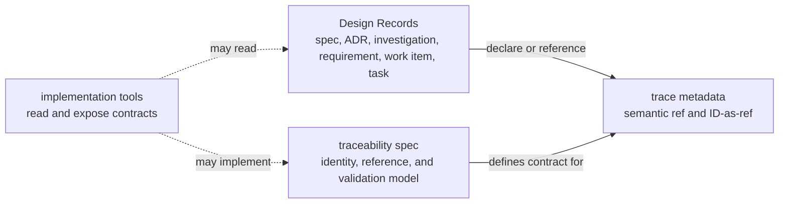

# Reference: Traceability boundary

- **id**: `spec:product.design_records.artifact_model.traceability_boundary`
- **status**: draft
- **date**: 2026-06-24
- **parent**: `spec:product.design_records.artifact_model`

## What this is

Defines traceability as a Design Records semantic boundary.
It separates canonical reference contracts from implementation tools.

## Traceability and tool boundary

Traceability is not an independent design authority.
It records, resolves, and validates artifact identity and references.

Implementation tools may implement Design Records traceability contracts.
Implementation tools do not own the semantic model.

## MVP scope

| item | MVP treatment |
|---|---|
| Active semantic prefix | `spec:` is active. |
| ID-as-ref | Complete public Design Records IDs are resolvable as record identities. |
| Existing issued records | Existing issued records retain legacy public IDs. |
| New sequential records | New sequential records use canonical app-aware artifact IDs. |
| New and migrated specs | New and migrated specs use path-derived `spec:` refs. |
| Investigation trace | `source_refs` and recorded `follow_up_results` participate in resolve validation. |
| `follow_up_candidates` | Candidate references are checked for canonical form without requiring unresolved candidates to exist. |
| Task refs in investigation metadata | Task public IDs are excluded from investigation metadata canonical references. |
| Physical paths | Physical paths are not canonical references. |
| `COV-*` | Outside MVP. |

`product/records/spec/design-records/traceability/` defines semantic ref grammar, canonical metadata boundaries, and resolve/validation rules.
This artifact-model boundary does not replace that traceability spec set.

## DRMCP boundary

Concrete DRMCP behavior belongs to DRMCP app-local specifications.
This spec keeps only the cross-owner boundary.

| excluded implementation behavior | app-local owner |
|---|---|
| Tool indexing behavior for Design Records MCP. | `spec:drmcp.design_records_mcp.tools.list_records`. |
| Tool resolving behavior for Design Records MCP. | `spec:drmcp.design_records_mcp.tools.resolve_reference`. |
| Tool validation behavior for Design Records MCP. | `spec:drmcp.design_records_mcp.tools.validate_records`. |
| Concrete DRMCP request, response, diagnostic, parser, persistence, UI, or tool behavior. | DRMCP app-local specifications. |

## Traceability contract boundary

Active reference semantics belong to the traceability spec area.
DRMCP operational behavior belongs to DRMCP app-local specifications.
No semantic realization endpoint or external coverage mechanism is currently active.

Historical disposition evidence is recorded in T05.

## Related specs

| ref | relation |
|---|---|
| `spec:product.design_records.artifact_model` | Parent artifact-model overview. |
| `spec:product.design_records.traceability` | Owner of canonical reference and validation semantics. |

## Sources

V01-ADR-084, V01-ADR-087, V01-ADR-088.
