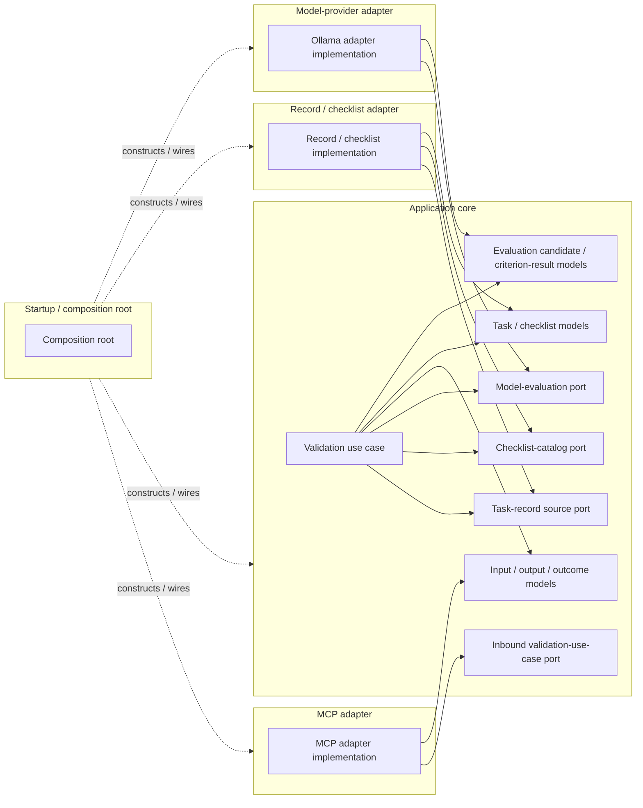

# Concept: TRV dependency model

- **id**: `spec:trv.application_architecture.dependency_model`
- **status**: draft
- **date**: 2026-07-02
- **parent**: `spec:trv.application_architecture`

## What this is

Defines static source dependencies and composition edges for the TRV architecture.
Runtime call order belongs to the validation-flow Specification.

## Concept model

In the diagram, a solid arrow means the source element depends on the target contract or model.
A dashed arrow means startup constructs or wires a top-level component.
Implementation or conformance relations are stated in prose and are not drawn as source-dependency edges.

Startup edges terminate at top-level component boundaries.
Exact constructors, factories, and internal wiring targets belong to W004.

### Allowed dependencies

| source | allowed target | purpose |
|---|---|---|
| MCP adapter | Inbound validation-use-case port | Invoke the application use case without depending on its concrete implementation. |
| MCP adapter | Application input, output, and outcome models | Convert MCP data to and from application-owned data. |
| Record and checklist adapter | Task-record source port | Implement Task retrieval. |
| Record and checklist adapter | Checklist-catalog port | Implement checklist retrieval. |
| Record and checklist adapter | Task and checklist models | Return application-owned Task and criterion data. |
| Model-provider adapter | Model-evaluation port | Implement model evaluation behind an application-owned boundary. |
| Model-provider adapter | Evaluation candidate and failure models | Return decoded provider output without exposing Ollama types. |
| Validation use case | Outbound application-owned ports and application models | Orchestrate validation without outward protocol knowledge. The use case implements the inbound port; that conformance relation is not a source-dependency edge. |
| Startup and composition root | Top-level concrete components | Construct and wire the application. |

### Forbidden dependencies

| source | forbidden target | reason |
|---|---|---|
| Application core | MCP protocol or MCP adapter implementation | Transport concerns must stay outside the core. |
| Application core | Filesystem or checklist-storage implementation | Record access must remain behind application-owned ports. |
| Application core | Ollama HTTP types or provider implementation | Provider mechanics must remain behind the model-evaluation port. |
| MCP adapter | Concrete validation-use-case implementation | The adapter must depend on the inbound port. |
| Adapter | Another adapter | Adapter collaboration must be orchestrated by the application core. |
| Record and checklist adapter | Prompt construction or semantic-result policy | Application behavior belongs to the validation use case. |
| Model-provider adapter | Checklist selection, criterion completeness policy, or overall-result construction | PRODUCT semantic behavior belongs to the application core. |
| Startup and composition root | Validation behavior or adapter-local protocol policy | Startup owns composition only. |

## Rules

- All adapter dependencies must point inward to application-owned ports or models.
- The application core must not depend on adapter implementations.
- The validation use case implements the inbound validation-use-case port; implementation or conformance is not represented as a solid source-dependency edge.
- The MCP adapter must not bypass the inbound application port.
- The record and checklist adapter may implement both input ports.
- Startup may depend on concrete top-level components only for construction and wiring.
- Startup construction edges must remain visually distinct from normal source dependencies.
- Runtime invocation order must not be inferred from this diagram.

## Non-goals

- Runtime call sequence or failure branching.
- Exact package graph, import paths, interface declarations, constructors, or dependency-injection framework.
- Exact MCP, filesystem, checklist, or Ollama schemas.

## Boundary

| concern | owner |
|---|---|
| Component responsibilities | `spec:trv.application_architecture.component_model`. |
| Runtime interaction order | `spec:trv.application_architecture.validation_flow`. |
| Exact source layout and wiring | TRV-WORK-SPEC-004 and its Specifications. |

## Related specs

| ref | relation |
|---|---|
| `spec:trv.application_architecture` | Parent architecture Overview. |
| `spec:trv.application_architecture.component_model` | Defines the component set used by this dependency view. |
| `spec:trv.application_architecture.validation_flow` | Defines runtime sequence separately from source dependencies. |
| `spec:trv.model_runtime` | Defines the model-evaluation port and Ollama boundary. |
| TRV-ADR-SPEC-001 | Durable inward-dependency and component-ownership decision. |
| TRV-ADR-SPEC-002 | Durable provider-port and external-runtime decision. |
