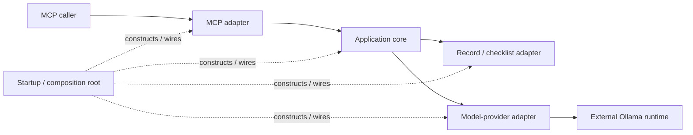

# Overview: TRV application architecture

- **id**: `spec:trv.application_architecture`
- **status**: draft
- **date**: 2026-07-02
- **parent**: `spec:trv`

## What this is

Entry point for the TRV application architecture.
It shows the whole-system composition and routes readers to focused architecture views.

## Current contract

TRV uses ports and adapters around one application core.
The application core owns validation orchestration and application meaning.
Adapters own MCP, repository, checklist, and model-provider mechanics.

Solid arrows show runtime collaboration at the whole-system level.
Dashed arrows show construction and wiring.
The child Specifications define exact architecture-level ownership and dependency direction.

## Topics

| title | kind | ref | summary |
|---|---|---|---|
| TRV component model | Concept | `spec:trv.application_architecture.component_model` | Five top-level components and application-core internal responsibility elements. |
| TRV dependency model | Concept | `spec:trv.application_architecture.dependency_model` | Static source dependencies, application-owned ports and models, startup construction edges, and forbidden dependencies. |
| TRV validation flow | Concept | `spec:trv.application_architecture.validation_flow` | Runtime sequence and stage ownership from MCP input through semantic evaluation and MCP projection. |
| TRV architecture boundary | Concept | `spec:trv.application_architecture.boundary` | Ownership boundaries among PRODUCT, W002, W003, W004, ADRs, and Specifications. |

## Non-goals

- Exact MCP tool names, request fields, response fields, or transport failure envelopes.
- Exact Go packages, files, symbols, interfaces, structs, constructors, or commands.
- Exact prompt wording, model-response schema, retry values, timeout values, or configuration names.
- Current DRMCP integration.

## Boundary

`spec:trv.model_runtime` remains a sibling topic under `spec:trv`.
The model-runtime topic can change independently from this architecture document tree.

## Related specs

| ref | relation |
|---|---|
| `spec:trv` | Parent TRV overview and topic registry. |
| `spec:trv.model_runtime` | Model-evaluation port, Ollama adapter, and external runtime boundary. |
| `spec:product.responsibility_boundary_validator` | PRODUCT-owned semantic contract realized by the application core. |
| TRV-ADR-SPEC-001 | Selects ports and adapters and the application ownership model. |
| TRV-ADR-SPEC-002 | Selects the application-owned model port and external Ollama runtime. |
