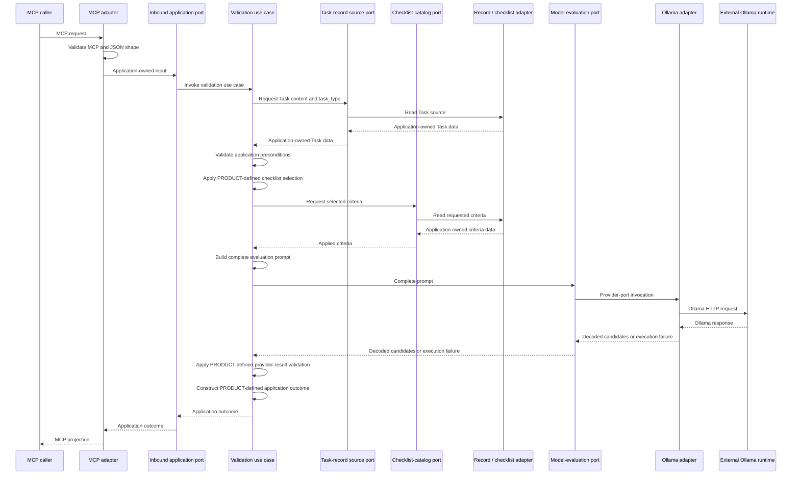

# Concept: TRV validation flow

- **id**: `spec:trv.application_architecture.validation_flow`
- **status**: draft
- **date**: 2026-07-02
- **parent**: `spec:trv.application_architecture`

## What this is

Defines the runtime sequence and stage ownership for one TRV validation invocation.
Static source dependencies belong to the dependency-model Specification.

## Concept model

The sequence shows architecture-level collaboration.
It does not define exact tool names, fields, methods, or protocol schemas.

### Stage ownership

| stage | owner | required outcome |
|---|---|---|
| MCP input validation | MCP adapter | Reject invalid MCP or JSON shape before application invocation. |
| Application invocation | MCP adapter and inbound port | Convert valid transport input into application-owned input. |
| Task retrieval orchestration | Validation use case through Task-record source port | Request Task data without depending on the record adapter implementation. |
| Task source access | Record and checklist adapter | Read the Task source and return application-owned Task data through the port. |
| Application precondition validation | Validation use case | Apply the application precondition stage before checklist retrieval. |
| Checklist selection and retrieval orchestration | Validation use case through checklist-catalog port | Apply PRODUCT-defined checklist selection and request the selected criteria without depending on the adapter implementation. |
| Checklist source access | Record and checklist adapter | Read the requested criteria and return application-owned criteria data through the port. |
| Prompt construction | Validation use case | Build one complete prompt from the Task and retrieved criteria. |
| Provider execution | Model-provider adapter | Execute Ollama HTTP and decode provider output. |
| Provider-result validation | Validation use case | Apply PRODUCT-owned result-completeness and correspondence semantics after provider decoding. |
| Application outcome construction | Validation use case | Construct the PRODUCT-defined application outcome. |
| MCP projection | MCP adapter | Map the application outcome without changing its meaning. |

### Outcome ownership

| application outcome class | owner | adapter boundary |
|---|---|---|
| Structural precondition failure | Validation use case | The MCP adapter projects the outcome without changing its PRODUCT-defined meaning. |
| Completed semantic evaluation | Validation use case | The MCP adapter projects the outcome without changing its PRODUCT-defined meaning. |
| Execution failure | Validation use case | The MCP adapter projects the outcome without changing its PRODUCT-defined meaning. |

The meaning and semantic contents of these outcome classes are defined by `spec:product.responsibility_boundary_validator`.

## Rules

- The MCP adapter must validate MCP and JSON shape before invoking the inbound application port.
- The validation use case must orchestrate Task retrieval through the Task-record source port and the record and checklist adapter.
- The validation use case must apply the application precondition stage before checklist retrieval.
- The validation use case must orchestrate the PRODUCT-defined checklist-selection stage and retrieve the selected criteria through the checklist-catalog port and the record and checklist adapter.
- The record and checklist adapter must own actual Task and checklist source access.
- The validation use case must construct the complete prompt inside the application core.
- The model-provider adapter must own provider execution and syntactic decoding behind the model-evaluation port.
- The validation use case must construct the application outcome after provider-result handling.
- The MCP adapter must project the application outcome without changing its meaning.
- `spec:product.responsibility_boundary_validator` exclusively defines invocation scope, semantic Evidence, checklist composition, criterion-result semantics, aggregation, model-verdict restrictions, and outcome meanings. This Specification does not redefine those rules.

## Non-goals

- Exact prompt wording or prompt-template storage.
- Exact criterion keys, array ordering, or correlation representation.
- Exact MCP response fields or error envelope.
- Exact Ollama request, response, timeout, retry, and decode schema.
- Exact logging, metrics, tracing, or test sequence.

## Boundary

| concern | owner |
|---|---|
| Cross-app semantic result rules and outcome meanings | `spec:product.responsibility_boundary_validator`. |
| Static source dependency direction | `spec:trv.application_architecture.dependency_model`. |
| External MCP contract | TRV-WORK-SPEC-003 and its Specifications. |
| Exact prompt, data, interface, and provider contracts | TRV-WORK-SPEC-004 and its Specifications. |

## Related specs

| ref | relation |
|---|---|
| `spec:trv.application_architecture` | Parent architecture Overview. |
| `spec:trv.application_architecture.component_model` | Defines the collaborating components and application-core elements. |
| `spec:trv.application_architecture.dependency_model` | Defines source dependencies separately from this runtime flow. |
| `spec:trv.model_runtime` | Defines provider execution and external Ollama ownership. |
| `spec:product.responsibility_boundary_validator` | Defines semantic evaluation, result, and failure semantics. |
| TRV-ADR-SPEC-001 | Durable orchestration and ownership decision. |
| TRV-ADR-SPEC-002 | Durable model-port and runtime decision. |
