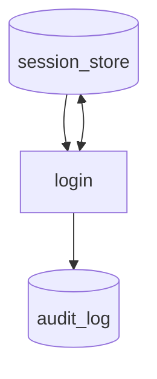
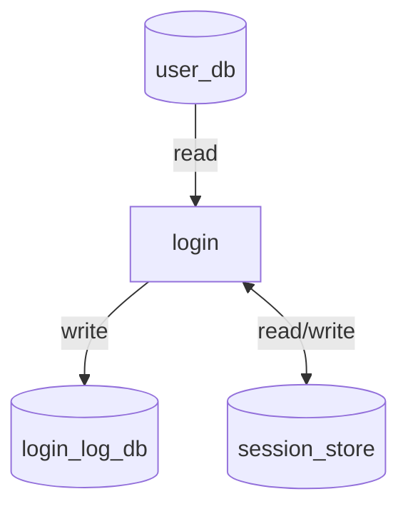

# V01-ADR-044: DAG store access edgeにread/writeラベルを付与する

- **status**: accepted
- **date**: 2026-04-26

## 背景

DAG renderにおいて、`store` ノードへのアクセスは `reads` / `writes` に基づいて描画される。

従来は、store edge の意味を矢印方向だけで表現していた。

この表現では、以下の問題がある。

- `store --> task` が `read` を意味することが図だけでは直感的に分かりにくい
- `task --> store` が `write` を意味することも同様に暗黙的である
- `<-->` は双方向データフローに見えやすく、実際の意味である `read/write access` と視覚的な印象がずれる
- store access は「データそのものの流れ」ではなく、永続化層への参照・更新操作であるため、通常の asset dataflow と同じ見え方にすると誤読を招く

## 決定

DAG renderにおける `store` との edge には、アクセス種別を表すラベルを付与する。

| YAML上の指定 | Mermaid表現 | 意味 |
|-------------|-------------|------|
| `reads: [store]` | `store -- "read" --> task` | task が store を読む |
| `writes: [store]` | `task -- "write" --> store` | task が store に書く |
| `reads` と `writes` の両方 | `task <-- "read/write" --> store` | task が store を読み書きする |

例：

store edge の向きは従来どおり維持するが、意味の主表現はラベルに寄せる。

- read: `store → task`
- write: `task → store`
- read/write: 双方向 edge + `read/write` label

## 理由

### 1. 矢印方向だけに意味を背負わせない

DAG図では、task間の dataflow、control flow、store access が同時に表示される。
その中で store access だけを矢印方向のみで表すと、読み手は凡例や仕様を知らない限り意味を判断しづらい。

`read` / `write` / `read/write` をラベルとして明示することで、図単体での可読性を上げる。

### 2. store access は通常の asset dataflow と異なる

asset edge は「task が生成した値が別taskに渡る」ことを表す。
一方、store edge は「task が永続化層にアクセスする」ことを表す。

この2つを同じ無ラベル `-->` で描くと、store が通常の中間assetと同じように見えやすい。
store edgeにアクセス種別ラベルを付けることで、永続化層への read/write 操作であることを明示する。

### 3. `<-->` の誤読を避ける

従来の `task <--> store` は、単に `reads + writes` の省略表現だった。
しかし視覚的には「双方向にデータが流れる」ように見える。

`read/write` label を付けることで、双方向 edge が表す意味を `双方向データフロー` ではなく `読み書きアクセス` として固定する。

### 4. Mermaidの既存表現の範囲で実現できる

Mermaid flowchart は edge label をサポートしているため、追加の記法や独自レンダラ拡張なしで表現できる。

## 影響

- `docs/spec/views/dag.md` の store edge render ルールを更新する
- `docs/spec/views/dag.md` 内の store を含む render例を更新する
- `docs/uc/001-ec-checkout-flow/docs/render-dag.md` の store edge 表現を更新する
- Go renderer 実装では、`reads` / `writes` から store edge を生成する箇所でラベルを付与する
- 既存の `task -> asset` / `asset -> task` の dataflow edge には影響しない
- 既存の `==>` control flow edge には影響しない

## Evidence
- commit: 5f5a945
- impl commit: tbd
- 参考: Mermaid flowchart edge label、UML Activity Diagram ObjectFlow、永続化層へのread/write access表現
