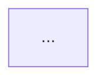

# V01-ADR-071: file-private helper model の Markdown render exposure

- **status**: accepted
- **date**: 2026-05-11

> このADRは起票時点での決定を記録したスナップショットである。
> 現在の仕様は spec を参照すること。

## 背景

V01-ADR-070 では、model に public / file-private の visibility 概念を導入し、file-private helper model を認めた。

V01-ADR-070 は同時に、file-private helper model を人間向け render から不可視にしてはならない、という制約を残した。
これは、brewprint が人間と LLM の共通設計言語であり、人間向けには Mermaid / Markdown render、LLM 向けには MCP query layer を提供するという基本方針に基づく。

file-private helper model が YAML 上に存在するにもかかわらず、render Markdown に出ず、MCP inspect を叩かなければ確認できない状態は望ましくない。
それでは人間が設計を読むときに YAML 直接確認か MCP への問い合わせを強制され、brewprint の人間向け render の価値が下がる。

一方で、file-private helper model は processing flow の node ではない。
Mermaid DAG 本体に schema detail を描き込むと、DAG が処理フローではなく schema 展開の図になってしまう。
特に UC-002 の MCP response model では、response 内部の entry / section / impact shape などが増えるため、Mermaid DAG 本体に展開するとノイズが大きい。

現行 `docs/spec/views/dag.md` では、Mermaid 図の後に `## Tasks` 詳細セクションを出力し、同一 file 内の task / fork / join / branch の signature・reads/writes・note を一覧する。
file-private helper model も、Mermaid 本体に描くのではなく、同じ Markdown detail section の一部として表示するのが自然である。

本ADRは、V01-ADR-070 §10 の render exposure 制約のうち、task file 内 file-private helper model を DAG Markdown 上にどう露出するかを定める。
model file 内 file-private helper model の render exposure は本ADRの直接対象外とし、後続ADRで扱う。

## 決定

### 1. file-private helper model は Mermaid DAG 本体には描画しない

file-private helper model は Data layer の schema 定義であり、Processing layer の flow node ではない。
そのため、DAG render の Mermaid flowchart 本体には描画しない。

DAG 本体に描画する対象は、引き続き task / asset / store / branch / fork / join / params / initializes 等の processing flow 構成要素とする。

### 2. task file 内の file-private helper model は DAG Markdown detail section に表示する

task file に file-private helper model が含まれる場合、DAG Markdown の Mermaid 図の後に `## Private models` section を出力する。

現行 DAG Markdown は Mermaid 図の後に `## Tasks` section を持つ。
`## Private models` は同じ detail section 群の一部として扱い、file 内の private helper schema を人間が確認できるようにする。

出力順は次のとおりとする。
endpoint task の場合、既存 DAG Markdown と同じく `**API**` 行は note の前に出力する。

````markdown
# {main task id}

**API**: [{method} {path}](../_cross/api.md)  <!-- endpoint: true の場合のみ -->

{note}



## Tasks

...

## Private models

...
````

`## Private models` は、対象 task file の `nodes:` に `type: model` かつ `main: true` を持たない node が1個以上存在する場合のみ出力する。
存在しない場合は section 自体を省略する。

### 3. `## Private models` は compact table を基本とする

`## Private models` は、DAG Markdown の読みやすさを保つため compact table を基本とする。

基本フォーマット:

```markdown
## Private models

| model | kind | used by | shape | note |
|---|---|---|---|---|
| impact_entry | struct | analyze_impact_response.impacts | id: str<br/>severity: impact_severity<br/>object: object_ref | impact entry |
| impact_summary | struct | analyze_impact_response.summary | by_severity: dict<int><br/>by_fixability: dict<int> | summary counts |
```

各列の意味:

| column | 内容 |
|---|---|
| `model` | file-private helper model の local id |
| `kind` | `struct` / `list` / `dict` / `enum` |
| `used by` | 同一 file 内で当該 helper model を直接参照している箇所の一覧。`<parent_id>.<location>` 形式で出力し、複数参照は `<br/>` 区切りで列挙する |
| `shape` | kind に応じた概要。struct / list / dict / enum の表記ルールは後述する |
| `note` | helper model の note。ない場合は `—` |

`used by` の `<location>` は、参照元の種類に応じて以下を使う。

| 参照元 | location 表記 |
|---|---|
| struct field | field name |
| task / branch / fork / join param | `param:<name>` |
| returns | `returns` |
| list model element | `element` |
| dict model value | `value` |

`used by` は depth 1 の直接参照だけを列挙する。
helper model がさらに別の helper model を参照している場合、その nested 参照の展開は `shape` の型名表示に留め、深い追跡は後続の model catalog / schema catalog view に委ねる。

`shape` は kind に応じて以下のとおり出力する。

| kind | shape 表記 |
|---|---|
| `struct` | 各 field を `name: type` 形式で `<br/>` 区切りで列挙する。field note は含めない |
| `list` | `list<element_type>` を1行で出力する |
| `dict` | `dict<value_type>` を1行で出力する。key は常に `str` とする |
| `enum` | values を `<br/>` 区切りで列挙する |

いずれの kind でも、`shape` は depth 1 のみ展開する。
nested helper model は型名参照のみとし、それ以上の展開は後続の model catalog / schema catalog view に委ねる。
具体的な truncation 閾値（行数・文字数）は spec 反映時に `docs/spec/views/dag.md` で確定する。

### 4. model file 内の file-private helper model は本ADRの直接対象外とする

V01-ADR-071 は、task file の DAG Markdown detail section における private models 表示を主対象とする。

model file 内 helper model の render 方式は本ADRの直接対象外とし、後続ADRで決定する。
その後続ADRでは、model file 単体 render を新設するのか、module 単位の model catalog / schema catalog view に集約するのかを扱う。

ただし、V01-ADR-070 §10 の「人間向け render から不可視にしてはならない」制約に従い、後続ADRは model file 内 helper model を必ず表示対象に含める。

### 5. public model の deep schema 展開は DAG Markdown の責務外とする

DAG Markdown の `## Private models` は、その task file に同居する file-private helper model を表示するための section である。

task の params / returns が参照する外部 public model の内部 schema を DAG Markdown 内で深く展開することは本ADRの対象外とする。

DAG Markdown は processing flow とその file-local context を読むための view であり、module 全体の schema 俯瞰は model catalog / schema catalog view の責務とする。

### 6. MCP inspect は render の代替ではない

人間向け render と MCP query の役割分担を明確にする。

file-private helper model は MCP inspect / get_signature から取得できるようにするが、それは人間向け render の代替ではない。

MCP は LLM や tool が必要に応じて問い合わせる query layer であり、人間が Markdown render を読むだけで file-local helper schema を確認できる導線を維持する。

## 理由

### なぜ Mermaid DAG 本体に描かないか

Mermaid DAG 本体は processing flow を表す view である。
file-private helper model は schema 定義であり、task 実行順や dataflow edge の node ではない。

helper model を Mermaid 本体へ描くと、処理フローと schema 構造が混ざり、DAG の主目的がぼやける。
特に response schema が深い MCP tool では、helper model の数が増え、DAG が読みにくくなる。

### なぜ Markdown detail section に出すか

現行 DAG render は、Mermaid 図の後に `## Tasks` section を持ち、同一 file 内の private sub task や branch / fork / join の情報を Markdown で補足する。

file-private helper model も同じ file-local context であり、Mermaid 本体ではなく Markdown detail section に出すことで、処理フローと schema 補足を分離できる。

これにより、人間は MCP query を使わずに render Markdown から private helper model を確認できる。

### なぜ compact table か

file-private helper model の詳細を H3 section としてすべて展開すると、DAG Markdown が長くなりすぎる可能性がある。
一方で、完全に省略すると人間が YAML / MCP に戻る必要がある。

compact table は、DAG Markdown の補足情報として必要最小限の visibility を提供する。
詳細な module 横断確認や public / private model の一覧は、model catalog / schema catalog view へ分離する。

### なぜ model file 内 helper model の詳細を本ADRで決めきらないか

本ADRの直接対象は、DAG Markdown における task file の render exposure である。
model file 内 helper model の表示には、model file 単体 render を作るのか、schema catalog view に集約するのかという別論点がある。

これは render/view 仕様としてやや広く、model catalog / schema catalog view ADR で扱う方が責務が明確である。

ただし、model file 内 helper model も不可視にしてよいわけではない。
本ADRでは、不可視禁止の制約を V01-ADR-070 から継承し、具体的な横断表示は後続ADRに送る。

## 却下した代替案

### 代替案A: file-private helper model を Mermaid DAG 本体に描く

- 利点: 図だけで helper model の存在が見える
- 欠点: processing flow と schema detail が混ざる。DAG が schema 展開図になり、読みづらくなる

→ 却下。Mermaid 本体には描かず、Markdown detail section に出す。

### 代替案B: file-private helper model は MCP inspect でだけ確認する

- 利点: render 実装は単純
- 欠点: 人間が Markdown render だけで確認できない。brewprint の人間向け render 方針と合わない

→ 却下。MCP inspect は補助 query layer であり、人間向け render の代替にはしない。

### 代替案C: DAG Markdown に public model の schema まで深く展開する

- 利点: task が使う schema を1ファイルで深く確認できる
- 欠点: DAG Markdown が肥大化する。module 横断で使われる public model の詳細は task render ではなく schema catalog の責務である

→ 却下。DAG Markdown では file-local private model の補足に留める。

### 代替案D: model catalog / schema catalog view だけで対応する

- 利点: schema 表示責務を catalog に集約できる
- 欠点: task file を読んでいる人間が、その file 内 helper model を確認するために別 view へ移動する必要がある。file-local context としての private model が見えにくい

→ 却下。module 横断の catalog は後続で導入しつつ、task DAG Markdown には file-local helper model の最小表示を持たせる。

## 影響

### spec への影響

本ADR受理後、以下の spec 更新が必要になる。

- `docs/spec/views/dag.md`
  - DAG Markdown の出力フォーマットに `## Private models` section を追加する
  - 出力順を `Mermaid` → `## Tasks` → `## Private models` として確定する
  - Mermaid DAG 本体には file-private helper model を描画しないことを明記する
  - task file 内 file-private helper model が存在する場合のみ section を出力することを明記する
  - `Private models` table の列と表示ルールを定義する
  - `used by` / `shape` / truncation 閾値の詳細を確定する

- `docs/spec/nodes.md`
  - file-private helper model が task file 内にも定義できることと、DAG Markdown detail section で表示されうることを補足する

### render 実装への影響

DAG renderer は、対象 task file 内に file-private helper model が存在する場合、Mermaid 図の後続 Markdown として `## Private models` section を出力する必要がある。

ただし、Mermaid graph construction には file-private helper model を加えない。

### UC / fixture への影響

UC-002 で file-private helper model を導入した場合、対応する DAG Markdown render に `## Private models` section が出力されるようになる。

具体的な fixture migration と golden 更新は task file / UC task file で追跡する。

### V01-ADR-070 制約の履行範囲

V01-ADR-070 §10 の「file-private helper model を人間向け render から不可視にしてはならない」制約のうち、本ADRが解消するのは task file 内 helper model に対する DAG Markdown 上の exposure に限る。

model file 内 helper model の render exposure は、本ADRでは未解消のまま残る。
この論点は後続ADRで扱う。候補としては、model file 内 helper model の render exposure を扱う V01-ADR-075、または module / contract 単位の model catalog / schema catalog view ADR がある。

当該過渡期が長期化すると V01-ADR-070 の制約が部分的にしか履行されない状態が続くため、後続ADRは M15 Phase C スコープ内で起票することが望ましい。

### 後続ADR候補

本ADRとは別に、少なくとも以下の後続ADR候補がある。

- DAG asset node label に TypeRef を表示する V01-ADR-074
- model file 内 helper model の render exposure を扱う V01-ADR-075
- public model と file-private helper model を module / contract 単位で俯瞰する model catalog / schema catalog view ADR

## Evidence

- commit: 476a4f4
- impl commit: tbd
- 参考: V01-ADR-070 model visibility と file-private helper model、docs/spec/views/dag.md の `## Tasks` detail section 方針
