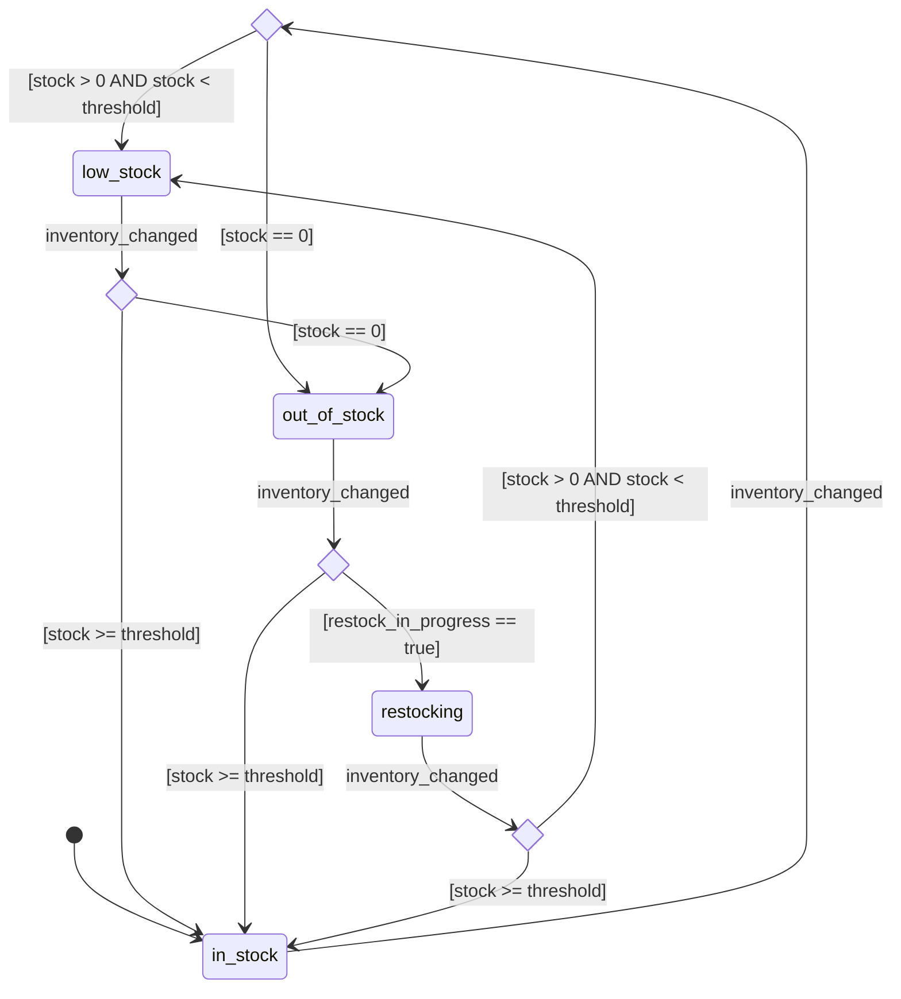

# inventory

## States

| state | note |
|---|---|
| in_stock | 在庫充足（閾値 threshold 以上） |
| low_stock | 在庫少量（0 < stock < threshold） |
| out_of_stock | 在庫切れ（stock == 0） |
| restocking | 補充作業中。バックヤードの restock 処理が inventory_db に書き込むことで発火・遷移する想定。restock_in_progress フラグ（inventory_db レコード内）で判定。 |

## Events

| event | source | actor | note |
|---|---|---|---|
| inventory_changed | er | — | catalog.store.inventory_db（商品在庫DB）の変化を監視するER起点event（V01-ADR-018）。クロスモジュールstore参照のためフルパス記法（V01-ADR-027）。payloadは省略（どのレコードが変化したかは watches 側の監視機構で解決される前提）。 |

