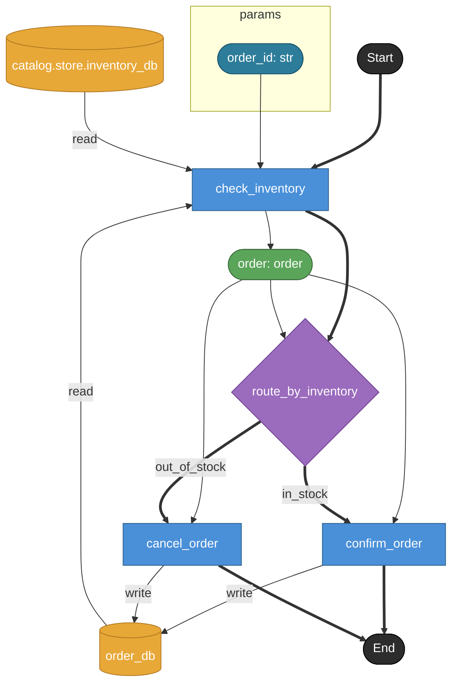

# process_order

在庫状況に応じて confirm（在庫充足）/ cancel（在庫不足）に分岐する。
returns なし（各分岐先 task が order_db を更新して終端、DAG的には END へfloating）。

## Tasks

### process_order

#### Params

| name | model | note |
|---|---|---|
| order_id | str | 対象注文ID |

### check_inventory

order_id から order を引き当て、含まれる order_item の在庫を inventory_db で照合。
条件評価そのものは branch ノード側の note + cases.label が表現する。

#### Params

| name | model | note |
|---|---|---|
| order_id | str | — |

#### Returns

| name | model | source |
|---|---|---|
| order | order | — |

#### Store access

| access | store |
|---|---|
| read | order_db |
| read | catalog.store.inventory_db |

### route_by_inventory

order に紐づく全 order_item について inventory_db.stock >= order_item.qty なら in_stock、
1件でも不足があれば out_of_stock。

#### Params

| name | model | note |
|---|---|---|
| order | order | — |

### confirm_order

在庫充足パス。order_db の order.status を confirmed に更新して終端。
下流 wiring 不要（floating node → END、V01-ADR-023）。

#### Params

| name | model | note |
|---|---|---|
| order | order | — |

#### Store access

| access | store |
|---|---|
| write | order_db |

### cancel_order

在庫不足パス。order_db の order.status を cancelled に更新して終端。
下流 wiring 不要（floating node → END、V01-ADR-023）。

#### Params

| name | model | note |
|---|---|---|
| order | order | — |

#### Store access

| access | store |
|---|---|
| write | order_db |

