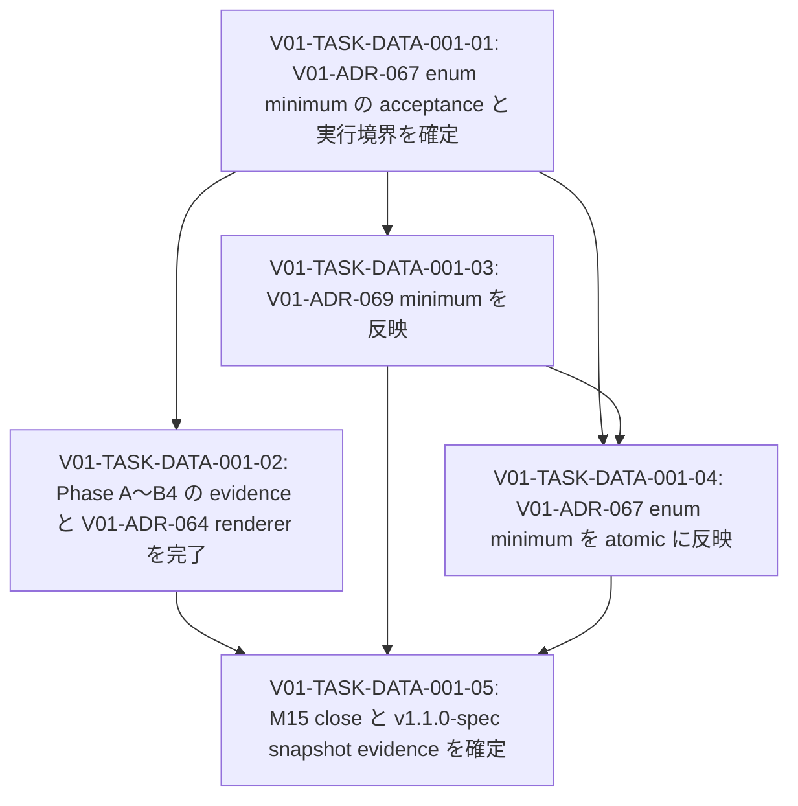

# V01-WORK-DATA-001: M15 v1.1.0-spec minimum-expressiveness release を実現する

- **id**: V01-WORK-DATA-001
- **status**: done
- **date**: 2026-05-29
- **source_requirement**: V01-REQ-DATA-001
- **impact_refs**:
  - V01-INV-DATA-001
  - V01-INV-DATA-002
  - V01-ADR-060
  - V01-ADR-061
  - V01-ADR-062
  - V01-ADR-063
  - V01-ADR-064
  - V01-ADR-067
  - V01-ADR-069
  - V01-ADR-074
- **tasks**:
  - V01-TASK-DATA-001-01
  - V01-TASK-DATA-001-02
  - V01-TASK-DATA-001-03
  - V01-TASK-DATA-001-04
  - V01-TASK-DATA-001-05

## Goal

`V01-REQ-DATA-001` が採用した F1 boundary に従い、legacy M15 を **minimum-expressiveness release** として完了可能な実行フローへ移し、`v1.1.0-spec` snapshot を成立させる。

本 work item は、Phase A〜B4 の完遂、V01-ADR-069 minimum の追従、V01-ADR-067 enum minimum の acceptance / spec / implementation / UC-002 migration / verification、legacy M15 close evidence と release snapshot 判定までを一つの解消フローとして所有する。

## Boundary

### Included in this work item

- V01-ADR-060〜V01-ADR-063 に由来する既存 Phase A〜B3 implementation / test / evidence の再照合
- V01-ADR-064 に由来する Phase B4 DAG renderer implementation、現行 fixture / golden 更新、regression verification
- V01-ADR-069 §10 に由来する M15 minimum scope の spec / implementation / tests 反映
  - nested `list<T>` / `dict<T>` の維持
  - parser safety limit
  - anonymous inline struct 非導入
  - `opaque_type_ref` warning
- V01-ADR-067 の enum minimum を accepted として確定し、初期 3 enum model を導入
  - `mcp_object_type`
  - `mcp_diagnostic_severity`
  - `reference_tree_direction`
- 上記 enum minimum に対応する UC-002 field migration と tests
- legacy M15 の historical close 記録および `v1.1.0-spec` snapshot evidence

### Explicitly excluded from this work item

- V01-ADR-070 / V01-ADR-071 / V01-ADR-072 / V01-ADR-075 に由来する helper model、private model render、model catalog、model file render
- V01-ADR-073 に由来する tagged union / discriminator payload の型表現
- V01-ADR-074 に由来する DAG asset node label の TypeRef hint 表示
  - v1.1 では enum を machine-readable な named model として導入するが、DAG Mermaid 本体での `asset_name: type_hint` 表示は後続へ送る。
  - V01-ADR-074 採用後は named model hint 規則により enum も表現できるため、本 work item で enum 専用 render rule は導入しない。
- V01-ADR-078 / V01-ADR-079 / V01-ADR-080 に由来する MCP semantic identity / state machine identity
- recursive `ObjectRef`、untagged union list、selector combination matrix、numeric range / default / cross-field behavior、usage-site-dependent vocabulary
- UC-002 に残る notes retreat の完全解消

## Impact scope

| layer | current state | handling in this work item |
|---|---|---|
| source requirement | `V01-REQ-DATA-001` accepted | F1 boundary の実行結果と close outcome を反映する |
| investigation evidence | `V01-INV-DATA-001` / `V01-INV-DATA-002` concluded、final review により F1 推奨 | 追加 inventory は行わず、境界根拠として使用する |
| legacy record | M15 open、Phase / checkbox が派生 ADR と乖離 | close 時に historical boundary と follow-up 分離を記録する。進捗正本にはしない |
| decision | V01-ADR-064 / V01-ADR-067 / V01-ADR-069 accepted | V01-ADR-067 enum minimum の acceptance gate は完了。受理済み boundary を後続 task の前提として扱う |
| design spec | V01-ADR-067 / V01-ADR-069 minimum の spec reflection は draft 反映済み、review minor fixes 反映済み | 実装検証結果を踏まえて必要なら追加同期する |
| implementation | V01-ADR-060〜V01-ADR-064 baseline / renderer evidence confirmed, V01-ADR-067 enum minimum and V01-ADR-069 parser safety / warning implemented. `go test ./...` passed | Implementation blocker cleared; release close can proceed after V01-TASK-DATA-001-05 |
| YAML / fixture | UC-001 current renders regenerated as v1.1 V01-ADR-064 goldens. UC-002 enum definition + initial 5 field migration complete; UC-002 full validate / render still blocked by pre-existing duplicate task QID issue | UC-001 golden blocker cleared. Existing UC-002 duplicate task issue remains outside this work item boundary |
| release evidence | `V01-TASK-DATA-001-05` により full verification / historical close / snapshot-ready evidence を記録済み | `v1.1.0-spec` is ready to tag after commit; tag issuance remains a separate git operation |

## Execution constraints

### Enum migration atomicity

V01-ADR-067 enum minimum の acceptance 確定後、3 enum model 定義追加と初期 field migration を別々の valid intermediate state として扱わない。

同一実行単位に含める対象:

- enum definitions:
  - `mcp_object_type`
  - `mcp_diagnostic_severity`
  - `reference_tree_direction`
- initial field migration:
  - `object_selector.object`
  - `object_ref.object`
  - `diagnostic.severity`
  - `get_reference_tree_request.direction`
  - `get_reference_tree_response.direction`

`get_references.direction`、`reference.direction`、object-dependent `kind`、`impact_severity`、`impact_fixability` は、実装途中で類似候補に見えても本 work item の migration scope に自動追加しない。

### V01-ADR-069 effect boundary

V01-ADR-069 minimum の `opaque_type_ref` warning は、container TypeRef 内の `any` を debt として露出する baseline である。UC-002 に存在する bare `any + note` の主要 response shape を warning 化または解消する capability として扱わない。

F1 の minimum-expressiveness 効果は主として V01-ADR-067 enum minimum が担い、helper-shape debt は後続 scope として保持する。

### Render boundary

- V01-ADR-064 の `returns.source` / initialized source DAG render は本 work item の blocker である。
- V01-ADR-074 の asset node TypeRef hint は blocker ではない。enum 導入後も DAG 本体で型 hint が表示されない状態を v1.1 の意図的 boundary とする。
- V01-ADR-074 を後続で採用する際、named model として導入済みの enum を既存 TypeRef hint rule により表示可能とする。

### Fixture snapshot boundary

`v1.0.0-spec` は git tag により保持された過去 snapshot であり、現行 UC-001 fixture を将来仕様へ更新不能にするものではない。本 work item では UC-001 / UC-002 の current fixture / golden を v1.1 regression evidence として必要に応じて更新し、`v1.1.0-spec` close 時に新しい snapshot evidence を確定する。

### Shared spec update ordering

V01-ADR-069 minimum と V01-ADR-067 enum minimum は `docs/spec/type-ref.md` / `docs/spec/diagnostics.md` 等の共通 surface を更新し得る。配下 task は、判断確定前の実装先行や相互上書きを避けるため、spec reflection と implementation / tests の順序・commit boundary を明示する。

## Task flow

## Task ordering and blockers

| task | can start when | blocks / constraint |
|---|---|---|
| V01-TASK-DATA-001-01 | immediately | V01-ADR-067 enum minimum の spec / implementation / migration 着手前に完了が必要 |
| V01-TASK-DATA-001-02 | V01-TASK-DATA-001-01 完了後 | Done. V01-ADR-060〜V01-ADR-064 evidence / renderer / UC-001 golden regeneration verified. V01-ADR-074 TypeRef hint was not introduced |
| V01-TASK-DATA-001-03 | V01-TASK-DATA-001-01 完了後 | Done. V01-ADR-069 parser safety / warning implementation と tests は local verification passed |
| V01-TASK-DATA-001-04 | V01-TASK-DATA-001-01 / 03 完了後 | Done. enum definitions と初期 field migration は atomic に反映済み。UC-002 full validate の既存 duplicate task QID issue は本 task 外 |
| V01-TASK-DATA-001-05 | V01-TASK-DATA-001-02 / 03 / 04 完了後 | Done. Work item close と `v1.1.0-spec` snapshot-ready evidence を記録済み |

## Completion condition

以下をすべて満たしたとき、本 work item を `done` にできる。

1. `V01-REQ-DATA-001` が定めた F1 boundary が、後続判断で矛盾なく維持されている。
2. V01-ADR-060〜V01-ADR-063 由来の Phase A〜B3 について、必要な implementation / tests / evidence が独立に確認されている。
3. V01-ADR-064 の Phase B4 renderer / fixture / regression verification が完了している。
4. V01-ADR-069 minimum の spec / implementation / tests 反映が完了しており、`opaque_type_ref` が bare `any + note` debt 全体を救済するものではないという境界が維持されている。
5. V01-ADR-067 の enum minimum が accepted として確定し、初期 3 enum model と初期 field migration が atomic に反映され、関連 validation / tests が完了している。
6. V01-ADR-070 / V01-ADR-073 / V01-ADR-074 / V01-ADR-078〜080 および notes retreat 完全解消が、暗黙の blocker として scope に逆流していない。
7. Legacy M15 record に、実 close boundary、後続へ送った範囲、`minimum-expressiveness release` としての結果が historical evidence として記録されている。
8. Full verification と `v1.1.0-spec` snapshot evidence が記録され、`V01-REQ-DATA-001` に解消結果を反映できる状態になっている。

## Close outcome

`V01-WORK-DATA-001` is done.

- `V01-TASK-DATA-001-01`〜`V01-TASK-DATA-001-05` are done.
- F1 boundary was maintained: Phase A〜B4 + V01-ADR-069 minimum + V01-ADR-067 enum minimum.
- `go test ./...` passed after UC-001 current render regeneration.
- UC-001 current renders are v1.1 V01-ADR-064 golden evidence.
- UC-002 initial enum migration is complete for the exact 3 enum model / 5 field scope.
- UC-002 full validate / render still has a pre-existing duplicate task QID / unresolved flow task issue; this is outside the enum migration and M15 close boundary.
- `v1.1.0-spec` is ready to tag after commit. The tag itself has not been issued by this document update.
- Follow-ups remain outside this work item: V01-ADR-070 / V01-ADR-071 / V01-ADR-072 / V01-ADR-075 helper/model render series, V01-ADR-073 tagged union, V01-ADR-074 DAG asset TypeRef hint, V01-ADR-078〜080 MCP / state identity, and remaining UC-002 notes retreat debt.
