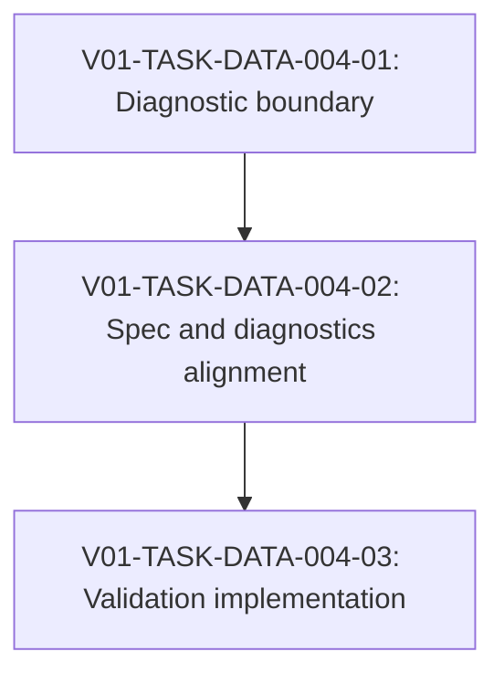

# V01-WORK-DATA-004: Implement task-file private helper signature exposure policy

- **id**: V01-WORK-DATA-004
- **status**: done
- **date**: 2026-05-31
- **source_requirement**: V01-REQ-DATA-003
- **impact_refs**:
  - V01-REQ-DATA-003
  - V01-WORK-DATA-002
  - V01-TASK-DATA-002-03
  - V01-ADR-070
  - V01-ADR-071
- **tasks**:
  - V01-TASK-DATA-004-01
  - V01-TASK-DATA-004-02
  - V01-TASK-DATA-004-03

## Goal

Implement the accepted V01-REQ-DATA-003 asymmetric policy for task-file private helper models in task signatures without reopening V01-WORK-DATA-002 or mixing in V01-WORK-DATA-003 model-file render scope.

The policy is:

- `params[].model` must not reference a task-file private helper model because params are caller-provided input contracts.
- `returns.model` may reference a task-file private helper model because returns are task-produced output contracts and task-local response schemas are useful.

## Boundary

### Included

- Preserve the V01-REQ-DATA-003 asymmetric signature exposure policy.
- Define validation behavior for task-file private helper model references from `params[].model`.
- Keep task-file private helper model references from `returns.model` valid.
- Define the diagnostic identifier, severity, target, and suppression behavior for disallowed params references.
- Keep allowed returns references silent in the minimum scope.
- Update the relevant specs for task signature exposure policy, diagnostics, and TypeRef resolution boundary.
- Add validation tests for params rejection and returns allowance.
- Clarify only as needed that render exposure is structural visibility, not validation success.

### Excluded

- V01-WORK-DATA-003 model-file helper render boundary.
- V01-TASK-DATA-003-02 model-file render minimum spec alignment.
- V01-ADR-075 model-file render.
- V01-ADR-072 model / schema catalog.
- V01-ADR-073 tagged union.
- V01-ADR-074 DAG asset TypeRef hint.
- V01-ADR-078 / V01-ADR-079 / V01-ADR-080 MCP semantic identity or helper exposure schema.
- UC-002 model response helper-shape migration.
- Remaining UC-002 notes retreat debt.
- Redesigning the `## Private models` render table.
- Reopening V01-WORK-DATA-002 task-file helper minimum.
- M15 / v1.1.0-spec reopening.

## Impact Scope

| layer | current state | handling in this work item |
|---|---|---|
| source requirement | V01-REQ-DATA-003 accepted | Owns policy execution and close evidence |
| previous work | V01-WORK-DATA-002 done | Do not reopen; treat task-file helper minimum as baseline |
| model-file render | V01-WORK-DATA-003 in progress elsewhere | Explicitly out of scope |
| decision | V01-ADR-070 / V01-ADR-071 accepted | Use task-file helper semantics and render exposure as context only |
| spec | task-file helper and TypeRef specs exist | Add only signature exposure policy and diagnostics wording |
| implementation | task-file helper TypeRef resolution exists | Add validation around params / returns direction |
| render | `## Private models.used by` exists | Do not redesign; preserve direct reference inventory semantics |

## Task Flow

## Tasks

- `V01-TASK-DATA-004-01`: Finalize diagnostic boundary for task-file private helper signature exposure.
- `V01-TASK-DATA-004-02`: Align specs and diagnostics for params rejection / returns allowance.
- `V01-TASK-DATA-004-03`: Implement validation behavior and regression tests.

## Completion Condition

This work item can be marked `done` when:

- `params[].model` references to task-file private helper models are rejected by validation.
- `returns.model` references to task-file private helper models remain valid and silent.
- The diagnostic identifier, severity, target, and suppression behavior are reflected in specs.
- Regression tests cover params rejection, returns allowance, and diagnostic suppression / non-cascade behavior.
- Render output is not redesigned and `## Private models.used by` remains direct reference inventory rather than validation success evidence.
- V01-WORK-DATA-003, V01-ADR-075, V01-ADR-073, V01-ADR-074, MCP identity, UC-002 migration, V01-WORK-DATA-002 reopening, and M15 reopening remain outside scope.

## Close Outcome

V01-WORK-DATA-004 is closed as `done` for the task-file private helper signature exposure policy.

Closed scope:

- V01-TASK-DATA-004-01 finalized the diagnostic boundary:
  - diagnostic id: `invalid_private_model_reference`
  - severity: `error`
  - target: offending `params[].model`
  - applies to task / branch / fork / join params
  - `returns.model` private helper references remain valid and silent
- V01-TASK-DATA-004-02 reflected the policy in:
  - `docs/spec/diagnostics.md`
  - `docs/spec/nodes.md`
  - `docs/spec/type-ref.md`
- V01-TASK-DATA-004-03 implemented and verified validation behavior:
  - params private helper references are rejected
  - returns private helper references remain valid
  - unresolved references still use `unresolved_model`
  - duplicate helper identity suppresses noisy cascade
  - DAG render behavior remains unchanged

Verification evidence:

- `go test ./internal/resolve -run "TestTaskFileHelper|TestTaskFilePrivateHelper|TestQualifiedTypeRefCannotReferenceTaskFileHelperModel|TestParamListMissingModelUsesUnresolvedModel"`: pass
- `go test ./internal/resolve`: pass
- `go test ./internal/render/dag ./internal/render/model ./internal/render/er`: pass
- `go test ./internal/query`: pass
- `go test ./internal/resolve ./internal/render/dag ./internal/query`: pass
- `go test ./...`: pass
- `Design Records validate_records(kind=task)`: pass

Deferred / excluded scope:

- V01-WORK-DATA-003 remains closed separately.
- V01-WORK-DATA-002 remains closed.
- Tagged union / V01-ADR-073 remains out of scope.
- Model-file render is available and is not reopened.
- UC-002 model response helper-shape migration remains excluded and should be handled by later follow-up work.
- Remaining UC-002 notes retreat debt remains excluded.
