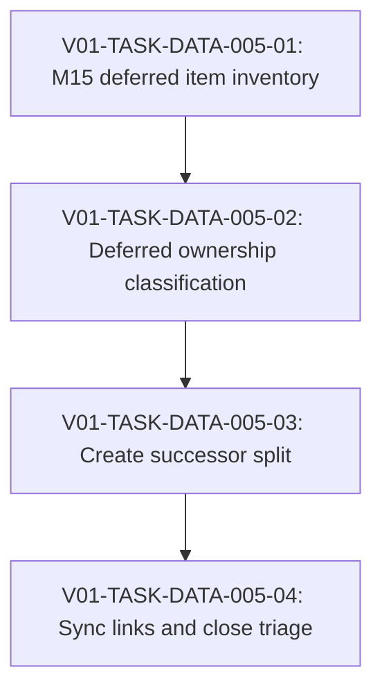

# V01-WORK-DATA-005: Triage M15 deferred follow-ups and split successor work

- **id**: V01-WORK-DATA-005
- **status**: done
- **date**: 2026-06-01
- **source_requirement**: V01-REQ-DATA-002
- **impact_refs**:
  - V01-REQ-DATA-002
  - V01-REQ-DATA-003
  - V01-WORK-DATA-001
  - V01-WORK-DATA-002
  - V01-WORK-DATA-003
  - V01-WORK-DATA-004
  - V01-ADR-073
  - V01-ADR-074
  - V01-ADR-078
  - V01-ADR-079
  - V01-ADR-080
- **tasks**:
  - V01-TASK-DATA-005-01
  - V01-TASK-DATA-005-02
  - V01-TASK-DATA-005-03
  - V01-TASK-DATA-005-04

## Goal

Create a single canonical planning point for M15 deferred follow-ups that were intentionally excluded from the completed DATA work item chain.

This work item exists to prevent the remaining deferred items from being rediscovered through M15 close notes, excluded-scope notes, or scattered task evidence every time DATA follow-up planning resumes.

## Boundary

### Included

- Inventory M15 / V01-WORK-DATA-001 deferred items that remain outside V01-WORK-DATA-002, V01-WORK-DATA-003, and V01-WORK-DATA-004.
- Classify each deferred item into successor requirement, work item, task, or no-action / obsolete.
- Decide whether each item belongs under DATA, MCP, or another domain.
- Preserve the current close boundaries of V01-WORK-DATA-002, V01-WORK-DATA-003, and V01-WORK-DATA-004.
- Produce a successor split for:
  - V01-ADR-073 tagged union / discriminator payload.
  - V01-ADR-074 DAG asset TypeRef hint.
  - V01-ADR-078 / V01-ADR-079 / V01-ADR-080 MCP semantic identity / state machine identity.
  - UC-002 duplicate task QID / unresolved flow task issue.
  - remaining UC-002 notes retreat debt.
- Identify whether any existing requirement should receive additional work item links.

### Excluded

- Implementing V01-ADR-073 tagged union / discriminator payload.
- Implementing V01-ADR-074 DAG asset TypeRef hint.
- Implementing V01-ADR-078 / V01-ADR-079 / V01-ADR-080 MCP identity behavior.
- Fixing UC-002 duplicate task QID / unresolved flow task diagnostics.
- Completing the remaining UC-002 notes retreat cleanup.
- Reopening M15 / v1.1.0-spec.
- Reopening V01-WORK-DATA-001, V01-WORK-DATA-002, V01-WORK-DATA-003, or V01-WORK-DATA-004.
- Changing renderer, validator, parser, MCP tool schema, fixtures, or golden files.

## Deferred Item Inventory Seed

| item | current known state | expected handling |
|---|---|---|
| V01-ADR-073 tagged union / discriminator payload | excluded from V01-WORK-DATA-003 / V01-WORK-DATA-004 implementation scope | likely successor DATA requirement or work item |
| V01-ADR-074 DAG asset TypeRef hint | explicitly deferred from M15 / V01-WORK-DATA-001 and excluded from later DATA work | likely successor DATA work item after TypeRef / model shape dependencies are understood |
| V01-ADR-078 / V01-ADR-079 / V01-ADR-080 MCP semantic identity / state machine identity | deferred from M15 and excluded from V01-REQ-DATA-002 / V01-WORK-DATA-002 / V01-WORK-DATA-003 / V01-WORK-DATA-004 | likely MCP-domain requirement or work item, not direct DATA implementation |
| UC-002 duplicate task QID / unresolved flow task issue | noted as M15 follow-up debt | likely targeted DATA diagnostic / fixture work item |
| remaining UC-002 notes retreat debt | partially reduced by helper/model response shape work but not fully eliminated | likely cleanup work item after diagnostic and model-shape follow-ups are split |

## Impact Scope

| layer | current state | handling in this work item |
|---|---|---|
| source requirement | V01-REQ-DATA-002 captured | Use as the umbrella source for DATA helper/model render follow-up planning |
| private helper signature policy | V01-REQ-DATA-003 / V01-WORK-DATA-004 active | Do not alter; only account for excluded remaining debt |
| completed DATA work | V01-WORK-DATA-002 / V01-WORK-DATA-003 done | Preserve close boundaries and do not reopen |
| M15 deferred ADRs | V01-ADR-073 / V01-ADR-074 / V01-ADR-078 / V01-ADR-079 / V01-ADR-080 | Classify into successor artifacts |
| UC-002 debt | duplicate QID, unresolved flow task, notes retreat | Split into targeted follow-up rather than burying in close notes |

## Task Flow

## Tasks

- `V01-TASK-DATA-005-01`: Inventory M15 deferred items and source notes.
- `V01-TASK-DATA-005-02`: Classify DATA / MCP / cleanup ownership.
- `V01-TASK-DATA-005-03`: Create successor REQ / WORK / TASK split.
- `V01-TASK-DATA-005-04`: Sync links and prepare close evidence.

## Completion Condition

This work item can be marked `done` when:

- all M15 deferred follow-up candidates listed above are either linked to a successor requirement / work item / task or explicitly marked no-action / obsolete;
- no remaining candidate exists only in M15 close notes, excluded-scope notes, or task evidence;
- successor artifacts clearly separate DATA expressiveness, MCP identity, UC-002 diagnostic debt, and UC-002 cleanup debt;
- V01-WORK-DATA-002, V01-WORK-DATA-003, and V01-WORK-DATA-004 are not reopened;
- no implementation, fixture, golden, renderer, validator, parser, or MCP tool behavior is changed by this triage work item itself.

## Close Evidence

V01-WORK-DATA-005 is closed as `done` for M15 deferred follow-up triage.

Closed scope:

- V01-TASK-DATA-005-01 inventoried the M15 deferred follow-up buckets and source notes.
- V01-TASK-DATA-005-02 classified ownership and successor action for each deferred bucket.
- V01-TASK-DATA-005-03 created or selected successor requirement / work item artifacts.
- V01-TASK-DATA-005-04 synchronized requirement links and recorded close evidence.

Successor handling:

- V01-ADR-073 tagged union / discriminator payload: `V01-REQ-DATA-004` / `V01-WORK-DATA-010`.
- V01-ADR-074 DAG asset TypeRef hint: `V01-REQ-DATA-005` / `V01-WORK-DATA-007`.
- V01-ADR-078 / V01-ADR-079 / V01-ADR-080 MCP semantic identity / state machine identity: existing `V01-REQ-MCP-004` / `V01-WORK-MCP-004`.
- UC-002 duplicate task QID / unresolved flow task issue: `V01-WORK-DATA-008` under `V01-REQ-DATA-002`.
- Remaining UC-002 notes retreat debt: `V01-WORK-DATA-009` under `V01-REQ-DATA-002`.

Boundary preserved:

- V01-WORK-DATA-002, V01-WORK-DATA-003, and V01-WORK-DATA-004 were not reopened.
- No implementation, fixture, golden, renderer, validator, parser, MCP tool schema, UC-002 YAML, or render output was changed by this triage work.
