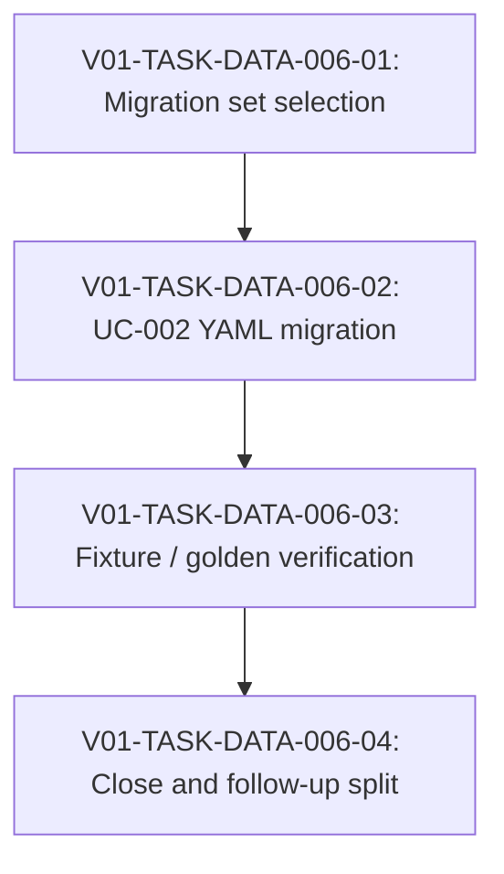

# V01-WORK-DATA-006: Migrate UC-002 helper-shape candidates

- **id**: V01-WORK-DATA-006
- **status**: done
- **date**: 2026-06-01
- **source_requirement**: V01-REQ-DATA-002
- **impact_refs**:
  - V01-REQ-DATA-002
  - V01-REQ-DATA-003
  - V01-WORK-DATA-002
  - V01-WORK-DATA-003
  - V01-WORK-DATA-004
  - V01-TASK-DATA-003-04
  - V01-ADR-070
  - V01-ADR-071
  - V01-ADR-075
- **tasks**:
  - V01-TASK-DATA-006-01
  - V01-TASK-DATA-006-02
  - V01-TASK-DATA-006-03
  - V01-TASK-DATA-006-04

## Goal

Migrate the UC-002 helper-shape candidates that were classified by V01-WORK-DATA-003 and left out of V01-WORK-DATA-004 after the required render and signature-policy blockers were resolved.

V01-WORK-DATA-003 made model-file render available and classified the UC-002 model response helper candidates. V01-WORK-DATA-004 resolved task-file private helper params / returns exposure policy. This work item owns the next migration step without reopening either work item.

## Boundary

### Included

- Review V01-TASK-DATA-003-04 candidate classification as the migration input.
- Migrate selected UC-002 model response helper-shape candidates where the public response model can remain public and nested response-local shapes can become same-file private helper models.
- Re-evaluate the V01-WORK-DATA-004 wait candidates after the params / returns policy is now enforced.
- For task-file candidates blocked by `params[].model` policy, decide whether to:
  - keep `any` / note-based shape,
  - use public model files,
  - migrate only returns-side helper shapes,
  - or defer to a later design.
- Update UC-002 YAML, fixtures, golden render outputs, and verification evidence only for the selected migration set.
- Preserve model-file render and task-file signature policy as already implemented capabilities.

### Candidate input from V01-TASK-DATA-003-04

Model-file helper migration candidates:

- N-005: `analyze_impact_response.impacts`
- N-006: `analyze_impact_response.coverage`
- N-014: `get_reference_tree_response.nodes`
- N-015: `get_reference_tree_response.edges`
- N-023: `get_source_response.snippet`
- N-029: `list_endpoints_response.tables`
- N-033: `list_objects_response.objects`

Task-file policy-blocked candidates to re-evaluate:

- UC-002 MCP task files where `query_service` returns `model: any` and `build_response.params[].model` consumes `query_result` as `any`.
- These candidates must not be migrated into task-file private helper params, because V01-WORK-DATA-004 made `params[].model` references to task-file private helper models invalid.

### Excluded

- Reopening V01-WORK-DATA-002 task-file helper minimum.
- Reopening V01-WORK-DATA-003 model-file render implementation or boundary.
- Reopening V01-WORK-DATA-004 signature policy implementation.
- Tagged union / V01-ADR-073 discriminator and variants rendering.
- V01-ADR-074 DAG asset TypeRef hint.
- V01-ADR-078 / V01-ADR-079 / V01-ADR-080 MCP semantic identity or helper exposure schema.
- Broad UC-002 notes-retreat cleanup outside the classified helper-shape candidates.
- Enum / range / default / support-matrix constraints not required for the selected helper-shape migration.
- Request-side or generic container debt that is not a response-local helper-shape migration.
- M15 / v1.1.0-spec reopening.

## Impact Scope

| layer | current state | handling in this work item |
|---|---|---|
| source requirement | V01-REQ-DATA-002 accepted helper/model-render follow-up | Provides the migration lineage |
| model-file render | V01-WORK-DATA-003 done | Use as available capability; do not reopen |
| task-file signature policy | V01-WORK-DATA-004 done | Use as constraint; do not reopen |
| UC-002 candidates | V01-TASK-DATA-003-04 classified | Use as input inventory |
| YAML / fixtures / golden outputs | UC-002 still has helper-shape note debt | Update only selected migration targets |

## Task Flow

## Task Candidates

- `V01-TASK-DATA-006-01`: Select the exact UC-002 helper-shape migration set from V01-TASK-DATA-003-04 candidates.
- `V01-TASK-DATA-006-02`: Migrate selected UC-002 YAML to model-file or allowed task-file helper shapes.
- `V01-TASK-DATA-006-03`: Update fixtures / golden outputs and run verification.
- `V01-TASK-DATA-006-04`: Close the migration work item and split any remaining notes-retreat follow-ups.

V01-TASK-DATA-006-01 has been created to record the selected migration set.
V01-TASK-DATA-006-02 has been created and completed to migrate the selected model-file response helper shapes and regenerate UC-002 render fixtures.
V01-TASK-DATA-006-03 has been created and completed as a separate verification review of the selected migration boundary, temp/canonical render equality, and validation evidence.
V01-TASK-DATA-006-04 has been created and completed to synchronize close evidence, deferred debt classification, and work item status.

## Completion Condition

This work item can be marked `done` when the selected UC-002 helper-shape migration set is implemented, verified with fixtures / golden outputs, and remaining candidates are explicitly classified as deferred, obsolete, or successor work without reopening V01-WORK-DATA-002, V01-WORK-DATA-003, V01-WORK-DATA-004, tagged union, MCP identity, or M15 scope.

## Close Evidence

V01-WORK-DATA-006 is closed as `done` for the selected UC-002 helper-shape migration.

Closed scope:

- V01-TASK-DATA-006-01 selected 7 model-file response-local helper-shape candidates.
- V01-TASK-DATA-006-02 migrated the selected candidates as same-file private helper models.
- V01-TASK-DATA-006-03 verified the migration boundary and render evidence with an OK to proceed verdict.
- V01-TASK-DATA-006-04 synchronized the close evidence and work item status.

Migration result:

- The owning response models remain public.
- The selected helpers were not cut out to standalone public model files.
- UC-002 task-file `query_result:any` patterns remain unchanged.
- Current UC-002 render evidence is `rendered 40 file(s)`.
- Temp and canonical render file lists matched.
- Temp and canonical render SHA-256 hashes matched.
- YAML validation, focused Go tests, and Design Records MCP task / work item validation passed.

Remaining deferred debt:

- The 8 UC-002 MCP task-file `query_result:any` patterns remain deferred under the accepted DATA-004 / V01-REQ-DATA-003 task `params[].model` private-helper policy.
- Tagged union / discriminator payloads, identity semantics, optional semantics, literal constraints, enum / vocabulary constraints, and broader notes-retreat debt remain outside V01-WORK-DATA-006.
- V01-WORK-DATA-002, V01-WORK-DATA-003, and V01-WORK-DATA-004 were not reopened.
- No V01-WORK-DATA-005, V01-REQ-MCP-006, V01-REQ-MCP-007, V01-WORK-MCP-006, tagged union, V01-ADR-074 DAG asset TypeRef hint, or MCP semantic identity work was mixed into this close.
