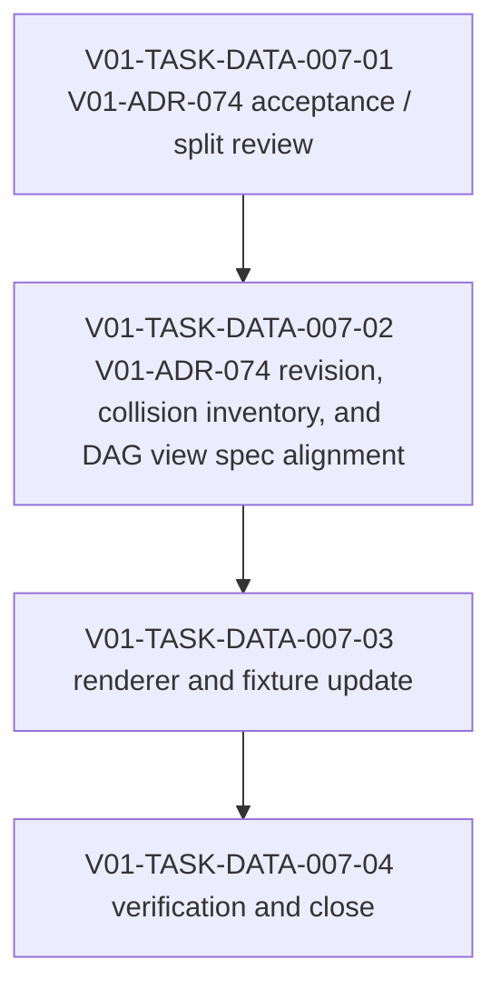

# V01-WORK-DATA-007: Implement DAG asset TypeRef hint render support

- **id**: V01-WORK-DATA-007
- **status**: done
- **date**: 2026-06-01
- **source_requirement**: V01-REQ-DATA-005
- **impact_refs**:
  - V01-REQ-DATA-005
  - V01-ADR-074
  - V01-WORK-DATA-001
  - V01-TASK-DATA-005-02
- **tasks**:
  - V01-TASK-DATA-007-01
  - V01-TASK-DATA-007-02
  - V01-TASK-DATA-007-03
  - V01-TASK-DATA-007-04

## Goal

Implement DAG asset TypeRef hint render support as a focused DATA render / view successor to V01-ADR-074.

## Boundary

### Included

- Review V01-ADR-074 and decide whether it can be accepted as-is, revised, or split before implementation.
- Define the exact DAG asset label TypeRef hint render boundary.
- Align relevant view specs and render behavior.
- Add or update fixture / golden evidence for asset node and params boundary asset hint rendering.
- Verify that full container TypeRef details remain outside Mermaid label output when required by the accepted boundary.

### Excluded

- V01-ADR-073 tagged union / discriminator payload support.
- V01-ADR-078 / V01-ADR-079 / V01-ADR-080 MCP semantic identity / state machine identity.
- UC-002 duplicate task QID / unresolved flow task issue.
- Remaining UC-002 notes retreat cleanup.
- Reopening M15, V01-WORK-DATA-001, V01-WORK-DATA-002, V01-WORK-DATA-003, or V01-WORK-DATA-004.

## Impact Scope

| layer | current state | handling in this work item |
|---|---|---|
| source requirement | V01-REQ-DATA-005 captured | Owns DAG TypeRef hint render support |
| decision | V01-ADR-074 proposed | Review and accept / revise / split before implementation |
| completed M15 work | V01-WORK-DATA-001 done | Preserve M15 close boundary; implement only as successor work |
| render views | DAG Markdown / Mermaid | Update only the accepted TypeRef hint surfaces |

## Task Flow

Initial task artifacts:

- V01-TASK-DATA-007-01
- V01-TASK-DATA-007-02
- V01-TASK-DATA-007-03
- V01-TASK-DATA-007-04

Expected later split:

## Completion Condition

This work item is `done`.

Close evidence:

- V01-ADR-074 is accepted under V01-REQ-DATA-005 / V01-WORK-DATA-007.
- `docs/spec/views/dag.md` defines accepted DAG asset TypeRef hint label behavior.
- DAG renderer implementation supports params boundary assets, task returns, join returns, and foreach collected assets.
- UC-001 DAG golden files were updated for TypeRef hint labels.
- `go test ./...` passed.
- UC-001 / UC-002 validate passed with 0 errors and 0 warnings.
- Shortened QID fallback was not implemented.
- No new diagnostics, TypeRef compatibility changes, UC YAML changes, or unrelated work were introduced.
- Close synchronization recorded in V01-TASK-DATA-007-04.
