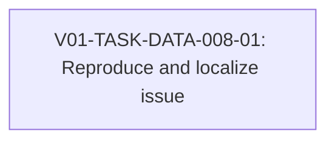

# V01-WORK-DATA-008: Resolve UC-002 duplicate task QID and unresolved flow task issue

- **id**: V01-WORK-DATA-008
- **status**: done
- **date**: 2026-06-01
- **source_requirement**: V01-REQ-DATA-002
- **impact_refs**:
  - V01-REQ-DATA-002
  - V01-WORK-DATA-001
  - V01-WORK-RESOLVE-001
  - V01-ADR-058
  - V01-TASK-DATA-005-01
  - V01-TASK-DATA-005-02
- **tasks**:
  - V01-TASK-DATA-008-01

## Goal

Resolve the pre-existing UC-002 duplicate task QID / unresolved flow task issue that was recorded as a blocker during M15 close triage.

This work item is a targeted diagnostic / fixture blocker follow-up, not a new DATA expressiveness feature.

## Boundary

### Included

- Reproduce and locate the UC-002 duplicate task QID / unresolved flow task issue.
- Decide whether the root cause is YAML identity, validation behavior, resolver behavior, fixture drift, or diagnostic cascade.
- Apply the minimal fix needed to restore clear UC-002 validation / render behavior, if still needed.
- Add regression evidence for the fixed behavior or already-resolved state.

### Excluded

- V01-ADR-073 tagged union support.
- V01-ADR-074 DAG asset TypeRef hint.
- V01-ADR-078 / V01-ADR-079 / V01-ADR-080 MCP identity series.
- Broad UC-002 notes retreat cleanup.
- Helper model / model-file render redesign.
- Reopening M15, V01-WORK-DATA-001, V01-WORK-DATA-002, V01-WORK-DATA-003, or V01-WORK-DATA-004.

## Impact Scope

| layer | captured state | close handling in this work item |
|---|---|---|
| source requirement | V01-REQ-DATA-002 captured | Kept as the DATA follow-up umbrella for the stale blocker record |
| M15 close | V01-WORK-DATA-001 done | Treat issue as pre-existing and outside M15 close |
| UC-002 validation / render | previously recorded as blocked by duplicate task QID / unresolved flow task issue | Current HEAD validates and renders cleanly; blocker was already resolved by V01-WORK-RESOLVE-001 / ADR-058-aligned resolver behavior |

## Task Flow

The work item closed with a single reproduction / localization task.



No later `V01-TASK-DATA-008-02` correction task is needed. The reproduction evidence showed this was a stale follow-up: the historical issue reproduced at `fe12ef6`, but current HEAD already resolves it.

## Completion Condition

This work item can be marked `done` when the duplicate task QID / unresolved flow task issue is localized, corrected or proven already resolved, regression-covered or verified by current validation / tests, and closed without pulling in unrelated DATA expressiveness or notes retreat cleanup work.

## Close Evidence

Closed on 2026-06-01.

### Result

`V01-TASK-DATA-008-01` confirmed that the UC-002 duplicate task QID / unresolved flow task issue does not reproduce on current HEAD / working tree.

Current verification passed:

- `go run ./cmd/brewprint validate --yaml-root docs\uc\002-brewprint-self-hosting\yaml`
- `go run ./cmd/brewprint validate --yaml-root docs\uc\002-brewprint-self-hosting\yaml --format json`
- `go run ./cmd/brewprint render --yaml-root docs\uc\002-brewprint-self-hosting\yaml --out $env:TEMP\brewprint-uc002-data008-render --clean`
- `go test ./cmd/brewprint ./internal/resolve ./internal/render/placement ./internal/render/dag`
- `go test ./...`

All current commands passed. UC-002 JSON validation returned no diagnostics, and temp render produced 40 files.

### Historical reproduction

The issue reproduced from clean snapshot `fe12ef6` with:

```text
go run ./cmd/brewprint validate --yaml-root docs\uc\002-brewprint-self-hosting\yaml
```

Historical diagnostics reported duplicate public QIDs such as:

```text
mcp.task.build_response
mcp.task.query_service
mcp.task.validate_request
```

and cascaded into unresolved same-file flow steps:

```text
build_response
query_service
validate_request
```

The historical run ended with `42 error(s), 0 warning(s)`.

### Root cause

Primary classification: resolver behavior problem.

Secondary classification: diagnostic cascade.

The UC-002 YAML was valid. V01-ADR-058 and the current specs allow file-private subnodes to share local IDs across files. The historical failure happened because non-main sub tasks were registered as public `module.kind.id` QIDs, so repeated helper IDs across task files collided. Once `symbols.addNode` emitted `duplicate_node` and skipped same-file registration, bare `flow.step` resolution cascaded into `unresolved_flow_task`.

Current resolver behavior fixes the issue by using file-private internal IDs such as `mcp/task/get_signature.yaml#validate_request`, excluding private subnodes from public `NodesByQID`, and resolving bare flow IDs through same-file private nodes first.

### Close decision

No DATA correction task is needed.

`V01-WORK-DATA-008` is closed as a stale M15 follow-up that was already resolved by `V01-WORK-RESOLVE-001` / ADR-058-aligned resolver changes before this DATA follow-up was executed.

No YAML, resolver, renderer, validator, fixture, golden, MCP public contract, V01-ADR-073, V01-ADR-074, V01-ADR-078, V01-ADR-079, V01-ADR-080, helper model / model-file render redesign, broad UC-002 notes retreat cleanup, or M15 reopening work is part of this close.
