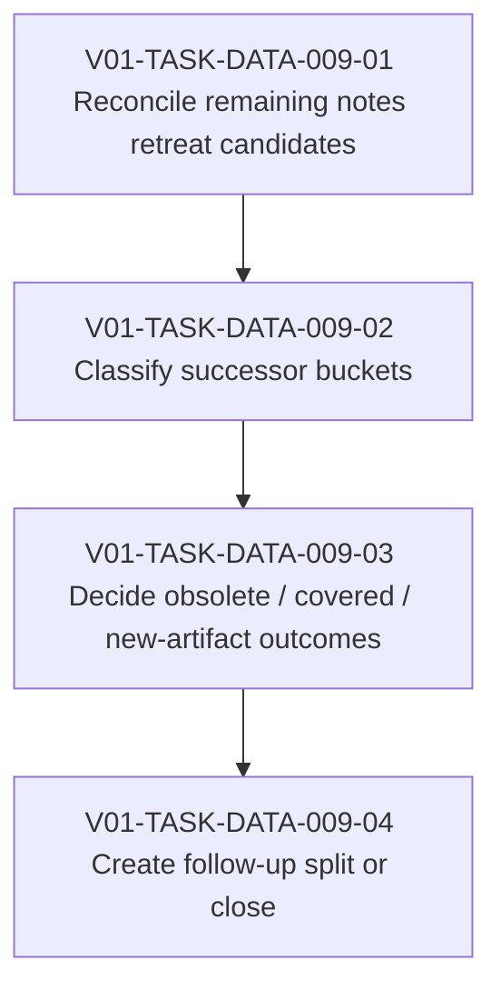

# V01-WORK-DATA-009: Classify remaining UC-002 notes retreat debt

- **id**: V01-WORK-DATA-009
- **status**: done
- **date**: 2026-06-01
- **source_requirement**: V01-REQ-DATA-002
- **impact_refs**:
  - V01-REQ-DATA-002
  - V01-INV-DATA-002
  - V01-TASK-DATA-003-04
  - V01-TASK-DATA-005-01
  - V01-TASK-DATA-005-02
- **tasks**:
  - V01-TASK-DATA-009-01
  - V01-TASK-DATA-009-02
  - V01-TASK-DATA-009-03
  - V01-TASK-DATA-009-04

## Goal

Classify the remaining UC-002 notes retreat debt into smaller successor buckets after the helper/model render, signature policy, tagged union, DAG TypeRef hint, MCP identity, and UC-002 duplicate task QID follow-ups have been separated.

This work item is cleanup planning, not direct cleanup implementation.

## Boundary

### Included

- Review remaining UC-002 notes retreat candidates that were not handled by M15, V01-WORK-DATA-002, V01-WORK-DATA-003, or V01-WORK-DATA-004.
- Classify remaining debt into implementable successor buckets.
- Separate enum-like leftovers, numeric/default behavior, selector matrices, recursive / union cases, request-side / generic containers, MCP identity-related notes, and human explanation / view-renderer notes.
- Decide which items are obsolete, already covered by successor work, or require new requirements / work items.

### Excluded

- Direct UC-002 YAML migration.
- Fixture / golden regeneration.
- V01-ADR-073 tagged union implementation.
- V01-ADR-074 DAG TypeRef hint implementation.
- V01-ADR-078 / V01-ADR-079 / V01-ADR-080 MCP identity implementation.
- UC-002 duplicate task QID / unresolved flow task fix.
- Reopening M15, V01-WORK-DATA-001, V01-WORK-DATA-002, V01-WORK-DATA-003, or V01-WORK-DATA-004.

## Impact Scope

| layer | current state | handling in this work item |
|---|---|---|
| source requirement | V01-REQ-DATA-002 captured | Owns broad helper/model follow-up umbrella, but not all cleanup implementation |
| investigation | V01-INV-DATA-002 concluded | Use as broad note-retreat inventory source |
| classification | V01-TASK-DATA-003-04 done | Use candidate split without reopening V01-WORK-DATA-003 |
| successor planning | V01-TASK-DATA-005-02 done | Use ownership classification as input |
| inventory task | V01-TASK-DATA-009-01 done | Reconcile remaining candidates before bucket classification |
| bucket classification task | V01-TASK-DATA-009-02 done | Classify remaining still-unowned candidates into successor buckets before action decisions |
| successor outcome decision task | V01-TASK-DATA-009-03 done | Decide covered / obsolete / new-artifact outcomes for each bucket before follow-up split or close |
| follow-up split / close task | V01-TASK-DATA-009-04 done | Create selected follow-up planning artifacts and record explicit no-action close outcomes |

## Task Flow

The task artifacts complete inventory reconciliation, bucket classification, successor outcome decisions, and the final follow-up split / close planning pass.

Completed split:

`V01-TASK-DATA-009-01` owns only `T1`. `V01-TASK-DATA-009-02` owns only `T2`. `V01-TASK-DATA-009-03` owns only `T3`. `V01-TASK-DATA-009-04` owns only `T4`.

`T4` created the selected follow-up planning artifacts and recorded explicit no-action / obsolete outcomes without performing direct cleanup implementation.

## Completion Condition

This work item can be marked `done` when remaining UC-002 notes retreat debt is classified into concrete successor actions or explicit no-action / obsolete outcomes without performing direct cleanup implementation.

## Close Evidence

Closed on 2026-06-01.

V01-WORK-DATA-009 is closed as planning and classification work only:

- `V01-TASK-DATA-009-01` reconciled the remaining UC-002 notes-retreat candidates.
- `V01-TASK-DATA-009-02` classified the remaining candidates into successor buckets.
- `V01-TASK-DATA-009-03` selected successor outcomes for each bucket.
- `V01-TASK-DATA-009-04` created the selected follow-up planning artifacts and recorded explicit no-action outcomes.

Created follow-up artifacts:

- `V01-WORK-DATA-011`: request-side / generic container cleanup planning under `V01-REQ-DATA-002`.
- `V01-WORK-DATA-012`: enum / literal / usage-site vocabulary cleanup planning under `V01-REQ-DATA-002`.
- `V01-REQ-DATA-006` / `V01-WORK-DATA-013`: request option and response behavior constraints.
- `V01-REQ-DATA-007` / `V01-WORK-DATA-014`: selector support matrix and object-dependent vocabulary.
- `V01-REQ-DATA-008` / `V01-WORK-DATA-015`: recursive and untagged-union representation.

Explicit no-action / obsolete outcomes:

- Primary MCP identity / semantic-reference candidates are covered by `V01-REQ-MCP-004` / `V01-WORK-MCP-004`; no duplicate DATA artifact was created.
- N-055 and N-056 are human explanation / view-renderer notes and do not need a successor artifact.
- N-052, N-053, and N-054 are secondary UC-001 rows outside the remaining UC-002 cleanup scope.
- N-049 remains intentionally non-public render-context mapping material for `analyze_impact`.
- Residual N-048 does not create DATA work unless future MCP identity work identifies a public reference-index map schema need.
- The `other still-unowned` bucket is empty and received no placeholder artifact.

Deferred outcomes:

- No bucket was kept deferred by `V01-TASK-DATA-009-04`.
- Residual N-048 has only conditional reopen evidence, preserved in `V01-TASK-DATA-009-03` and `V01-TASK-DATA-009-04`, if `V01-WORK-MCP-004` later needs a public map-shape contract.

No direct cleanup implementation was performed in `V01-WORK-DATA-009`. The close did not change UC-002 YAML, fixtures, golden outputs, parser, renderer, validator, MCP implementation, V01-ADR-073 tagged union implementation, V01-ADR-074 DAG TypeRef hint implementation, V01-ADR-078 / V01-ADR-079 / V01-ADR-080 MCP identity implementation, or the UC-002 duplicate task QID / unresolved flow task fix.
