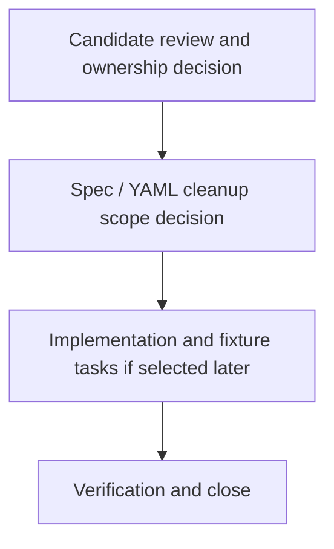

# V01-WORK-DATA-011: Plan UC-002 request-side and generic container cleanup

- **id**: V01-WORK-DATA-011
- **status**: done
- **date**: 2026-06-01
- **source_requirement**: V01-REQ-DATA-002
- **impact_refs**:
  - V01-REQ-DATA-002
  - V01-INV-DATA-002
  - V01-WORK-DATA-009
  - V01-TASK-DATA-009-03
  - V01-TASK-DATA-009-04
- **tasks**:
  - V01-TASK-DATA-011-01
  - V01-TASK-DATA-011-02
  - V01-TASK-DATA-011-03
  - V01-TASK-DATA-011-04

## Goal

Plan the follow-up for the UC-002 `request-side / generic container` bucket without mixing it into completed helper-shape migration or direct cleanup implementation.

This work item owns N-002, N-004, N-007, N-008, N-012, N-016, N-018, and `TF-QUERY-RESULT`.

## Boundary

### Included

- Review the request-side and generic container candidates selected by `V01-TASK-DATA-009-03`.
- Decide whether the candidates need public model shapes, generic container conventions, request-side helper treatment, or explicit no-action outcomes.
- Split later task artifacts only when this work item is selected for execution.

### Excluded

- Direct UC-002 YAML migration in this capture.
- Fixture / golden regeneration in this capture.
- Parser, renderer, validator, MCP, or other implementation changes in this capture.
- Tagged union / discriminator payload support.
- DAG asset TypeRef hint support.
- MCP identity / semantic reference support.
- Numeric/default behavior, selector support matrix, recursive structure, or untagged-union successor scope.
- Reopening M15, V01-WORK-DATA-001, V01-WORK-DATA-002, V01-WORK-DATA-003, V01-WORK-DATA-004, V01-WORK-DATA-005, V01-WORK-DATA-006, V01-WORK-DATA-007, V01-WORK-DATA-008, V01-WORK-DATA-009, or V01-WORK-DATA-010.

## Impact Scope

| layer | current state | handling in this work item |
|---|---|---|
| source requirement | V01-REQ-DATA-002 captured | Use existing UC-002 helper/model follow-up umbrella |
| source planning | V01-WORK-DATA-009 done | Consume the selected successor bucket only |
| candidate bucket | request-side / generic container | Own the bucket as a future cleanup planning track |

## Task Flow

No task artifacts are created at initial capture time.

Expected later split:

## Completion Condition

This work item can be marked `done` when the request-side / generic container bucket has a concrete accepted cleanup path, implemented and verified if selected, or explicit no-action outcomes for all candidates without reopening completed DATA work.

## Evidence

完了日: 2026-06-05

全候補の cleanup path が確定・実装・検証済みとなったため `done` に遷移する。

| タスク | status |
|---|---|
| V01-TASK-DATA-011-01 | done |
| V01-TASK-DATA-011-02 | done |
| V01-TASK-DATA-011-03 | done |
| V01-TASK-DATA-011-04 | done |
