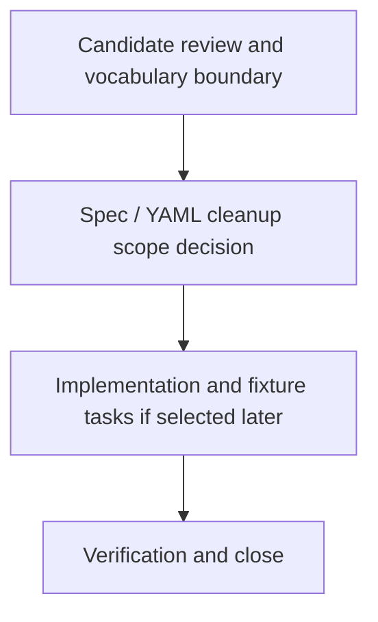

# V01-WORK-DATA-012: Plan UC-002 enum, literal, and vocabulary cleanup

- **id**: V01-WORK-DATA-012
- **status**: done
- **date**: 2026-06-01
- **source_requirement**: V01-REQ-DATA-002
- **impact_refs**:
  - V01-REQ-DATA-002
  - V01-INV-DATA-002
  - V01-WORK-DATA-009
  - V01-TASK-DATA-009-03
  - V01-TASK-DATA-009-04
- **tasks**:
  - V01-TASK-DATA-012-01
  - V01-TASK-DATA-012-02
  - V01-TASK-DATA-012-03

## Goal

Plan the follow-up for remaining UC-002 enum-like, literal, and usage-site vocabulary cleanup after the M15 enum minimum and helper-shape migration have closed.

This work item owns N-019, N-030, N-034, N-045, N-046, N-051, and residual N-006 / N-015 / N-023 / N-029 vocabulary or literal notes.

## Boundary

### Included

- Review the enum-like / literal constraint bucket selected by `V01-TASK-DATA-009-03`.
- Decide which candidates need named enums, literals, usage-site vocabulary constraints, or explicit no-action outcomes.
- Preserve the completed M15 enum minimum as closed and treat this as follow-up cleanup only.
- Split later task artifacts only when this work item is selected for execution.

### Excluded

- Direct UC-002 YAML migration in this capture.
- Fixture / golden regeneration in this capture.
- Parser, renderer, validator, MCP, or other implementation changes in this capture.
- Reopening `V01-WORK-DATA-001` or broadening the M15 enum minimum.
- Tagged union / discriminator payload support.
- DAG asset TypeRef hint support.
- MCP identity / semantic reference support.
- Numeric/default behavior, selector support matrix, recursive structure, request-side container, or untagged-union successor scope.
- Reopening M15, V01-WORK-DATA-002, V01-WORK-DATA-003, V01-WORK-DATA-004, V01-WORK-DATA-005, V01-WORK-DATA-006, V01-WORK-DATA-007, V01-WORK-DATA-008, V01-WORK-DATA-009, or V01-WORK-DATA-010.

## Impact Scope

| layer | current state | handling in this work item |
|---|---|---|
| source requirement | V01-REQ-DATA-002 captured | Use existing UC-002 helper/model follow-up umbrella |
| completed enum minimum | V01-WORK-DATA-001 done | Preserve as closed; do not reopen |
| source planning | V01-WORK-DATA-009 done | Consume the selected successor bucket only |
| candidate bucket | enum-like / literal constraint | Own the bucket as a future cleanup planning track |

## Task Flow

No task artifacts are created at initial capture time.

Expected later split:

## Completion Condition

This work item can be marked `done` when the enum-like / literal constraint bucket has a concrete accepted cleanup path, implemented and verified if selected, or explicit no-action outcomes for all candidates without reopening completed DATA work.

## Evidence

Completed on 2026-06-05.

All three tasks completed:

- `V01-TASK-DATA-012-01` (done): Reviewed and classified all V01-WORK-DATA-012 candidates (N-006 residual, N-015 residual, N-019, N-023 residual, N-029 residual, N-030, N-034, N-045, N-046, N-051).
- `V01-TASK-DATA-012-02` (done): Decided cleanup path for each candidate; produced decision table and YAML cleanup input.
- `V01-TASK-DATA-012-03` (done): Applied selected enum models and usage-site updates to UC-002 YAML; ran validation (`ok`), render (`rendered 47 file(s)`), and Go tests; updated evidence.

All selected candidates were implemented as named enums. N-023 residual and N-029 residual are explicitly confirmed no-action / note-only. No closed DATA work was reopened.
