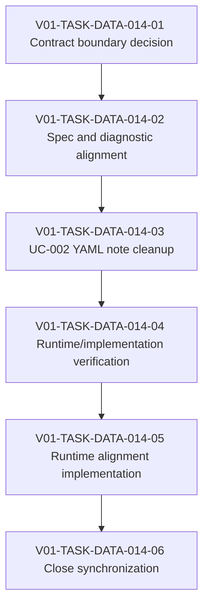

# V01-WORK-DATA-014: Define selector support matrix and object-dependent vocabulary

- **id**: V01-WORK-DATA-014
- **status**: done
- **date**: 2026-06-01
- **source_requirement**: V01-REQ-DATA-007
- **impact_refs**:
  - V01-REQ-DATA-007
  - V01-REQ-DATA-002
  - V01-INV-DATA-002
  - V01-WORK-DATA-009
  - V01-TASK-DATA-009-03
  - V01-TASK-DATA-009-04
- **tasks**:
  - V01-TASK-DATA-014-01
  - V01-TASK-DATA-014-02
  - V01-TASK-DATA-014-03
  - V01-TASK-DATA-014-04
  - V01-TASK-DATA-014-05
  - V01-TASK-DATA-014-06

## Goal

Define the follow-up path for selector support matrices and object-dependent vocabulary captured by `V01-REQ-DATA-007`.

This work item owns the `selector matrix / support matrix` bucket: N-020, N-031, N-037, N-040, and N-042.

## Boundary

### Included

- Decide the contract boundary for selector support matrices and object-dependent kind vocabulary.
- Identify required spec, diagnostic, YAML, and fixture follow-up before any implementation work begins.
- Split later task artifacts only when this work item is selected for execution.

### Excluded

- Direct UC-002 YAML migration in this capture.
- Fixture / golden regeneration in this capture.
- Parser, renderer, validator, MCP, or other implementation changes in this capture.
- Tagged union / discriminator payload support.
- DAG asset TypeRef hint support.
- MCP identity / semantic reference support.
- Request-side generic container cleanup, enum/literal cleanup, numeric/default behavior, recursive structure, or untagged-union successor scope.
- Reopening M15, V01-WORK-DATA-001, V01-WORK-DATA-002, V01-WORK-DATA-003, V01-WORK-DATA-004, V01-WORK-DATA-005, V01-WORK-DATA-006, V01-WORK-DATA-007, V01-WORK-DATA-008, V01-WORK-DATA-009, or V01-WORK-DATA-010.

## Impact Scope

| layer | current state | handling in this work item |
|---|---|---|
| source requirement | V01-REQ-DATA-007 captured | Owns selector support matrix and object-dependent vocabulary |
| source planning | V01-WORK-DATA-009 done | Consume the selected successor bucket only |
| candidate bucket | selector matrix / support matrix | Own the bucket as a future contract decision track |

## Task Flow

Task artifacts:

- `V01-TASK-DATA-014-01`: contract boundary decision.
- `V01-TASK-DATA-014-02`: MCP selector matrix and object-dependent vocabulary spec update.
- `V01-TASK-DATA-014-03`: UC-002 selector support matrix YAML note cleanup.
- `V01-TASK-DATA-014-04`: runtime and implementation alignment verification.
- `V01-TASK-DATA-014-05`: MCP selector support matrix runtime alignment implementation.
- `V01-TASK-DATA-014-06`: work item close synchronization.

## Completion Condition

Status: done.

The selector support matrix and object-dependent vocabulary constraints were accepted, specified, implemented, verified, and reviewed without mixing in unrelated DATA or MCP identity work.

## Evidence

Verdict: PASS.

Close evidence:

- `V01-TASK-DATA-014-01` decided the contract boundary: selector support matrix and object-dependent kind vocabulary belong to MCP schema/tool/error contracts, not DATA DSL dependent enum support.
- `V01-TASK-DATA-014-02` updated MCP schema/tool/error specs for selector support matrix semantics, object-dependent kind vocabulary, unsupported selector behavior, and the `analyze_impact` exception.
- `V01-TASK-DATA-014-03` cleaned UC-002 YAML notes so selector-related YAML models point to the canonical MCP specs instead of owning broad prose notes.
- `V01-TASK-DATA-014-04` verified runtime / implementation alignment and identified follow-up implementation gaps.
- `V01-TASK-DATA-014-05` implemented MCP runtime alignment and passed final re-review after repair.
- `V01-TASK-DATA-014-06` synchronized this work item close.

Final implementation/test evidence recorded by `V01-TASK-DATA-014-05`:

- `go test ./internal/query ./internal/mcp`: PASS.
- `go test ./internal/designrecords ./internal/designrecordsmcp`: PASS.
- `go test ./internal/mcp -run "TestServerCallTool" -v`: PASS.
- Design Records MCP validation for `V01-TASK-DATA-014-05`: OK.
- Design Records MCP validation for `V01-WORK-DATA-014`: OK.

Final behavior coverage:

- unsupported-but-resolvable selectors surface `unsupported_object` for selector tools where the matrix says `no`.
- unresolved selectors remain `not_found`.
- `analyze_impact` keeps the normal-response plus `unsupported_selector` diagnostic exception.
- `field` / `model_field` alias handling is consistent while ObjectRef output remains `object: field`.
- `list_objects` validates unknown object/kind and supports `model_field` alias filtering.
- `file: node` and `file: state_file` reference aggregation is covered.

Out-of-scope dirty files such as `tmp.py` remain intentionally outside this work item close.
