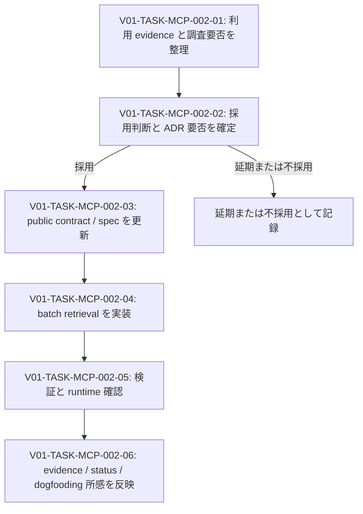

# V01-WORK-MCP-002: Design Records batch retrieval capability を検証・実現する

- **id**: V01-WORK-MCP-002
- **status**: done
- **date**: 2026-05-26
- **source_requirement**: V01-REQ-MCP-002
- **impact_refs**:
  - V01-ADR-077
  - V01-ADR-087
  - V01-ADR-090
- **tasks**:
  - V01-TASK-MCP-002-01
  - V01-TASK-MCP-002-02
  - V01-TASK-MCP-002-03
  - V01-TASK-MCP-002-04
  - V01-TASK-MCP-002-05
  - V01-TASK-MCP-002-06

## Goal

LLM が複数の design record を確認するときの反復取得負荷を検証し、採用する場合は Design Records MCP の public read-only contract、実装、検証を一貫して更新する。

本 work item は、requirement を起点として調査・判断・仕様更新・実装・検証を短期 task に分解する作業運用の dogfooding 対象でもある。

## Boundary

- 本 work item は V01-REQ-MCP-002 を解消する作業フロー、影響範囲、進捗集約を所有する。
- tool 名、request / response schema、件数上限、partial result contract は判断 task の完了前には確定事項として扱わない。
- requirement / work item / task の MCP support は V01-REQ-MCP-003 の対象であり、本 work item では扱わない。
- 従来 milestone と呼んでいた実行計画を work item が引き取り、task を短期作業へ分離する正式方針は、本 dogfooding 後に別 ADR で判断する。

## Impact scope

| layer | initial state | expected handling |
|---|---|---|
| requirement | captured | 必要性と採用判断の結果を反映する |
| investigation | pending judgment | 根拠の保存が必要な場合のみ起票する |
| decision | pending judgment | public contract 追加の判断が必要なら ADR を起票する |
| design spec | not_started | capability 採用時に tool contract を更新する |
| implementation | not_started | capability 採用時に implementation / tests を更新する |
| verification | not_started | contract / implementation / runtime result を確認する |

## Task flow

## Task ordering and blockers

| task | can start when | blocks |
|---|---|---|
| V01-TASK-MCP-002-01 | immediately | V01-TASK-MCP-002-02 |
| V01-TASK-MCP-002-02 | V01-TASK-MCP-002-01 完了後 | V01-TASK-MCP-002-03 または status 更新 |
| V01-TASK-MCP-002-03 | capability 採用かつ必要な判断完了後 | V01-TASK-MCP-002-04 |
| V01-TASK-MCP-002-04 | public contract / spec 確定後 | V01-TASK-MCP-002-05 |
| V01-TASK-MCP-002-05 | implementation 完了後 | V01-TASK-MCP-002-06 |
| V01-TASK-MCP-002-06 | verification 完了後 | work item close |

## Completion condition

以下のいずれかを満たしたとき完了とする。

1. Capability を採用し、必要な判断記録、spec、implementation、tests、runtime verification、evidence 更新が完了している。
2. Capability を延期または不採用と判断し、その根拠と V01-REQ-MCP-002 の status が反映されている。

close 時には、本 work item の task 粒度と flowchart 形式、および旧 milestone 役割を work item に統合する運用について、後続の workflow artifact ADR 起票に必要な所感または不足点を記録する。

## Current blockers

- なし。`get_records` の decision / spec / implementation / tests / runtime verification / close review は完了している。

## Progress summary

- 2026-05-26: V01-REQ-MCP-002 の dogfooding work item として起票。短期 task と task flow 表現の初回運用対象とする。
- 2026-05-26: V01-TASK-MCP-002-01 を完了。M19 close note、現行 `SPEC-design-records-mcp-tools`、V01-ADR-077 / V01-ADR-087 / V01-ADR-085 と本 dogfooding での個別 `get_record` 利用を照合し、複数 record の詳細確認では単一取得の反復が実際に生じることを確認した。独立 investigation は不要と判断し、batch retrieval 採用可否および contract 論点の判断を V01-TASK-MCP-002-02 に渡す。
- 2026-05-26: V01-TASK-MCP-002-02 で capability 採用、`get_records` の責務境界、partial result、duplicate ID の `info` diagnostic、raw body 非 truncate、public response size 上限を定義しない方針を合意した。
- 2026-05-26: `V01-ADR-090: Design Records MCP batch retrieval tool boundary` を accepted として起票し、Design Records MCP から record として取得できることを確認した。V01-TASK-MCP-002-02 を完了し、V01-REQ-MCP-002 を accepted、本 work item を `design_spec_pending` として V01-TASK-MCP-002-03 へ進める。
- 2026-05-26: Independent review の指摘を受け、V01-ADR-090 に exact record ID lookup 境界を補強し、V01-TASK-MCP-002-03 で `items` response shape、invalid request / all-missing behavior、duplicate diagnostic payload、resolver 非介入境界を `docs/spec/design-records-mcp/{overview,schema,tools}.md` に明文化した。V01-TASK-MCP-002-03 を完了し、本 work item を `implementation_pending` として V01-TASK-MCP-002-04 へ進める。
- 2026-05-26: V01-TASK-MCP-002-04 に着手し、core batch handler / response types / MCP tool registration / dispatch と unit・transport tests を追加した。現時点では Go test / runtime verification 未確認のため、implementation 完了判定は保留する。
- 2026-05-26: ユーザー実行による formatting 適用、対象 package tests、repository 全体の Go test suite の成功を evidence として V01-TASK-MCP-002-04 を完了した。次工程は `TASK-MCP-002-05-runtime-verification.md` による MCP runtime 確認であり、本 work item を `verification_pending` へ進める。
- 2026-05-26: V01-TASK-MCP-002-05 で stdio JSON-RPC runtime を用いた `get_records` の正常系、partial result、duplicate diagnostic、raw body 取得を確認し、contract と implementation の一致を確認した。
- 2026-05-26: V01-TASK-MCP-002-06 で close evidence と dogfooding 所感を記録した。ChatGPT 側の tool registry/schema 表示が更新後も `get_records` を露出しない観測は、runtime capability defect と切り分けた運用上の follow-up candidate として保持する。本 work item を `done` とする。
