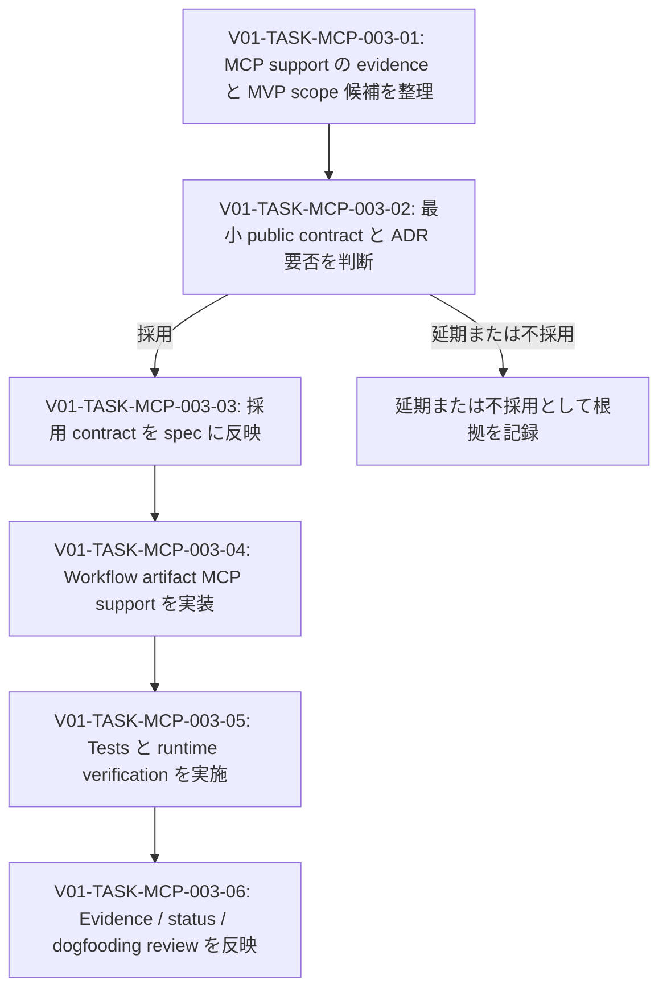

# V01-WORK-MCP-003: Workflow artifact MCP support の最小 public contract を判断・実現する

- **id**: V01-WORK-MCP-003
- **status**: done
- **date**: 2026-05-26
- **source_requirement**: V01-REQ-MCP-003
- **impact_refs**:
  - V01-ADR-087
  - V01-ADR-088
  - V01-ADR-090
  - V01-ADR-091
  - V01-ADR-092
  - SPEC-design-records-mcp-overview
  - SPEC-design-records-mcp-schema
  - SPEC-design-records-mcp-tools
- **tasks**:
  - V01-TASK-MCP-003-01
  - V01-TASK-MCP-003-02
  - V01-TASK-MCP-003-03
  - V01-TASK-MCP-003-04
  - V01-TASK-MCP-003-05
  - V01-TASK-MCP-003-06

## Goal

LLM が `REQ-* -> WORK-* -> TASK-*` の運用チェーンを MCP 経由で辿れるようにする必要性を基に、workflow artifact support の最小 public contract を判断し、採用する範囲について design record contract、implementation、verification まで一貫して追跡する。

本 work item は、V01-ADR-091 で確定した新形式 workflow artifact 運用の二回目 dogfooding 対象でもある。

## Boundary

- 本 work item は V01-REQ-MCP-003 を解消する作業フロー、影響範囲、task graph、全体の completion condition を所有する。
- Workflow artifact の canonical relation は `REQ-*` / `WORK-*` / `TASK-*` ID-as-ref を用いる。Physical path は relation contract に含めない。
- `req:` / `work:` / `task:` semantic prefix は導入前提としない。
- `get_record(s)` の対象 kind、`resolve_reference` の supported input、relation validation、orphan diagnostics、progress projection の採否は V01-TASK-MCP-003-02 の判断完了前には確定事項として扱わない。
- Work item に task status の checkbox または status copy を手動複製しない。個別 task status の正本は各 task artifact とする。
- `milestone` を新しい artifact layer、metadata field、canonical identity、relation として追加しない。

## Impact scope

| layer | initial state | expected handling |
|---|---|---|
| requirement | accepted | `V01-ADR-092` により最小 capability の採用結果を反映済み |
| evidence / scope | completed | 現行 contract と dogfooding gap を整理済み。判断へ引き渡し済み |
| decision | completed | `V01-ADR-092` accepted。Codex 再 review で acceptance 可能と確認済み |
| design spec | completed | 採用した MCP contract を V01-TASK-MCP-003-03 で spec に反映済み |
| implementation | completed | V01-TASK-MCP-003-04 で採用した surface / validation を実装・test 済み |
| verification | completed | V01-TASK-MCP-003-05 で runtime と workflow relation の確認を完了した |
| close review | completed | V01-TASK-MCP-003-06 で二回目 dogfooding の所感と残課題を反映した |

## Task flow

## Task ordering and blockers

| task | can start when | blocks |
|---|---|---|
| V01-TASK-MCP-003-01 | immediately | V01-TASK-MCP-003-02 |
| V01-TASK-MCP-003-02 | V01-TASK-MCP-003-01 完了後 | V01-TASK-MCP-003-03 または requirement / work item status 更新 |
| V01-TASK-MCP-003-03 | capability 採用かつ必要な判断完了後 | V01-TASK-MCP-003-04 |
| V01-TASK-MCP-003-04 | public contract / spec 確定後 | V01-TASK-MCP-003-05 |
| V01-TASK-MCP-003-05 | implementation 完了後 | V01-TASK-MCP-003-06 |
| V01-TASK-MCP-003-06 | verification または延期・不採用記録完了後 | work item close |

## Completion condition

以下のいずれかを満たしたとき、本 work item を `done` にできる。

1. Workflow artifact MCP support の最小 public contract を採用し、必要な判断記録、spec 更新、implementation、tests、runtime verification、V01-REQ-MCP-003 への結果反映、close evidence が完了している。
2. Capability の全部または一部を延期・不採用と判断し、判断対象ごとの根拠、残す requirement または後続 work の扱い、V01-REQ-MCP-003 への結果反映、close evidence が完了している。

Completion 判定では、workflow chain の ID-as-ref 方針と physical path 非対応が維持されていること、task status の derived projection を採用しない限り手動 status copy を追加していないことを確認する。

## Current blockers

- Target chain / capability completion に blocker はない。`V01-WORK-MCP-003` completion condition 1 は満たされたため、本 work item は `done` とする。
- Repository-wide validation では、target chain 外の legacy artifact `V01-WORK-MCP-001.tasks = M19` が current validator で `invalid_workflow_relation_target` となる既知 diagnostic が残る。これは pre-ADR-091 work item migration / compatibility follow-up candidate として保持し、今回 `V01-WORK-MCP-001` は直接修正しない。

## Progress summary

- 2026-05-26: V01-ADR-091 accepted 後の二回目 workflow artifact dogfooding として起票。V01-REQ-MCP-003 を `decision_needed` に進め、最小 public contract の evidence / scope 整理を V01-TASK-MCP-003-01 で開始した。
- 2026-05-26: 初期確認で、現行 Design Records MCP は `decision` / `spec` / `investigation` のみを public record kind とし、`get_records` は未対応 workflow ID を exact lookup の `not_found` として扱い、`resolve_reference` は `REQ-*` / `WORK-*` を `unsupported` input として扱う contract であることを確認した。relation validation、orphan diagnostics、task status 由来 progress projection は現行 contract に存在しないため、MVP 採否判断対象として V01-TASK-MCP-003-01 に記録した。
- 2026-05-26: V01-TASK-MCP-003-01 を完了。Workflow artifact の public record / resolver / relation validation を coherent MVP 候補として V01-TASK-MCP-003-02 に渡し、orphan diagnostics と progress projection は初期 MVP から分離し得る拡張論点として保持した。独立 investigation は現時点で不要と判断した。
- 2026-05-27: `spec:project-artifact-model` の investigation -> requirement / work item relation を V01-TASK-MCP-003-01 の evidence に補正反映した。V01-TASK-MCP-003-02 で、既存 record-oriented surface への workflow artifact 統合、workflow ID-as-ref resolve、宣言済み relation integrity validation、investigation metadata から `REQ-*` / `WORK-*` への canonical reference 拡張を採用候補とする `V01-ADR-092` を `proposed` で起票した。
- 2026-05-27: Codex review 指摘を受け、declared relation の双方向 integrity validation、investigation metadata から `TASK-*` を除外する boundary、workflow ID grammar を MCP-supported grammar として採用する判断を `V01-ADR-092` に明記した。再 review で `OK to proceed to acceptance` が確認され、`V01-ADR-092` と `V01-REQ-MCP-003` を accepted、V01-TASK-MCP-003-02 を done とし、本 work item を `design_spec_pending` に進めた。
- 2026-05-27: V01-TASK-MCP-003-03 を完了。Design Records MCP の overview / schema / tools と project artifact model / traceability leaf specs に V01-ADR-092 の public contract を反映し、`yaml:` reserved boundary の曖昧さおよび design record dependency と `task.depends_on` の責務衝突を解消した。本 work item を `implementation_pending` に進めた。
- 2026-05-27: V01-TASK-MCP-003-04 を完了。Pass 1 で workflow record surface、Pass 2 で workflow direct resolver / investigation metadata boundary、Pass 3 で workflow declared relation validation を実装し、`go test ./internal/designrecords ./internal/designrecordsmcp` と `go test ./...` が passing であることを確認した。本 work item を `verification_pending` に進めた。
- 2026-05-27: V01-TASK-MCP-003-05 を完了。`go test ./internal/designrecords ./internal/designrecordsmcp` と `go test ./...` が passing であることを再確認し、`go run ./cmd/design-records-mcp -root .` の stdio JSON-RPC runtime で workflow record retrieval、mixed batch retrieval、workflow ID-as-ref resolver、missing / unsupported boundary、declared relation validation を確認した。`V01-REQ-MCP-003` / `V01-WORK-MCP-003` / `TASK-MCP-003-*` の chain に blocker はなく、既存別 artifact `V01-WORK-MCP-001.tasks=M19` の `invalid_workflow_relation_target` diagnostic は close review へ渡す。
- 2026-05-27: V01-TASK-MCP-003-06 を完了。Close review で `V01-ADR-092` accepted、V01-TASK-MCP-003-03 / 04 / 05 の完了 evidence、tests / runtime verification、`V01-REQ-MCP-003` への decision result 反映を照合し、completion condition 1 が満たされたと判定した。二回目 dogfooding では、三層 workflow artifact、Mermaid task graph、短期 task 分割、task status ownership、ID-as-ref / physical path 非対応、spec reflection review gate が有効であることを確認した。
- 2026-05-27: Runtime validation で可視化された `V01-WORK-MCP-001.tasks = M19` は、repository-wide `validate_records({})` を完全 clean ではなくしている既知 diagnostic として記録した。これは `V01-WORK-MCP-003` target chain の capability completion blocker ではなく、legacy M-series work item migration / compatibility follow-up candidate として扱う。
- 2026-05-27: Entry docs stale wording follow-up として、workflow artifact MCP support を未対応のように示す `docs/doc-policy.md` の表現、requirements / work-items authoring README の MCP record kind future wording、investigation README の `REQ-*` / `WORK-*` canonical reference boundary を狭く更新した。
