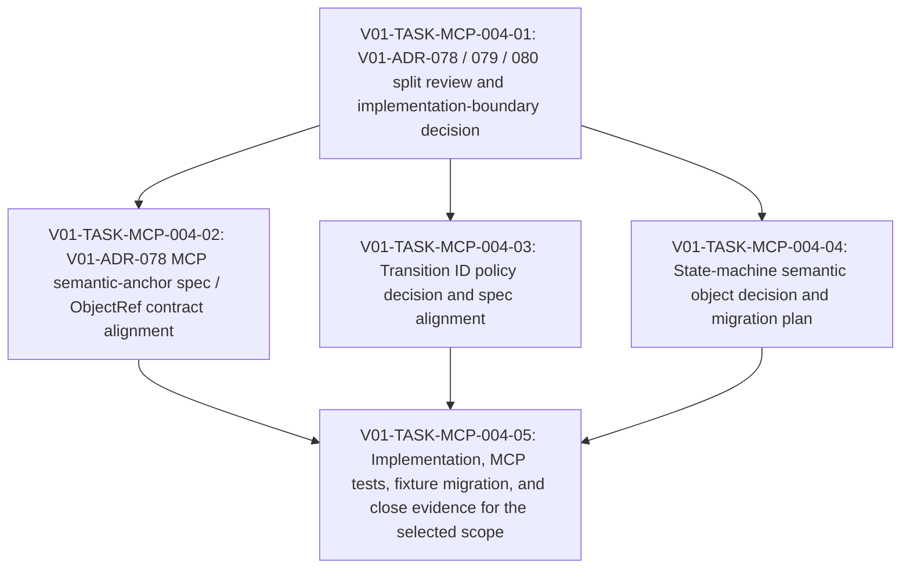

# V01-WORK-MCP-004: Split MCP semantic identity and state-machine identity implementation boundary

- **id**: V01-WORK-MCP-004
- **status**: not_started
- **date**: 2026-05-31
- **source_requirement**: V01-REQ-MCP-004
- **impact_refs**:
  - V01-INV-DATA-001
  - V01-INV-DATA-002
  - V01-REQ-DATA-001
  - V01-WORK-DATA-001
  - V01-REQ-RESOLVE-001
  - V01-WORK-RESOLVE-001
  - V01-ADR-078
  - V01-ADR-079
  - V01-ADR-080
- **tasks**:

## Goal

Define the implementation boundary for MCP semantic identity and state-machine identity follow-up work so V01-ADR-078 / V01-ADR-079 / V01-ADR-080 can move forward without being conflated with the completed resolver bugfix or the closed M15 data-layer release.

## Boundary

### Included

- Review V01-ADR-078 semantic-anchor synthetic ID policy and identify remaining spec / implementation / fixture work.
- Review V01-ADR-079 transition ID non-file-path constraints and decide whether it can proceed independently or needs V01-ADR-080 first.
- Review V01-ADR-080 state-machine semantic object and file-path-free scenario reference direction.
- Decide whether MCP private object exposure / ObjectRef schema migration is in this work item or should become a separate requirement / work item.
- Define future task boundaries for spec, implementation, fixture migration, MCP tests, and verification.

### Excluded

- Resolver file-private sub node identity bugfix work already completed by `V01-WORK-RESOLVE-001`.
- M15 / `v1.1.0-spec` reopening.
- Data-layer helper model or tagged union work.
- One-shot implementation of every V01-ADR-078 / V01-ADR-079 / V01-ADR-080 consequence before a split decision.

## Impact Scope

| layer | current state | handling in this work item |
|---|---|---|
| source requirement | `V01-REQ-MCP-004` captured | This work item owns the split and implementation-boundary flow |
| previous data work | `V01-WORK-DATA-001` done | Preserve M15 close boundary |
| previous resolver work | `V01-WORK-RESOLVE-001` done | Do not reopen resolver bugfix scope |
| decision | V01-ADR-078 accepted; V01-ADR-079 / V01-ADR-080 proposed | Separate accepted-policy implementation from proposed-policy decisions |
| MCP spec | semantic identity / ObjectRef / selector surfaces may need update | Future tasks own spec changes |
| implementation | transition and state-machine identity changes are not yet implemented | Future tasks own implementation and tests |
| fixtures / UC | MCP response examples and state / sequence fixtures may need migration | Future tasks own fixture updates |

## Task flow

## Task Candidates

- `V01-TASK-MCP-004-01`: V01-ADR-078 / 079 / 080 split review and implementation-boundary decision.
- `V01-TASK-MCP-004-02`: V01-ADR-078 MCP semantic-anchor spec / ObjectRef contract alignment.
- `V01-TASK-MCP-004-03`: Transition ID policy decision and spec alignment.
- `V01-TASK-MCP-004-04`: State-machine semantic object decision and migration plan.
- `V01-TASK-MCP-004-05`: Implementation, MCP tests, fixture migration, and close evidence for the selected scope.

Task artifacts are intentionally not created in this migration step. Therefore these candidate IDs are shown only in the body and are not listed in the metadata `tasks` field.

## Completion Condition

This work item can be marked `done` when the MCP semantic identity / state-machine identity implementation boundary is decided, the selected spec and implementation work is completed and verified, and any out-of-scope private object exposure or state-machine migration work is explicitly split rather than left ambiguous.

