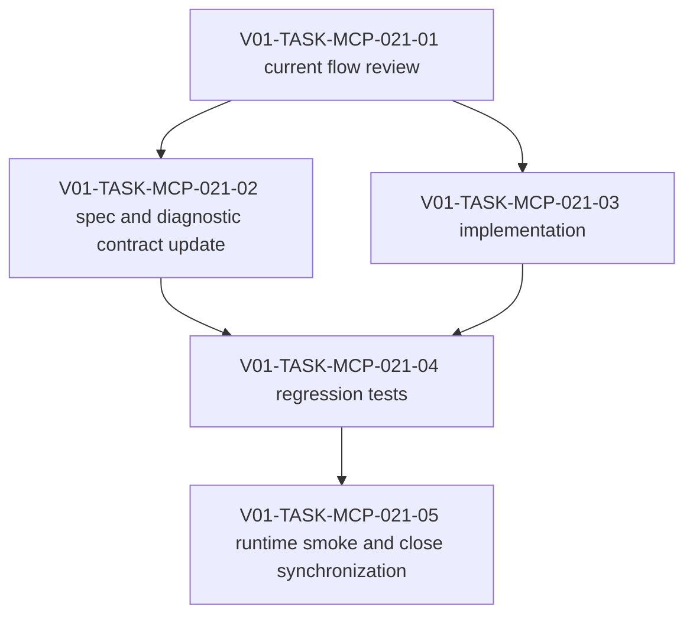

# V01-WORK-MCP-021: heading-safe named_section_replace body normalization

- **id**: V01-WORK-MCP-021
- **status**: done
- **date**: 2026-06-05
- **source_requirement**: V01-REQ-MCP-022
- **impact_refs**:
  - SPEC-design-records-mcp-tools
  - V01-ADR-093
- **tasks**:
  - V01-TASK-MCP-021-01
  - V01-TASK-MCP-021-02
  - V01-TASK-MCP-021-03
  - V01-TASK-MCP-021-04
  - V01-TASK-MCP-021-05

## Goal

Implement heading-safe normalization for `propose_record_update` with `update.type = named_section_replace` so replacement bodies that accidentally start with the already-selected section heading do not produce duplicated headings in retained proposal diffs.

## Boundary

This work is limited to Design Records MCP authoring update behavior for `named_section_replace`.

It covers replacement content supplied by `body` and `body_cache_id`.

It does not introduce multi-section replacement, arbitrary string replacement, or canonical workflow section name changes.

V01-REQ-MCP-021 tolerant heading canonicalization remains a related but separate concern. This work should not depend on completing tolerant matching unless implementation reuse is clearly safe.

## Impact Scope

- Authoring update flow for `propose_record_update`.
- Replacement body normalization before retained proposal creation.
- Warning diagnostic category for stripped duplicate section headings.
- Diff generation for retained proposals.
- Regression tests and runtime smoke around direct body and body cache sources.
- Spec/tool contract documentation for the warning and normalization behavior.

## Task flow

## Task Candidates

- Review current `propose_record_update`, `named_section_replace`, and body cache resolution flow.
- Update MCP tool contract and diagnostic documentation for heading stripping warning behavior.
- Implement normalization for the first matching Markdown heading line only.
- Add regression tests for body, body cache, internal headings, heading mismatch, and level mismatch.
- Run runtime smoke, update evidence, and close synchronized artifacts.

## Completion Condition

- `named_section_replace` strips a first non-empty Markdown heading line only when it matches the selected section heading and level.
- The same behavior applies to `body` and `body_cache_id` sources.
- Retained proposal diffs show the normalized replacement body.
- Warning diagnostics identify the stripped heading and level.
- Body-internal headings are preserved.
- Non-matching headings continue to follow existing validation and selector behavior.
- Required spec/docs, implementation, tests, runtime smoke, and close synchronization are complete.

## Evidence

Close synchronization completed after the full V01-WORK-MCP-021 task flow was finished:

- V01-TASK-MCP-021-01 current flow review done.
- V01-TASK-MCP-021-02 contract update done.
- V01-TASK-MCP-021-03 implementation done.
- V01-TASK-MCP-021-04 regression coverage done.
- V01-TASK-MCP-021-05 runtime smoke done.
- `go test ./internal/designrecords ./internal/designrecordsmcp` passed.
- Runtime smoke passed.
