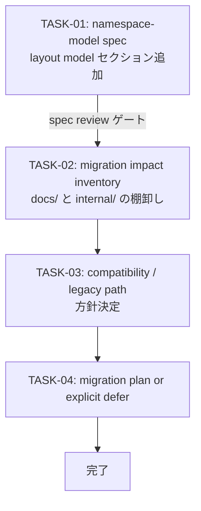

# V01-WORK-PRODUCT-003: App namespace-first layout model 仕様化と migration 方針決定

- **id**: V01-WORK-PRODUCT-003
- **status**: done
- **date**: 2026-06-08
- **source_requirement**: V01-REQ-PRODUCT-003
- **impact_refs**:
- **tasks**:

## Goal

V01-REQ-PRODUCT-003 が定義した app namespace-first repository layout model を spec として固定し、migration の実行可否と互換方針を決定する。実ファイル移動は本 WORK のスコープ外とする。

## Boundary

このWORKが所有するもの:

- namespace-model spec への app namespace-first layout model セクション追加
- 現状 `docs/` と `internal/` の migration impact inventory
- compatibility / legacy path support 方針の決定
- migration 実行 or explicit defer の判断と記録

このWORKが所有しないもの:

- 実際のファイル・ディレクトリの移動
- BPDSL による DSL 生成の実装
- MCP API のパス変更対応
- UI MVP の情報設計

## Task flow

## Task Candidates

- TASK-01: `docs/spec/concepts/namespace-model/index.md` に app namespace-first layout model を追記（`records/` / `dsl/` / `src/` の意味・用途・任意性、`dsl/ → src/` 生成パターンを全 app namespace の意図する方向として明示） → spec review ゲート
- TASK-02: 現状 `docs/` と `internal/` の移動対象ファイル・ディレクトリを棚卸しし、app namespace 別の migration 対象パス一覧を作成
- TASK-03: 旧パス（`docs/requirements/mcp/` 等）の扱い、MCP のパス変更対応方針、migration timing を決定し記録
- TASK-04: migration を v0.2.0 で実行するか explicit defer にするかを判断し、実行する場合は別 WORK を切り出す

## Completion Condition

- namespace-model spec に app namespace-first layout model が記述されている ✓（`docs/spec/concepts/repository-layout/index.md`）
- migration 対象の棚卸しが完了し、パス一覧が存在する ✓（V01-INV-PRODUCT-001）
- compatibility / legacy path 方針が決定されている ✓（完全切り替え・symlink なし・V01- prefix 採用）
- migration 実行の WORK が切り出されている ✓（V01-WORK-PRODUCT-004）
- V01-REQ-PRODUCT-003 が accepted に更新されている ✓

## Evidence

| タスク | 成果物 |
|---|---|
| TASK-01: V01-ADR-097 + repository-layout spec 作成 | `docs/adr/097-app-namespace-first-repository-directory-layout.md`、`docs/spec/concepts/repository-layout/index.md` |
| TASK-02: migration impact inventory | `docs/investigations/product/INV-PRODUCT-001-migration-impact-inventory-for-app-namespace-first-repository-layout.md` |
| TASK-03: compatibility / legacy path 方針決定 | V01-ADR-098（superseded）、V01-ADR-099（V01- epoch prefix）、path: メタデータ不在確認 |
| TASK-04: migration plan 確定・WORK 切り出し | `docs/work-items/product/WORK-PRODUCT-004-repository-layout-migration-execution-v01-restructure-and-v01-id-rename.md` |
