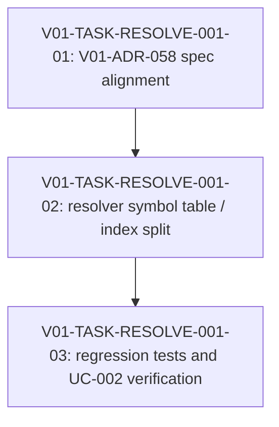

# V01-WORK-RESOLVE-001: file-private sub node identity enforcement を実現する

- **id**: V01-WORK-RESOLVE-001
- **status**: done
- **date**: 2026-05-31
- **source_requirement**: V01-REQ-RESOLVE-001
- **impact_refs**:
  - V01-ADR-058
  - V01-ADR-078
  - spec:nodes
  - spec:naming
  - spec:diagnostics
- **tasks**:
  - V01-TASK-RESOLVE-001-01
  - V01-TASK-RESOLVE-001-02
  - V01-TASK-RESOLVE-001-03

## Goal

`V01-REQ-RESOLVE-001` が捕捉した resolver / symbol table の乖離を解消し、file-private sub node を project-wide public QualifiedID 一意性制約から分離する。

本 work item は、V01-ADR-058 の spec 反映、resolver internal index の修正、regression tests、および UC-002 validate / render verification までを一つの解消フローとして所有する。

## Boundary

### Included in this work item

- V01-ADR-058 の accepted 判断に沿った spec alignment
  - `docs/spec/nodes.md`
  - `docs/spec/naming.md`
  - `docs/spec/diagnostics.md`
- resolver / symbol table の main/public node と file-private sub node の扱い分離
- file-local sub node duplicate validation
- flow / reads / writes 等の bare ID file-local resolution regression
- UC-002 duplicate task QID / unresolved flow task issue の再検証

### Explicitly excluded from this work item

- M15 / `v1.1.0-spec` の再オープン
- UC-002 YAML の private sub task ID を project-wide unique に rename する運用回避
- `list_objects(include_private)` の追加・変更
- ObjectRef の `anchor` / `visibility` schema migration
- private helper model exposure schema
- transition / state machine identity policy

MCP private object exposure の未反映部分は、必要に応じて別 requirement / work item として扱う。

## Impact scope

| layer | current state | handling in this work item |
|---|---|---|
| source requirement | `V01-REQ-RESOLVE-001` captured | 本 work item の source requirement として扱う |
| decision | `V01-ADR-058` accepted, `V01-ADR-078` accepted | V01-ADR-058 を primary contract、V01-ADR-078 を MCP synthetic ID 方向性として参照する |
| spec | sub node file-private の記述が V01-ADR-058 の具体化に追いついていない | V01-TASK-RESOLVE-001-01 で alignment する |
| implementation | sub task が project-wide QID uniqueness に混入している | V01-TASK-RESOLVE-001-02 で resolver / index を修正する |
| tests / fixture | UC-002 full validate が duplicate_node / unresolved_flow_task で fail | V01-TASK-RESOLVE-001-03 で regression と verification を行う |
| MCP public contract | private object exposure schema に未反映部分がある | 本 work item では扱わず、別枠へ送る |

## Task flow

## Task ordering and blockers

| task | can start when | blocks / constraint |
|---|---|---|
| V01-TASK-RESOLVE-001-01 | immediately | 実装前に spec の読解余地を潰す |
| V01-TASK-RESOLVE-001-02 | V01-TASK-RESOLVE-001-01 完了後 | MCP public contract migration を混ぜない |
| V01-TASK-RESOLVE-001-03 | V01-TASK-RESOLVE-001-02 完了後 | UC-002 validate / render verification で close 判定する |

## Completion condition

以下をすべて満たしたとき、本 work item を `done` にできる。

1. V01-ADR-058 の判断が `docs/spec/nodes.md` / `docs/spec/naming.md` / `docs/spec/diagnostics.md` に反映されている。
2. main/public node の project-wide QualifiedID uniqueness と file-private sub node の file-local identity が実装上分離されている。
3. 同一 file 内 sub node local ID 重複は diagnostic になる。
4. 別 file 間の同名 sub node local ID は許容される。
5. local flow step は同一 file の sub task を優先して解決できる。
6. UC-002 validate / render の duplicate task QID / unresolved flow task issue が解消したことを verification evidence として記録できる。
7. MCP private object exposure / ObjectRef schema migration が本 work item に混入していない。

## Close outcome

`V01-WORK-RESOLVE-001` is done.

- `V01-TASK-RESOLVE-001-01` is done: V01-ADR-058 file-private sub node scope was reflected into `docs/spec/nodes.md`, `docs/spec/naming.md`, `docs/spec/diagnostics.md`, and related `edges.md` cross-references.
- `V01-TASK-RESOLVE-001-02` is done: resolver / symbol table indexing was updated so public/main nodes use project-wide QualifiedID identity and file-private sub nodes use file-local internal identity.
- `V01-TASK-RESOLVE-001-03` is done: regression coverage and UC-002 validate / render verification were recorded.
- `duplicate_node` is now scoped to public node QualifiedID collision; same-file private sub node local ID duplication uses `duplicate_sub_node`.
- Cross-file same private sub node local ID is allowed.
- Bare node/source resolution preserves same-file private sub node/source first, then same-module main node fallback.
- Private sub task / join return asset identity uses the internal file-local node identity, avoiding cross-file asset collisions.
- Public-shaped aliases for private sub nodes are not exposed through public lookup indexes.
- Verification reported by implementation handoff:
  - `go test ./...` -> pass
  - `go run ./cmd/brewprint validate --yaml-root docs\uc\002-brewprint-self-hosting\yaml` -> ok
  - `go run ./cmd/brewprint render --yaml-root docs\uc\002-brewprint-self-hosting\yaml --out $env:TEMP\brewprint-uc002-render-review2 --clean` -> rendered 11 file(s)
- UC-002 duplicate task QID / unresolved flow task issue is resolved, with no remaining diagnostics reported for UC-002.
- Scope exclusions were preserved: M15 / `v1.1.0-spec` was not reopened, UC-002 YAML was not renamed as a workaround, and MCP private object exposure / ObjectRef schema migration was not introduced.

## Notes

Codex investigation により、UC-002 repeated IDs は各 file 内では1回ずつであり、別 file 間の private sub task ID 重複であることが確認された。

現行 failure は `duplicate_node` 21件と `unresolved_flow_task` 21件であり、duplicate 後に `NodesByFile[fileID]` へ登録されないことが flow 解決不能へ連鎖していた。