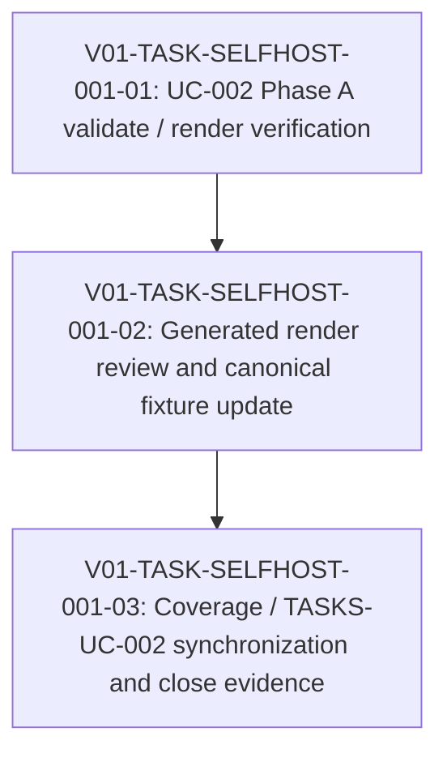

# V01-WORK-SELFHOST-001: Verify UC-002 Phase A canonical render and coverage

- **id**: V01-WORK-SELFHOST-001
- **status**: done
- **date**: 2026-05-31
- **source_requirement**: V01-REQ-SELFHOST-001
- **impact_refs**:
  - V01-ADR-057
  - V01-REQ-DATA-001
  - V01-WORK-DATA-001
  - V01-REQ-RESOLVE-001
  - V01-WORK-RESOLVE-001
- **tasks**:
  - V01-TASK-SELFHOST-001-01
  - V01-TASK-SELFHOST-001-02
  - V01-TASK-SELFHOST-001-03

## Goal

Establish UC-002 Phase A as a verified current baseline by validating and rendering the MCP public contract YAML, generating canonical render artifacts, and synchronizing UC-002 coverage / gap tracking with the post-M15 and post-RESOLVE state.

## Boundary

### Included

- Validate UC-002 Phase A YAML against the current resolver / data-layer baseline.
- Generate canonical UC-002 Phase A render artifacts under the UC-002 `renders/` directory.
- Review generated render outputs for expected Phase A coverage:
  - project index
  - MCP group index
  - DAG renders for the MCP tool tasks
  - ER render behavior, including the expected limitation for context-store contract schemas
- Update UC-002 coverage and TASKS-UC-002 to distinguish current remaining gaps from issues already resolved by M15 or RESOLVE work.
- Record verification evidence in future task artifacts and, when ready, this work item close outcome.

### Excluded

- Phase B internal layer blueprinting.
- M14 close or legacy M14 status changes.
- Changes to legacy M14 / M14a / M15 records.
- Helper model, tagged union, DAG TypeRef hint, or MCP semantic identity implementation.

## Impact Scope

| layer | current state | handling in this work item |
|---|---|---|
| source requirement | `V01-REQ-SELFHOST-001` captured | This work item resolves its Phase A verification need |
| legacy record | M14 is paused | Do not close or edit M14 in this work item |
| prerequisite data work | `V01-WORK-DATA-001` done | Treat M15 F1 boundary as closed baseline |
| prerequisite resolver work | `V01-WORK-RESOLVE-001` done | Treat duplicate task QID / unresolved flow issue as resolved |
| UC-002 YAML | Phase A files are placed | Validate and render current YAML |
| UC-002 renders | Canonical render artifacts are generated/reviewed | Accepted as the Phase A canonical fixture baseline |
| UC-002 coverage | Coverage and gap log are synchronized | Completed by `V01-TASK-SELFHOST-001-03` |

## Task flow

## Task Candidates

- `V01-TASK-SELFHOST-001-01`: UC-002 Phase A validate / render verification.
- `V01-TASK-SELFHOST-001-02`: Generated render review and canonical fixture update.
- `V01-TASK-SELFHOST-001-03`: Coverage / TASKS-UC-002 synchronization and close evidence.

All three task artifacts have been created and completed. `fixture_pending` was the pre-close stage while canonical render review and coverage synchronization were still pending; the final work item status is `done`.

## Completion Condition

This work item can be marked `done` when UC-002 Phase A validate / render evidence is recorded, canonical renders are reviewed, coverage and gap logs reflect the current baseline, and no M14a or M15 closed scope has been reopened.

## Close outcome

`V01-WORK-SELFHOST-001` is done.

- `V01-TASK-SELFHOST-001-01` is done: `go test ./...` passed, UC-002 Phase A validate returned `ok`, and canonical render generation completed with `rendered 11 file(s)`.
- `V01-TASK-SELFHOST-001-02` is done: generated renders were reviewed, canonical and temp render outputs matched byte-for-byte, and the 11 files were accepted as the Phase A canonical fixture baseline.
- `V01-TASK-SELFHOST-001-03` is done: `coverage.md` and `TASKS-UC-002.md` now reflect the completed Phase A validate / render / review evidence.
- Phase A render coverage now records project index, MCP group index, 8 MCP tool DAG renders, and the expected empty ER render as generated and reviewed.
- No new UC-002 YAML, renderer implementation, or render artifact change was required by the close pass.
- Scope exclusions were preserved: M14 self-hosting remains paused, M14a and M15 remain closed, and legacy M14 / M14a / M15 records were not edited.
